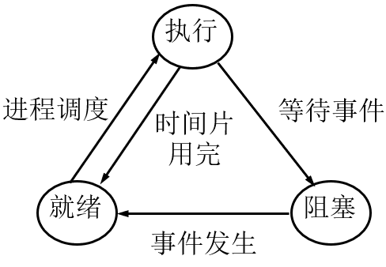
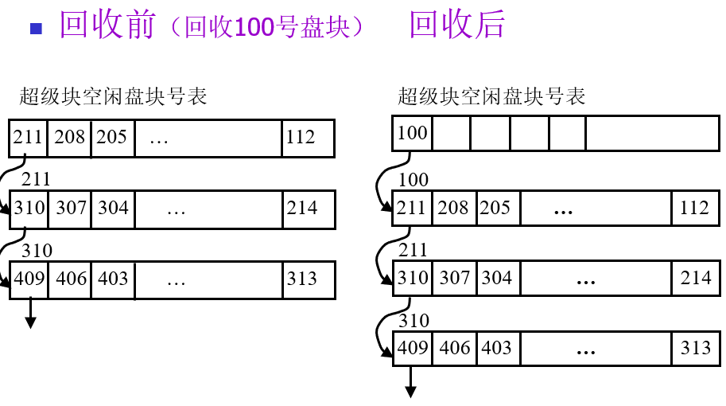
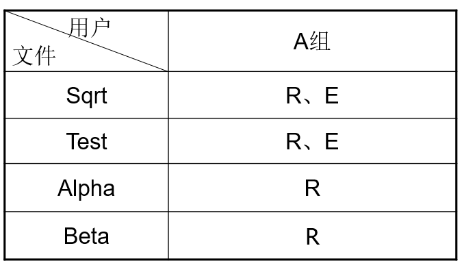

[TOC]

# 第一章 操作系统概述

## 1.1 操作系统的概念

计算机系统由硬件和软件两部分组成。


计算机硬件和软件以及软件的各部分之间形成了一种层次结构的关系。
操作系统是配置在计算机硬件上的第一层软件，是对硬件的首次扩充。它位于硬件与其它软件之间，是所有其他软件运行的基础。 


裸机：没有配置软件的计算机。即计算机硬件
虚拟机：覆盖了软件的机器称为虚拟机或扩展机。

配置操作系统的主要目标：提供接口，易于使用；有效地控制和管理资源；合理地组织计算机系统的工作流程，以提高资源利用率并改善系统性能。

从用户观点看：操作系统是用户与计算机硬件之间的接口，为用户使用计算机提供服务。
从资源管理观点看：操作系统是计算机系统资源的管理者。

操作系统管理的计算机系统软硬件资源包括：处理机，存储器，设备，文件

资源的共享使用方式有：时分复用，空分复用

## 1.2 操作系统的形成与发展

**人工操作方式**

**早期批处理**

监督程序是一个常驻内存的程序，它管理作业的运行，负责装入和运行各种系统程序来完成作业的自动过渡。
监督程序是最早的操作系统雏形。

批处理技术是指计算机系统对一批作业自动进行处理的一种技术。
早期的批处理分为：联机批处理，脱机批处理

联机批处理中采用联机输入/输出，即输入/输出操作在主机控制下进行，其缺点是速度慢。

在脱机批处理系统中，除主机外另设一台外围机（又称卫星机）。
用户作业通过外围机输入到磁带上，而主机只负责从磁带上把作业调入内存，并予以执行。
作业完成后，主机负责把结果输出到磁带上，然后再由外围机把磁带上的信息在打印机上输出。


脱机输入/输出：输入/输出操作在外围机的控制下，脱离主机进行。
脱机I/O优点：减少了CPU的空闲时间，提高I/O速度。 
联机输入/输出：输入/输出操作在主机控制下进行。

**多道程序设计技术**

将多个作业存放在主存中，这些程序在管理程序的控制下交替运行，共享处理机和系统中的其他资源


特点：多道，宏观上并行，微观上串行

**操作系统的发展**

操作系统是一组控制和管理计算机硬件和软件资源，合理地组织计算机工作流程，以及方便用户的程序的集合。

## 1.3 操作系统的类型

最基本的操作系统类型有三种：批处理操作系统，分时操作系统，实时操作系统

**批处理系统**

作业（job）是用户在一次解题或一个事务处理过程中要求计算机系统所做工作的集合，包括用户程序、所需的数据及命令等。

单道批处理系统工作流程：把一批作业以脱机输入方式输入到磁带上，并在系统中配置监督程序，在它的控制下，使一批作业一个接一个地连续处理，其过程为：


单道批处理系统的特征：自动性，顺序性，单道性
多道批处理系统的特征：多道性，无序性，调度性

**分时操作系统**

推动分时系统发展的主要动力是用户需求，即：人机交互，共享主机，方便用户上机

所谓分时技术就是：把处理机的运行时间分成很短的时间片，按时间片轮流把处理机分配给各联机作业使用。若某个作业在分配给它的时间片内不能完成其计算，则该作业暂停运行，把处理机让给另一个作业使用，等待下一轮时再继续其运行。 


在操作系统中采用分时技术就形成了分时操作系统。

在分时操作系统中，

一个计算机和许多终端设备连接，每个用户可以通过终端向系统发出命令，请求完成某项工作，而系统则分析从终端设备发来的命令，完成用户提出的要求，然后用户再根据系统提供的运行结果，向系统提出下一步请求，这样重复上述交互会话过程，直到用户完成全部工作为止。 

特点：多路性，交互性，独立性，及时性（及时接收：设置多路卡，及时处理：时间片轮转）

**实时操作系统**

实时系统是指系统能及时响应外部事件的请求，在规定的时间范围内完成对该事件的处理，并控制实时任务协调一致地运行。

分类：实时控制系统，实时信息处理系统

特点：及时性，可靠性

**通用操作系统**

如果一个操作系统兼有批处理、分时和实时操作系统三者或其中两者的功能，则称该操作系统为通用操作系统。

**其他操作系统类型**

嵌入式操作系统，个人计算机操作系统，网络操作系统，分布式操作系统 

## 1.4 操作系统的基本特征

操作系统有4个基本特征：并发，共享，虚拟，不确定

**并发**

并行：是指两个或多个事件在同一时刻发生。
并发：是指两个或多个事件在同一时间间隔内发生。

共享是指系统中的资源可供多个并发执行的进程共同使用。

**共享**

有两种资源共享方式：
互斥共享：一段时间只允许一个进程访问
同时访问：一段时间允许多个进程访问 

**并发和共享是操作系统的两个最基本特征**

**虚拟**

虚拟是指把一个物理上的实体变为若干个逻辑上的对应物。如分时技术、虚拟内存

**不确定**

不确定性表现为多个作业的执行顺序和每个作业的执行时间是不确定的。不确定性也称异步性

## 1.5 操作系统的作用和功能

作用：用户与计算机硬件之间的接口，提供虚拟机，计算机系统的管理者

主要功能：处理机管理，存储器管理，设备管理，文件管理

**处理机管理**

处理机管理的主要任务是对处理机的分配和运行实施有效的管理。

进程控制：负责进程的创建、撤消及状态转换。
进程同步：对并发执行的进程进行协调。有同步与互斥
进程通信：负责完成进程间的信息交换。
调度：分为作业调度和进程调度。

作业调度：从后备作业队列中按照一定的原则，选择若干作业进入内存。
进程调度：决定哪个进程获得处理机

**存储器管理**

存储器管理的主要任务是方便用户使用存储器，提高存储器利用率，从逻辑上扩充内存。
存储器管理（memory management）具有内存分配、保护、扩充和地址变换功能。

内存分配

内存分配的任务是按一定的策略为每道程序分配内存，程序运行结束后回收内存。

内存分配方式有静态和动态两种：
静态：作业的内存空间在装入时确定，作业装入内存后不允许再申请新的内存空间，也不能在内存中移动。
动态：作业需要的基本内存空间在装入时确定，允许作业运行期间继续申请新的附加内存空间，允许作业在内存中移动。

内存保护

内存保护的任务是保证各程序在自己的内存区域内运行而不相互干扰。
如简单的内存保护机制有：上下界寄存器。

地址映射

逻辑地址：用户编程时所使用的地址。又称相对地址、虚地址。
地址空间：逻辑地址的集合。
物理地址：内存中的地址。又称绝对地址、实地址。
内存空间：物理地址的集合。
地址映射：将逻辑地址转换为物理地址。又称地址变换。虚实之间的映射。 

内存扩充 

借助虚拟存储技术从逻辑上扩充内存。 
通过请求调入和置换功能可以实现虚拟内存。 

**设备管理**

设备分配：根据用户的I/O请求，为之分配所需的设备，设备使用完成后还应回收。
缓冲管理：对各类设备缓冲区进行有效管理。
设备驱动：主要完成设备启动、I/O操作及中断处理。
设备独立性：设备独立性又称设备无关性，是指用户程序中的设备与实际使用的物理设备无关。

**文件管理**

文件管理的主要任务是对文件进行管理，方便用户使用并保证文件安全性。文件管理功能包括：

文件存储空间的管理：对文件存储空间进行管理，包括存储空间的分配与回收等功能。
目录管理：管理文件的数据结构，提供按名存取的功能。
文件操作管理：从外存读入数据或将数据写入外存。
文件保护：防止未授权用户存取文件；防止授权用户以不正确方式存取文件。

## 1.6 操作系统的接口

操作系统向用户提供了各种使用其服务功能的手段，即提供了操作系统接口。

联机命令接口，脱机命令接口

操作系统向用户提供的接口：命令接口，程序接口，图形接口

**OS提供的公共和基本服务**

程序执行：系统能够把程序装入内存并运行。
输入/输出操作：系统统一管理设备，为用户程序的运行提供I/O服务。
信息保存（文件系统管理）：系统为用户提供文件读写等服务功能。
通信服务：提供进程间通信服务。
错误检测及报告：能对用户程序运行过程中出现的错误进行检测并及时报告给操作员或用户。
资源分配：为进程的运行分配资源。如CPU等
统计：统计用户使用资源的类型和数量
保护：对计算机中存储的信息进行保护

**命令接口**

命令接口：脱机控制方式，联机控制方式（内部命令，外部命令）

**程序接口**

程序接口由一组系统调用命令组成。有时也称为系统调用接口。用户通过在程序中使用这些系统调用命令来请求操作系统提供的服务。

系统调用：由若干条指令构成的过程，用以实现特定的操作系统服务功能。系统调用命令有时也称为广义指令。它是由操作系统提供的一个或多个子程序模块实现的。

按功能可以将系统调用分为：设备管理，文件管理，进程控制，进程通信。内存管理

执行过程：为执行系统调用命令作准备。执行系统调用。系统调用命令执行完后的处理。

运行状态不同：系统调用在核心态下运行，子程序在用户态下运行。
进入方式不同：系统调用通过中断机构进入以实现运行状态的改变，子程序直接调用不涉及运行状态改变。

**图形用户接口**

图形用户接口是通过对出现在屏幕上的对象直接进行操作，以控制和操纵程序的运行。 
图形用户接口减少或免除了用户的记忆工作量，其操作方式从原来的记忆并键入改为选择并点取，极大地方便了用户。
目前图形用户接口是最为常见的人机接口形式，可以认为图形接口是命令接口的图形化。

## 1.7 操作系统的运行环境和内核结构

计算机硬件所提供的支持，构成了现代操作系统的运行环境。包括：处理机，存储器，设备，时钟，中断等 

操作系统是一个大型系统软件，其内核结构主要有三种：模块结构，层次结构，微内核结构

**模块结构**

模块结构将操作系统内核按照功能划分为一个个独立的模块，模块之间相对独立，只能通过事先规定好的接口方式来调用。每个模块实现一个完整独立的功能，所有模块之间相互调用，共同构成一个完整的系统内核。

效率高；但全局函数使用多造成访问控制困难；结构不清晰，可理解性、可维护性及可移植性差。

**层次结构**

层次结构是将操作系统内核按照一定的规则划分为一系列相互依赖的层次，每个层次也可以分解为一系列更小的模块。每个模块完成一个特定的功能，只能与相邻层次发生直接联系，所有这些层次的集合就实现了整个系统。

层次结构是一种特殊的模块结构。其特点为：给模块赋予了层次顺序，使调用关系变得有序；在上下两层不变的基础上可以换掉某层，便于移植和扩充。但以牺牲一定的灵活性为代价


**微内核结构**

微内核结构将操作系统中的内存管理、设备管理、文件管理等高级服务功能尽可能从内核分离出来，变成几个独立的非内核模块，而在内核只保留少数最基本的功能，如调度、进程间通信、地址空间支持等，使内核变得简洁可靠。

特点：降低了开发难度，具有较好的扩展性及移植性，特别适合大规模开放式的分布系统。但效率较低。


**宏内核与微内核**

操作系统内核按照其运行的情况可分为：

宏内核：也称单内核，在运行过程中，它是一个独立的进程。模块结构、层次结构的系统内核基本都是宏内核。Linux系统属于宏内核类型。
微内核：微内核中，大部分内核模块都作为独立的进程，它们之间通过消息通信使模块之间互相提供服务。微内核本身类似一个消息管理器，通过合理组织内核模块来保证只调入最需要的模块运行。Windows NT/2000系统属于微内核类型。

# 第二章 进程与线程

进程（process）是资源分配的基本单位，也是独立运行的基本单位。

## 2.1 进程的引入 

前趋图（顺序执行过程，顺序性，封闭性，可再现性），

```
cobegin
   S1；S2；…Sn；
coend
```

读集，写集（Bernstein条件）

如果(Pi，Pj)∈→，可以写成Pi→Pj，则称Pi是Pj的直接前趋，Pj是Pi的直接后继。
若存在一个序列Pi→Pj→…→Pk，则称Pi是Pk的前趋。
在前趋图中，没有前趋的结点称为初始结点，没有后继的结点称为终止结点。 


## 2.2 进程的定义及描述

进程：一个具有一定功能的程序关于某个数据集合的一次运行活动。 

组成：


特性：**动态性，并发性，独立性，异步性，结构性**

> 并发和并行的区别：**它们虽然都说是"多个进程同时运行"，但是它们的"同时"不是一个概念。并行的"同时"是同一时刻可以多个进程在运行(处于running)，并发的"同时"是经过上下文快速切换，使得看上去多个进程同时都在运行的现象，是一种OS欺骗用户的现象**。


> 进程是动态概念，程序是静态概念；进程是程序在处理机上的一次执行过程，而程序是指令的集合。
> 进程是暂时的，程序是永久的。进程是一个状态变化的过程；程序可以长久保存。
> 进程与程序的组成不同。进程的组成包括程序、数据和进程控制块。
> 进程与程序是密切相关的。一个程序可以对应多个进程；一个进程可以包括多个程序。
> 进程可以创建新进程，而程序不能形成新程序。

PCB（进程控制块）

描述和管理进程的数据结构。它是进程实体的一部分，操作系统通过PCB感知进程的存在，PCB是进程存在的唯一标志。

1. 进程标识符：惟一标识进程的一个标识符或整数。==PID==
2. 进程当前状态：说明进程当前所处状态。
3. 进程队列指针：用于记录PCB队列中下一个PCB的地址。
4. 程序和数据地址：进程的程序和数据在内存或外存中的存放地址。
5. 进程优先级：反映进程获得CPU的优先级别。
6. CPU现场保护区：CPU现场信息的存放区域，包括：通用寄存器、程序计数器、程序状态字等。
7. 通信信息：进程与其他进程所发生的信息交换。
8. 家族关系：指明本进程与家族的关系，如父子进程标识。
9. 资源清单：列出进程所需资源及当前已分配资源。

## 2.3 进程的状态及转换

进程至少应有以下三种基本状态：就绪状态，执行状态，阻塞状态



在许多系统中又增加了两种状态：新建状态，终止状态


**状态介绍：**

1.新建态：系统创建进程，操作系统给进程分配系统资源、pcb等等
2.就绪态：已经具备运行条件，等待空闲的cpu，进行调用
3.运行态：当cpu处于空闲阶段就会在就绪态的进程里面选择一个进行执行，，也就是把cpu占据进入了运行态，一核的cpu就只可以一次运行一个进程，多少核的cpu可以有多少个进程处于运行态
4.等待态：因为某个事件而暂时不可用运行
5.终止态：运行进程从cpu撤销，操作系统就会回收资源、撤销PCB

**状态转换详细例子：**

就绪态—>运行态：进程被调度
运行态—>就绪态：时间片到，或CPU被其他高优先级的进程抢占
运行态—>阻塞态：等待系统资源分配，或等待某事件发生(主动行为)
阻塞态—>就绪态：资源分配到位，等待的事件发生(被动行为)
创建态—>就绪态：系统完成创建进程相关的工作
运行态—>终止态：进程运行结束，或运行过程中遇到不可修复的错误

**挂起状态**

进程的挂起： [挂起](http://baike.baidu.com/view/1451210.htm)进程在操作系统中可以定义为暂时被淘汰出内存的进程，**机器的资源是有限的**，在资源不足的情况下，操作系统对在内存中的程序进行合理的安排，其中有的进程**被暂时调离出内存**，当条件允许的时候，会被操作系统再次调回内存，重新进入等待被执行的状态即就绪态，系统在超过一定的时间没有任何动作

进程挂起的原因有：

1. 系统故障或功能受到破坏：先挂起，故障消除后再恢复。
2. 检查中间结果：挂起进程以便检查。
3. 资源不足：挂起进程以腾出资源。
4. 内存不足：在外存挂起。


## 2.4 进程控制和管理

进程控制的职能是==对系统中的所有进程实施有效的管理==。
常见的进程控制功能有进程创建、撤消、阻塞与唤醒等。
这些功能一般由操作系统内核原语来实现。

**操作系统内核**

在操作系统设计中，往往把一些与硬件紧密相关的模块、运行频率较高的模块及公用的一些基本操作安排在==靠近硬件的软件层次==中，使它们常驻内存，以提高操作系统的运行效率，通常把这部分软件称为操作系统内核。

内核（kernel）主要包括：中断，时钟管理，进程管理，存储器管理，设备管理

**原语**

原语是由若干条机器指令构成的，用以完成特定功能的一段程序，这段程序在执行期间不可分割。==注意： 原语运行在核心态==

**计算机系统的两种运行状态**

核心态（kernel mode）：又称管态、系统态，是操作系统管理程序执行时机器所处的状态。这种状态具有较高的特权，能执行一切指令，访问所有的寄存器和存储区。
用户态（User mode） ：又称目态，是用户程序执行时机器所处的状态。这种状态具有较低特权，只能执行规定的指令，访问指定的寄存器和存储区。

常见的进程控制功能有进程创建、撤消、阻塞与唤醒等。

**进程创建原语**

导致进程创建的原因有：用户登录，作业调度，OS服务，应用需要

进程创建原语的功能是创建一个新进程，其主要操作过程如下：

- 向系统申请一个空闲PCB。
- 为新进程分配资源。如分配内存空间。
- 初始化新进程的PCB。在其PCB中填入进程名、家族信息、程序和数据地址、进程优先级、资源清单及进程状态等。
- 将新进程的PCB插入就绪队列。

**进程撤销**

引起进程撤销的原因有：正常结束，异常结束，外界干预

撤消原语采用的两种策略：1.撤消指定标识符的进程，2.撤消指定进程及其所有子孙进程

撤消指定进程及其所有子孙进程：

- 从系统的PCB表中找到被撤消进程的PCB。
- 检查被撤消进程的状态是否为执行状态，若是则立即停止该进程的执行，设置重新调度标志。
- 检查被撤消进程是否有子孙进程，若有子孙进程还应撤消该进程的子孙进程。
- 回收该进程占有的全部资源并回收其PCB。

**进程阻塞**

引起进程阻塞及唤醒的事件：请求系统服务。启动某种操作并等待操作完成。等待合作进程的协同配合。系统进程无新工作可做。

阻塞原语的主要功能是将进程由==执行状态转为阻塞状态==。其主要操作过程如下：

- 停止当前进程的执行；
- 保存该进程的CPU现场信息；
- 将进程状态改为阻塞，并插入到相应事件的等待队列中；
- 转进程调度程序，从就绪队列中选择一个新的进程投入运行。

**进程唤醒原语**

唤醒原语的主要功能：当进程等待的事件发生时，由发现者进程将其唤醒。

唤醒原语的主要功能是将进程唤醒，其主要操作过程如下：

- 将被唤醒进程从相应的等待队列中移出；
- 将进程状态改为就绪，并将该进程插入就绪队列；
- 转进程调度或返回。

**进程的挂起与激活**

挂起原语和激活原语都有多种实现方式如：

- 把发出挂起原语的进程自身挂起
- 挂起具有指定标识符的进程
- 把某进程及其子孙进程挂起
- 激活一个具有指定标识名的进程
- 激活某进程及其子孙进程

挂起原语的主要功能是将指定进程挂起，算法思想如下：

- 到PCB表中查找该进程的PCB；
- 检查该进程的状态，
- 若为执行，则停止执行并保护CPU现场信息，将该进程状态改为挂起就绪；
- 若为活动阻塞，则将该进程状态改为挂起阻塞；
- 若为活动就绪，则将该进程状态改为挂起就绪；
- 若进程挂起前为执行状态，则转进程调度，从就绪队列中选择一个进程投入运行。

激活原语的主要功能是将指定进程激活。其算法思想如下：

- 到PCB表中查找该进程的PCB。
- 检查该进程的状态。若状态为挂起阻塞，则将该进程状态改为活动阻塞。
- 若状态为挂起就绪，则将该进程状态改为活动就绪。
- 若进程激活后为活动就绪状态，可能需要转进程调度。

## 2.5 进程的组织

系统中有许多进程，为了能对它们进行有效的管理，应将PCB组织起来。常用的组织方式有：线性方式，链表方式，索引方式

**线性方式（类似数组存储方式）：**


**链式方式（链表存储）：**


**索引方式（页表和页面方式）：**


## 2.6 线程

**引入：**

线程是轻量级的进程，在一个进程内部可以存在一个或多个线程，**进程与进程之间是不能共享[内存](https://so.csdn.net/so/search?q=内存&spm=1001.2101.3001.7020)的**，进程之间的消息通信不方便，但是一个进程内部的线程之间是共享这个进程的内存空间的，线程之间通信很方便。

**定义**

在操作系统中引入进程的目的是使**多道程序能并发执行**，以改善资源利用率及提高系统吞吐量；
在操作系统中再引入线程，则是为了**减少程序并发执行所付出的时空开销**（不需要切换上下文），使操作系统具有更好的并发性。

> 进程具有两个属性：
>
> - 拥有资源的独立单位
> - 调度和分派的基本单位

线程是进程内一个相对独立的、可调度的执行单元。

线程自己基本上不拥有资源，**只拥有一点在运行时必不可少的资源**（如程序计数器、一组寄存器和栈），但它可以与**同属一个进程**的其他线程**共享进程拥有的全部资源**。


**线程的一些属性**：

- 处理机调度基本单位
- **每个线程都有一个线程ID，线程控制块**：注意线程是谁分配的，操作系统？用户程序？
- 线程几乎不拥有系统资源

**线程的控制**

和进程类似，线程也有运行、就绪、阻塞等状态。线程的同步与通信与进程类似。进程的挂起及终止将影响到其中的所有线程。
进程中的线程具有：执行状态，线程上下文，执行栈，线程静态存储局部变量，寄存器及对所属进程资源的访问

**多线程**

定义：多线程是指一个进程中有多个线程，这些线程共享该进程的状态和资源，它们驻留在同一地址空间，并且可以访问到相同的数据。可分为三种：一对一、多对一、多对多

一对一模型：一个用户级线程映射到一个内核级线程。

1. 优点:当一个线程被阻塞后，别的线程还可以继续执行，并发能力强。**多线程可在多核处理机上并行执行。**
2. 缺点:一个用户进程会占用多个内核级线程，线程切换由操作系统内核完成，需要切换到核心态，**因此线程管理的成本高，开销大。**


多对一模型:多个用户及线程映射到一个内核级线程。每个用户进程只对应一个内核级线程。

优点: 用户级线程的切换在用户空间即可完成，**不需要切换到核心态**，线程管理的系统开销小，效率高

缺点: 当一个用户级线程被阻塞后，**整个进程都会被阻塞，并发度不高。**多个线程不可在多核处理机上并行运行


多对多模型: n用户级线程映射到m个内核级线程(n >=m)。每个用户进程对应m个内核级线程。

克服了多对一模型并发度不高的缺点，又克服了一对一模型中一个用户进程占用太多内核级线程，开销太大的缺点


**线程的实现**

操作系统中有多种方式实现对线程的支持：

1. 内核级线程：操作系统内核完成创建和撤消工作的线程。

   一个内核级线程阻塞时不会影响其他线程的运行。
   处理机时间分配的对象是线程，所以有多个线程的进程将获得更多处理机时间。
   内核级线程的管理工作由**操作系统内核**完成。线程调度、切换等工作都由内核负责，因此内核级线程的切换必然需要在核心态下才能完成。
   
   >可以这样理解，“内核级线程”就是“从操作系统内核视角看能看到的线程”。
   >
   >操作系统只“看得见”内核级线程，因此只有**内核级线程才是处理机分配的单位**。
   
   
   
2. 用户级线程：由应用进程利用线程库提供创建、同步、调度和管理线程的函数来控制的线程。

   用户级线程的维护由**应用进程**完成，可以用于不支持内核级线程的操作系统
   当一个线程阻塞时，整个进程都必须等待，处理机时间是分配给进程的，进程内有多个线程时，每个线程的执行时间相对少一些。 

   >用户级线程由应用程序通过线程库实现。所有的线程管理工作都由应用程序负责（包括线程切换)
   >用户级线程中，线程切换可以在用户态下即可完成，无需操作系统干预。
   >在用户看来，是有多个线程。但是在操作系统内核看来，并意识不到线程的存在。（用户级线程对用户不透明，对操作系统透明)
   >可以这样理解，“**用户级线程”就是“从用户视角看能看到的线程**”。

   

3. 上述两种方法的组合实现：一对一模型，多对一模型，多对多模型

**线程与进程的比较**

> 调度：线程是调度和分派的基本单位，进程是拥有资源的基本单位。
> 拥有资源：进程是拥有资源的基本单位，由一个或多个线程及相关资源构成。
> 并发性：进程之间可以并发执行，同一进程中的各线程之间也可以并发执行。
> 系统开销：进程创建、撤销级切换的开销大于线程。而同一进程的线程间同步与通信开销小。


# 第三章 进程同步与通信

在多道程序系统中，进程之间的相互制约关系体现在如下两个方面：
直接制约关系：合作进程之间产生的制约关系。
间接制约关系：共享资源产生的制约关系。

## 3.1 同步与互斥的概念

**临界资源与临界区**

**临界资源**：一段时间内仅允许一个进程使用的资源称为临界资源。
如：打印机、共享变量。
**临界区**（critical section） ：进程中访问临界资源的那段代码称为临界区，又称临界段。
**同类临界区**：所有与同一临界资源相关联的临界区。

临界资源访问过程：进入区，临界区，退出区，剩余区


访问临界资源应遵循的原则：空闲让进，忙则等待，有限等待，让权等待

**空闲让进**。临界区空闲时，可以允许一个请求进入临界区的进程立即进入临界区;
**忙则等待**。当已有进程进入临界区时，其他试图进入临界区的进程必须等待;
**有限等待**。对请求访问的进程，应保证能在有限时间内进入临界区（保证不会饥饿)
**让权等待**。当进程不能进入临界区时，应立即释放处理机，防止进程忙等待。

**同步与互斥**

**同步（直接制约关系）** ：多个相互合作的进程在一些关键点上可能需要互相等待或互相交换信息，这种相互制约关系称为进程同步。

同步例：计算进程与打印进程共享一个单缓冲区。 

**互斥（间接制约关系）**：当一个进程正在使用某资源时，其他希望使用该资源的进程必须等待，当该进程用完资源并释放后，才允许其他进程去访问此资源，我们称进程之间的这种相互制约关系为互斥。

## 3.2 互斥的实现方法

**软件算法**

有两个进程P0和P1互斥地共享某个临界资源。
P0和P1是循环进程，它们执行一个无限循环程序，每次使用该资源一个有限的时间间隔。

算法1（一个公共登记牌）,违背了**空闲让进**的原则(若P1先执行,P1无法进去)

```
int turn＝0；
P0：{ 
         do {
                  while （turn!=0）；
                  进程P0的临界区代码CS0 ；
                  turn＝1 ；
                  进程P0的其他代码；
              } while (true)
       }
P1：{ 
         do {
                  while （turn!=1）；
                  进程P1的临界区代码CS1 ；
                  turn＝0 ；
                  进程P1的其他代码；
              } while (true)
       }
```

算法2（每人一个牌，看一眼别人的牌，都不想进去就自己进去并登记在自己的牌上面）**违背忙则等待**,双方同时执行while循环

```
enum  boolean {false，true}；
boolean  flag［2］＝{false，false}；
P0：{
          do  {
                   while  （flag[1]）；
                   flag[0]＝true；
                   进程P0的临界区代码CS0 ；
                   flag[0]＝false ；
                   进程P0的其他代码；}
          while(true)    }
P1：{
          do  {
                   while  （flag[0]）；
                   flag[1]＝true；
                   进程P1的临界区代码CS1 ；
                   flag[1]＝false ；
                   进程P1的其他代码；}
          while(true)    }
```

算法3（每人一个牌，登记在自己的牌上面，再看一眼别人的牌，都不想进去就自己进去）违背**空闲让进,有限等待的原则**

```
enum  boolean {false，true}；
boolean  flag［2］＝{false，false}；
P0：{
          do {             
                  flag[0]＝true；
                  while  （flag[1]）；
                  进程P0的临界区代码CS0 ；
                  flag[0]＝false；
                  进程P0的其他代码；}
           while(true)   }
P1：{
          do {             
                  flag[1]＝true；
                  while  （flag[0]）；
                  进程P1的临界区代码CS1 ；
                  flag[1]＝false；
                  进程P1的其他代码；}
           while(true)   }
```

算法4（公共登记牌和自己的牌，先登记自己的牌，再把公共牌让权给对方，对方没有反应就进去） **依然未遵循让权等待的原则。让的那方仍然在while等待**

```c++
enum  boolean {false，true}；
boolean  flag［2］ ＝{false，false}；   int turn；
P0：{ 
         do  {                 
                  flag[0]＝true；
                  turn＝1；
                  while  （flag[1] && turn = = 1）；
                  进程P0的临界区代码CS0 ；
                  flag[0]＝false ；
                  进程P0的其他代码；}
          while (true)     }
P1：{ 
         do  {                 
                  flag[1]＝true；  // 表示自己想进入临界区 
                  turn＝0；        // 将机会让给对方
                  while  （flag[0] && turn = = 0）；// 如果对方想进去，且自己是最后一次谦让，则自己被锁住
                  进程P1的临界区代码CS1 ；
                  flag[1]＝false ；
                  进程P1的其他代码；}
          while (true)     }
```

**硬件方法**

用硬件方法实现互斥的主要思想是保证检查操作与修改操作不被打断。

**禁止中断方法**

当进程执行临界区代码时，要防止其他进程进入其临界区访问，最简单的方法是禁止中断。
禁止中断能保证当前运行进程将临界区代码顺利执行完，从而保证了互斥的正确实现，然后再允许中断。 

```
 ┆
关中断；
临界区；
开中断；
 ┆
```

开关中断方法的不足

限制了处理机交替执行程序的能力，因此执行的效率将会明显降低；
将关中断的权力交给用户进程则很不明智，若一个进程关中断之后不再开中断，则系统可能会因此终止。

**硬件指令方法**

许多计算机中提供了专门的硬件指令，实现对字节内容的检查和修改或交换两个字节内容的功能。
使用这样的硬件指令就可以解决临界区互斥的问题。

TS指令的功能可描述如下：

```
boolean  TS(boolean *1ock)
{
    boolean old；
    old=*lock；
    *lock=true；
    return old；
}
```

为每个临界资源设置一个共享布尔变量lock表示资源的两种状态：true表示正被占用，false表示空闲。算法如下：

```
    ┆
 while  TS(&lock)；            // 仍然会导致忙等现象出现，违背了让权等待的原则
 进程的临界区代码CS ；
 lock=false ；
 进程的其他代码；
     ┆
```

Swap指令的功能可描述如下：

```
Swap(boolean *a，boolean *b)
{
   boolean  temp；
   temp=*a；
   *a=*b；
   *b=temp；
}
```

为每个临界资源设置一个共享布尔变量lock表示临界资源状态；再设置一个局部布尔变量key用于与lock交换信息。算法如下：

```
   ┆
key=true；
while(key！=false)Swap(&lock，&key)；    // 和上面的一样，仍然会导致忙等
进程的临界区代码CS ；
lock=false ；
进程的其他代码；
   ┆
```

**锁机制**

锁是一个代表资源状态的变量，通常用0表示资源可用（开锁），用1表示资源已被占用（关锁）。

在使用临界资源前需先考察锁变量的值，如果值为0则将锁设置为1（关锁），如果值为1则回到第一步重新考察锁变量的值。当进程使用完资源后，应将锁设置为0（开锁）。

```
上锁原语
lock（w）
{
    while（w==1）；
    w = 1；
}
```

```
开锁原语
unlock（w）
{ 
	w = 0；
}
```

用锁机制实现互斥

```
进程P1             进程P2
   ┆                ┆
 lock(w)；         lock(w)；
 临界区；           临界区；
 unlock(w)；       unlock(w)；
   ┆                ┆
```

自旋锁 ：一个进程长时间spin()等待可以获得锁，但是仍然会导致忙等现象

上述锁机制也称为自旋锁。            
可以用于中断处理程序，因为中断处理程序中不允许睡眠。
持有自旋锁的时间最好小于两次上下文切换的时间。持有自旋锁时不允许睡眠**（睡眠后让其他程序无法获得锁）**。

>不能被睡眠原因有以下几点：
>
>1.中断处理程序通常需要快速响应，它们处理的是紧急且必须尽快完成的任务。如果中断处理程序在处理过程中睡眠，可能会导致系统无法及时响应其他中断，影响系统的正常运行
>
>2.中断处理程序**没有固定的`task_struct`（进程描述符）**,即中断处理程序不能看作一个进程，所以操作系统无法向进程一样调度中断处理程序。
>
>3.`schedule()`函数在切换进程时会保存当前进程的上下文，以便之后恢复执行。但在中断处理程序中，由于**CPU寄存器的值已经变化，如果此时调用`schedule()`**，保存的上下文将不是当前进程的上下文，这会导致问题

读/写自旋锁：允许多个进程同时读一个共享对象，但进程写共享对象时需要先获得写锁，写锁只允许独立访问该对象。

## 3.3 信号量

信号量是由荷兰科学家Dijkstra提出的，是一种卓有成效的进程同步机制。

**信号量的定义**

信号量由两个成员（s，q）组成，其中s是一个具有非负初值的整型变量，q是一个初始状态为空的队列。又称信号灯。
除信号量的初值外，信号量的值仅能由P操作（又称为wait操作）和V操作（又称为signal操作）改变。
P、V来自荷兰语Proberen和Vershogen，分别表示探查和增加

信号量的物理含义

信号量中的整型变量S表示系统中某类资源的数目。
当其值大于0时，表示系统中当前可用资源的数目；
**当其值小于0时，其绝对值表示系统中因请求该类资源而被阻塞的进程数目**。

**信号量分类**

1.整型信号量：用一个整数型的变量作为信号量，用来表示系统中某种资源的数量。

​                           与普通整数变量的区别：对信号量的操作只有三种，初始化，P操作，V操作。


2.记录型信号量：整型信号量的缺陷是存在“忙等”问题，因此人们又提出了“记录型信号量”，即用**记录型数据结构表示的信号量**。

下面的P/V操作是介绍的记录型信号量的操作

**P操作**

设S为一个信号量，P（S）执行时主要完成下述动作：

```
S＝S－1；
if（S＜0） {
设置进程状态为等待；             
将进程放入信号量等待队列；
转调度程序；
}
```

**V操作**

V(S)执行时主要完成下述动作：

```
S＝S＋1；
if（S≤0）{
将信号量等待队列中的第一个进程移出；
设置其状态为就绪状态并插入就绪队列；
然后再返回原进程继续执行；
}
```

P操作可能阻塞执行进程，而V操作可以唤醒其他进程。
P、V操作在封锁中断的情况下执行，即一个进程在信号量上操作时，不会有别的进程同时修改该信号量。也就是说P、V操作是原语。
**信号量比自旋锁有更好的处理器利用率，但开销比自旋锁大，信号量更适合锁会长时间持有的情况**。

**利用信号量实现互斥**

步骤:

1. 分析并发进程的关键活动，划定临界区（如:对临界资源打印机的访问就应放在临界区)
2. 设置互斥信号量mutex，初值为1
3. 在临界区之前执行P(mutex) P是对信号量进行减少操作
4. 在临界区之后执行V(mutex) V是对信号量进行加操作，释放资源

```
进程P1：                    进程P2：
              ┆                        ┆
             P(S);                    P(S);
       进程P1的临界区；     		  进程P2的临界区；
             V(S)；                   V(S)；
              ┆                         ┆
```

若2个进程共享一个临界资源，信号量的取值范围是：

| 信号量的取值范围                                 | 取值 |
| ------------------------------------------------ | ---- |
| 若没有进程使用临界资源                           | 1    |
| 若只有1个进程使用临界资源                        | 0    |
| 若1个进程使用临界资源，另1个进程等待使用临界资源 | -1   |

**P、V操作必须成对出现。缺少P就不能保证临界资源的互斥访问。缺少V会导致资源永不被释放，等待进程永不被唤醒。**

**利用信号量实现前趋关系(实现同步也是如此）**

步骤：

1. 分析什么地方需要实现“同步关系”，即必须保证“一前一后”执行的两个操作（或两句代码)：hint:拓扑排序
2. 设置同步信号量s,初始为0
3. 在“前操作”之后执行v(S)
4. 在“后操作”之前执行P(S)


```
semaphore a=0;
...
semaphora g=0;
P1（）
{      
     执行P1的代码；
      v(a)；
      v(b)；
 }
P2（）
{
     p(a)；
     执行P2的代码；
     v(c)；
     v(d)；
 }
P3（）
{
    p(b)；
    执行P3的代码；
    v(e)； 
 }
P4（）
{
    p(c)；
    执行P4的代码；
    v(f)；
}
P5（）
{
    p(d)；
   执行P5的代码；
    v(g)；
}
P6（）
{
     p(e)；
     p(f)；
     p(g)；
    执行P6的代码；
}
main(){
	cobegin
	P1();
	...
	P6();
	coend
}
```


```
P1（）
{      
    执行P1的代码；
    v(f1)；
    v(f1)；
 }
P2（）
{
     p(f1)；
    执行P2的代码；
     v(f2)；
     v(f2)；
 }
P3（）
{
    p(f1)；
   执行P3的代码；
    v(f3)； 
 }
P4（）
{
    p(f2)；
   执行P4的代码；
    v(f4)；
}
P5（）
{
     p(f2)；
    执行P5的代码；
     v(f5)；
}
P6（）
{
    p(f3)；
    p(f4)；
    p(f5)；
    执行P6的代码；
}
```

**经典进程同步问题**

多道程序环境中的进程同步是一个非常有趣的问题，吸引了很多学者研究，从而产生了一系列经典进程同步问题。

**生产者—消费者问题**

规则：

1. 生产者、消费者共享一个初始为空、大小为n的缓冲区。
2. 只有缓冲区没满时，生产者才能把产品放入缓冲区，否则必须等待。
3. 只有缓冲区不空时，消费者才能从中取出产品，否则必须等待。
4. 缓冲区是临界资源，各进程必须互斥地访问。

同步关系有：当缓冲池满时生产者进程需等待，当缓冲池空时消费者进程需等待。诸进程应互斥使用缓冲池。


设置两个同步信号量empty、full，其初值分别为n、0。
有界缓冲池是一个临界资源，还需要设置一个互斥信号量mutex，其初值为1。
这里为什么有三个信号量？对于生产者来说，他只管缓冲区有没有空就行了，所以这里就需要一个信号量empty来管理
对于消费者来说，它就只关注有没有产品就行了，所以就设置一个信号量full。这里我们会有一个直觉，因为full和empty有一个数量关系（full+empty==缓冲区容量），然后会觉得用一个变量来实现这个缓冲区的同步，事实上，如果这样操作，会导致消费者在缓冲区为空的时候进行资源获取（这显然是不允许的）。所以在遇到同步问题的时候，一定记住，对于容器这种的东西（特别是有容量的，容量为1的可以不用设置两个信号量，已经退化为互斥信号量了），一定要设置两个信号量来控制。
至于实现互斥，直接一个信号量就行了。

生产者—消费者问题的同步描述如下：


这里为什么P(mutex)和P(empty)不能互换（消费者那边也是如此）：可以这样想，想象这个缓冲区为管理员，他的口袋为大伙装东西，然后一些人来取。按照常规逻辑，管理员会首先看看口袋里是否空着的，如果空着的就给大伙发消息，告诉大伙我这里空着的，然后如果有人来（对应P(empty)操作），他俩就一对一开始操作(对应P(mutex)),想想，如果把这两个操作进行交换了，管理员和你开始操作了，但是告诉你没空了（或者没东西了）。这样就出现错误了。

**多生产者—多消费者**

桌子上有一只盘子，可以放下两个水果，每次只能向其中放入一个水果。爸爸专向盘子中放苹果，妈妈专向盘子中放橘子，儿子专等着吃盘子中的橘子，女儿专等着吃盘子中的苹果。只有盘子空时，爸爸或妈妈才可向盘子中放一个水果。仅当盘子中有自己需要的水果时，儿子或女儿可以从盘子中取出水果。用PV操作实现上述过程。

分析：有一个盘子，且容量为2，所以设置两个信号量 empty=2，full=0,orange=0和apple=0,用于盘子互斥操作的mutex。

实现过程如下：

```
dad:                    // mom同理                             son:
      while(1)                                                      while(1)
      {                                                                    {
         p(empty);                                                           p(full);
         p(mutex);                                                           p(orange);
         放orange;                                                            p(mutex);
         v(mutex);                                                           吃orange;
         v(orange);                                                          v(mutex);
         v(full);                                                            v(empty);
      }                                                                     }
```

这里可以把full信号量去掉，因为这里orange和apple这两个信号量起到了和full一样的作用。

**吸烟者问题**

假设一个系统有三个抽烟者进程和一个供应者进程。每个抽烟者不停地卷烟并抽掉它，但是要卷起并抽掉一支烟，抽烟者需要有三种材料:烟草、纸和胶水。三个抽烟者中，第一个拥有烟草、第二个拥有纸、第三个拥有胶水。供应者进程无限地提供三种材料，供应者每次将两种材料放桌子上，拥有剩下那种材料的抽烟者卷一根烟并抽掉它，并给供应者进程一个信号告诉完成了，供应者就会放另外两种材料再桌上，这个过程一直重复(让三个抽烟者轮流地抽烟)。


这里可以不用设置单独的互斥信号量，因为每次放东西放两个，拿东西的也是拿两个，可以等价为桌子的容量为1，所以不需要设置mutex

**读者—写者问题**

读者—写者问题分类

读者优先：当写者提出存取共享对象的要求后，仍允许新读者进入。总是给读者优先权，只要写者当前没有进行写操作，读者就能获得访问权。
写者优先：当写者提出存取共享对象的要求后，不允许新读者进入，且等待的写者可以跳过等待的读者进行写操作。

为解决读者写者问题，应设置两个信号量和一个共享变量

互斥信号量mutex，用于使读进程互斥地访问共享变量count，其初值为1；
共享变量count，用于记录当前正在读数据集的读进程数目，初值为0。
写互斥信号量rw，用于实现写进程与读进程的互斥以及写进程与写进程的互斥，其初值为1；

读者优先算法


潜在的问题：**只要读进程还在读，写进程就要一直堵塞等待**，可能会饿死。因此在这种算法中，读进程优先。下面来实现“ 先来先服务”算法，这样就不会导致写进程饿死。

写者优先算法：


核心思想：**设置了一个计数器count用来记录当前正在访问共享文件的读进程数**。我们可以用count的值来判断当前进入的进程是否是第一个/最后一个读进程，从而做出不同的处理。

另外，对count变量的检查和赋值不能一气呵成导致了一些错误，**如果需要实现“一气呵成”，自然应该想到用互斥信号量**。

**哲学家进餐问题**

1.问题描述:

一张圆桌上坐着5名哲学家，每两个哲学家之间的桌上摆一根筷子，桌子的中间是一碗米饭。哲学家们倾注毕生的精力用于思考和进餐，哲学家在思考时，并不影响他人。只有当哲学家饥饿时，才试图拿起左、右两根筷子（一根一根地拿起)。如果筷子已在他人手上，则需等待。饥饿的哲学家只有同时拿起两根筷子才可以开始进餐，当进餐完毕后，放下筷子继续思考。

2.问题分析：

   1.系统中有5个哲学家进程，5位哲学家与左右邻居对其中间筷子的访问是互斥关系

2. 每个哲学家进程需要**同时持有两个临界资源**才能开始吃饭。
3. 信号量设置。定义互斥信号量数组chopstick[5]={1,1,1,1,1}，用于实现对5个筷子的互斥访问。并对哲学家按0~4编号，哲学家i左边的筷子编号为i，右边的筷子编号为(i+1)%5。

3.错误解答：


这种解法，违背了资源同时持有的原则，即**哲学家不是同一时间拿起两双筷子**，对于一气呵成的操作，应该加上互斥量实现互斥

4.正确解答：

方案1：可以对哲学家进程施加一些限制条件，比如最多允许四个哲学家同时进餐。这样可以保证至少有一个哲学家是可以拿到左右两只筷子的***（这里运用的抽屉原理，对于N个进程，每个进程需要m个资源才能运行，则至少需要N(m-1)+1个资源才能运行）***

算法伪代码如下：

```
semaphore chopstick[5] = {1,1,1,1,1}; //初始化信号量
semaphore eating = 4;  //至多只允许四个哲学家可以同时进餐

Pi(){ //i号哲学家的进程
    while(1){
        think; 
        P(eating); //请求进餐，若是第五个则挨饿
        P(chopstick[i]); //取左边筷子
        P(chopstick[(i+1)%5]) ;  //取右边筷子
        eat;  					
        V(chopstick[(i+1)%5]) ;  //放回右边筷子
        V(chopstick[i]) ;  //放回左边筷子
        V(eating); //释放信号量给其他挨饿的哲学家
    }
}
```

方案2：规定奇数号哲学家先拿他左边的筷子，然后在去拿右边的筷子；而偶数号哲学家则相反。按此规定，将是1、2号哲学家竞争1号筷子；3、4号哲学家竞争3号筷子。这样，每个相邻的哲学家首先会争夺他们中间的筷子

算法伪代码如下：

```
semaphore chopstick[5] = {1,1,1,1,1}; //初始化信号量

Pi(){ //i号哲学家的进程
    while(1){
        think; 
        if(i%2==0){
            P(chopstick[(i+1)%5]) ;  //取右边筷子
            P(chopstick[i]); //取左边筷子
            eat;  
            V(chopstick[(i+1)%5]) ;  //放回右边筷子
            V(chopstick[i]) ;  //放回左边筷子
        }else{           //奇数哲学家，先左后右
            P(chopstick[i]); //取左边筷子
            P(chopstick[(i+1)%5]) ;  //取右边筷子
            V(mutex); //释放互斥量
            eat;  
            V(chopstick[i]) ;  //放回左边筷子
            V(chopstick[(i+1)%5]) ;  //放回右边筷子
        
        }
    }
}
```

方案三：也就是实现**一气呵成**，仅当一个哲学家左右两支筷子都可用时才允许他抓起筷子。


**睡眠的理发师问题**

问题描述：理发店理有一位理发师、一把理发椅和n把供等候理发的顾客坐的椅子，要求：

1. 如果没有顾客，理发师便在理发椅上睡觉
2. 一个顾客到来时，它必须叫醒理发师
3. 如果理发师正在理发时又有顾客来到，则如果有空椅子可坐，就坐下来等待，否则就离开

为解决睡眠的理发师问题，应使用三个信号量和一个控制变量：
1)控制变量count用来记录等候理发的顾客数，初值均为0；
2)信号量customers用来记录等候理发的顾客数，并用作阻塞理发师进程，初值为0；
3)信号量barbers用来记录正在等候顾客的理发师数，并用作阻塞顾客进程，初值为0；
4)信号量mutex用于互斥，初值为1

>为什么三个信号量？
>
>首先，顾客来了，理发师会被唤醒，那么这里，有一个先后关系要实现同步 *（顾客—>理发师）*，这里需要设置一个信号量用于同步
>
>其次，顾客来了，理发师会进行理发吧，到时候凳子上人数会减少吧，*（理发师—>顾客）*，这里需要一个信号量用于同步
>
>当然，由于这n把椅子，理发师叫人理发，以及顾客找椅子坐，这两个过程是互斥的（访问了椅子这个互斥量），需要设置一个信号量实现互斥。


**信号量集机制-AND型信号量**

AND型信号量的基本思想是：将进程在整个运行过程中需要的多类资源，一次性地全部分配给进程，待该进程使用完后再一起释放。只要有一个资源未能分配给该进程，其他所有资源也不分配。
我们称AND型信号量的P原语为SP或Swait， V原语为SV或Ssignal。 

```
一般信号量集 SP（S1，S2，…，Sn）   
 {  if（S1＞＝1 & S2＞＝1 & … & Sn＞＝1）
        for （i=1; i<= n; i++)  Si= Si-1;
     else
    {
    将进程插入第一个小于1的信号量等待队列；
    将调用进程的程序计数器置为SP的第一条指令；
    }
 } 
SV（S1，S2，…，Sn ）
{  for （i=1； i<=n; i++)  
   {   Si= Si+1;
       唤醒Si等待队列上的所有进程
       并将它们插入就绪队列；
   }
 }
```

**一般信号量集**

信号量集是AND型信号量的扩充，其基本思想是：在一次原语操作中完成对所有资源的申请，即进程可以一次申请多类资源，每类资源可以申请多个，当某类资源的数量低于其下限值或不能满足进程的申请要求时，则不进行分配。

```
SP（S1,t1,d1，S2,t2,d2，…，Sn,tn,dn）
     /*ti为下限值，di为资源申请量*/
{  if S1>=t1 && S1>=d1 && … && Sn>=tn && Sn>=dn )
     for (i=1 ; i<=n; i++) Si=Si－di；
   else
   { 将进程插入第一个资源数小于ti或di的信号量的等待队列；
      将调用进程的程序计数器设置为SP的第一条指令；    }  }
SV（S1,d1，S2,d2，…，Sn,dn ）
{   for（ i=1； i<=n; i++)  
     {  Si=Sｉ＋di；
        唤醒队列Si上的所有进程
        并将它们插入就绪队列；
    }
}
```

**用AND型信号量集解决生产者-消费者问题**


信号量集的几种特殊的情况

SP（S，d，x）:此时信号量集中只有一个信号量，它每次申请d个资源，当资源数量少于x个时，便不予分配。
SP（S，1，1）：此时的信号量集已退化为记录型信号量。
SP（S，1，0）：这是一种很特殊的信号量，可作为一个可控开关。当S≥1时，允许多个进程进入特定区域；当S＝0时，禁止任何进程进入特定区。

**用信号量集解决读者-写者问题**


==这里比较疑惑==

**用AND型信号量解决哲学家进餐问题**


## 3.4 管程机制

信号量的同步操作分散在各进程中不便于管理，还可能导致系统死锁。如：生产者消费者问题中将P颠倒可能死锁。
为此Dijkstra于1971年提出：把所有进程对某一种临界资源的同步操作都集中起来，构成一个所谓的秘书进程。凡要访问该临界资源的进程，都需先报告秘书，由秘书来实现诸进程对同一临界资源的互斥使用。

**管程定义**

管程定义了一个**数据结构**和能为**并发进程所执行的一组操作**，这组操作能同步进程和改变管程中的数据。

**管程的构成**

1. 局部于管程的共享数据结构
2. 对共享数据结构进行操作的一组函数
3. 对局部于管程的数据设置初始值的语句

```
Monitor  monitor _name；/*管程名*/
variable  declarations；     /*共享变量说明*/
 P1(...)           /*对数据结构操作的函数*/
   { … }
 P2(...)
   { … }
   ┆
 Pn(...)
    { … }
{
     initialization code;     /*设初值语句*/
}
```

**管程的基本特性**

- 局部于管程的数据只能被局部于管程内的函数所访问。
- 一个进程只有通过调用管程内的函数才能进入管程访问共享数据。
- 每次仅允许一个进程在管程内执行某个函数。
- 由于管程是一个语言成分，所以管程的互斥访问完全由编译程序在编译时自动添加上，无需程序员关心，而且保证正确。 

**条件变量**：条件变量用于实现进程间的同步关系，一个条件变量代表了进程继续执行的所需要的一个条件，例如一个进程想进入该管程
访问共享数据，那么必须要满足条件变量

利用管程实现同步时，还应设置条件变量和在条件变量上进行操作的两个同步原语。
条件变量用于区别各种不同的等待原因。其说明形式为： condition   x，y；
同步原语Cwait和Csignal。Cwait使调用进程等待，并将它排在相应的等待队列上；Csignal唤醒等待队列的队首进程。

**用管程解决生产者-消费者问题**

管程模块PC控制用于保存和取出字符的缓冲区，缓冲区大小为n。
PC中包括两个函数：append将字符放入缓冲区中；take从缓冲区中取出字符。
管程中设置了两个条件变量： notempty及notfull。变量count表示缓冲池中的产品数目。
==回归课本==

**利用管程解决哲学家进餐问题**

用三种不同状态表示哲学家的活动：进餐、饥饿、思考。（thinking，hungry，eating）state[5]；
为每个哲学家设置一个条件变量self（i），当哲学家饥饿又不能获得筷子时，用self来阻塞自己；
管程设置三个函数：pickup取筷子，putdown放筷子，test测试是否具备进餐条件。

==回归课本==

## 3.5 进程通信

进程通信（processe communication）：是指进程之间的信息交换。
进程互斥与同步交换的信息量较少且效率较低，因此称这两种进程通信方式为低级进程通信方式，相应地也将P、V原语称为两条**低级进程通信原语**。
**高级进程通信方式**是指进程之间以较高的效率传送大量数据。

**进程通信的类型**

高级进程通信方式可分为三大类：**共享存储器系统（共享文件系统），消息传递系统，管道通信系统**

**1.共享存储器系统**

相互通信的进程共享某些数据结构或共享存储区。

1. 基于共享数据结构的通信方式：诸进程通过公用某些数据结构交换信息。如生产者-消费者问题。

2. 基于共享存储区的通信方式：在存储器中划出一块共享存储区，诸进程可通过对共享存储区进行读或写来实现通信。包括建立共享存储区、附接及断接。

   

**2.消息传递系统**

在消息传递系统中，进程间的数据交换以消息为单位，程序员直接利用系统提供的一组通信命令（原语）来实现通信。

消息传递系统因其实现方式不同可分为：

1. **直接通信**方式：发送进程将消息发送到接收进程，并将其挂在接收进程的消息队列上；接收进程从消息队列上取消息。
2. **间接通信**方式：发送进程将消息发送到信箱，接收进程从信箱中取消息。

**消息缓冲通信**

消息缓冲通信是直接通信方式的一种实现。

所谓消息是指一组信息，消息缓冲区的数据结构如下：

```
struct message 
{
         sender; 发送者进程标识符
         size; 消息长度
         text; 消息正文
         next; 指向下一个消息缓冲区的指针
}
```

在PCB中还应增加

```
struct PCB
   {     ┇
           mq;消息队列队首指针
           mutex;消息队列互斥信号量
           sm;消息队列资源信号量
          ┇
   } 

```

消息缓冲通信的实现思想

为了实现消息通信，**发送进程应先在自己的工作区中设置一个发送区**，把欲发送的消息填入其中，然后再用发送原语将其发送出去。
接收进程调用接收原语从自己的消息缓冲队列中摘下第一个消息，并将其内容复制到自己的消息接收区内。

两个进程进行通信的过程


```
void send（receiver，a）receiver为接收者标识号，a为发送区首址
{
   向系统申请一个消息缓冲区i；
   将发送区a中的消息复制到i中；
   获得接收进程的内部标识j;
   P（mutex）；
   把消息插入j的消息队列上；
   V（mutex）；
   V（sm）；
}
```

```
void  receive（sender, b）b为接收区首址
{
      获得接收进程内部标识j;
      P（sm）；
      P（mutex）；
      将消息队列中的第一个消息移出；
      V（mutex）；
      将消息复制到接收区b；
}
```

**信箱通信**

信箱通信方式中，进程之间通信需要通过共享数据结构实体--信箱来进行。信箱是一种数据结构，其中存放信件。信箱逻辑上分成**信箱头和信箱体**两部分。
信箱头：信箱头中存放有关信箱的描述。
信箱体：信箱体由若干格子组成，每格存放一个信件，格子的数目和大小在创建信箱时确定。 

信箱通信原语包括：

信箱的创建和撤消：Send(mailbox,message);
消息的发送和接收：Receive(mailbox,message);

**消息通信中的同步问题**

进程间的消息通信存在同步关系。对于发送进程来说，它在执行发送原语后有两种可能选择：

发送进程**阻塞**，直到这个消息被接收进程接收到，这种发送称为阻塞发送。
发送进程**不阻塞**，继续执行，这种发送称为非阻塞发送。

对于一个接收进程来说，在执行接收原语后也有两种可能选择：

如果一个消息在接收原语执行之前已经发送，则该消息被接收进程接收，接收进程继续执行。
如果没有正在等待的消息，则该进程阻塞直到有消息到达；或者该进程继续执行，放弃接收的努力。前者称为**阻塞**接收，后者称为**非阻塞**接收。

根据发送进程和接收进程采取方式的不同，通常有三种常用的组合方式：

- 非阻塞发送、阻塞接收。
- 非阻塞发送、非阻塞接收。
- 阻塞发送，阻塞接收。

**管道（共享文件）通信**

管道（pipe）通过连接读进程和写进程的共享文件来实现读写进程之间通信。(本质上是从内存中开辟出一个大小固定的缓冲区)

**特性：**

1.管道只能采用**半双工通信**，某一时间段内只能实现单向的传输。如果要实现双向同时通信，则需要设置两个管道。

2.各进程要**互斥**地访问管道。

3.数据以字符流的形式写入管道，当**管道写满时，写进程的write()系统调用将被阻塞**，等待读进程将数据取走。当读进程将数据全部取后，管道变空，此时读进程的read()系统调用将被阻塞。

4.如果没写满，就不允许读。如果没读空，就不允许写。

5.数据一旦被读出，就从管道中被抛弃，这就意味着读进程最多只能有一个，否则可能会有读错数据的情况。

**管道**

使用管道通信时，基本上采用文件系统的原有机制实现。包括创建、打开、关闭、读写等。

管道机制应提供以下三方面的协调能力：
互斥：诸进程互斥读写管道
同步：管道空、满情况处理
存在：确定对方是否存在

管道通信：循环队列

==以下可能不考==

UNIX的进程同步与通信

UNIX的早期版本中，为进程的同步与通信提供了：
软中断信号
管道机制

在UNIX SYSTEM Ⅴ中，推出了新的进程通信机构IPC：
消息机制
共享存储区机制
信号量机制

软中断信号（简称信号）是一种实现进程间简单通信的设施，用于通知对方发生了异常事件。
UNIX SYSTEM Ⅴ中，共有19个软中断信号。
软中断是对硬件中断的一种模拟，接收进程在收到软中断信号后，将按照事先的规定去执行一个软中断处理程序。
软中断处理程序必须等到接收进程执行时才能生效。
19类信号

==以上可能不考==

# 第四章 调度与死锁

一个作业从提交到完成通常要经历多级调度。

## 4.1 调度的层次

在不同操作系统中所采用的调度层次不完全相同。
有的系统中仅采用一级调度，而在另一些系统中则可能采用两级或三级调度。 

处理机的三级调度：作业调度，进程调度，交换调度


**作业调度**

作业调度又称**高级调度**、宏观调度或长程调度，其主要任务是按一定的原则从外存上处于后备状态的作业中选择一个或多个作业，给它们分配内存、输入/输出设备等必要的资源，并建立相应的进程，以使该作业具有获得竞争处理机的权利。

>高级调度是辅存（外存）与内存之间的调度。每个作业只调入一次，调出一次。作业调入时会建立相应的PCB，作业调出时才撤销PCB。高级调度主要是指调入的问题，因为只有调入的时机需要操作系统来确定，调出的时机必然是作业运行结束才调出。

作业调度的运行频率较低，通常为几分钟一次。


**进程调度**

进程调度又称**低级调度**、微观调度或短程调度(Short-term scheduler) ，其主要任务是按照某种策略和方法从就绪队列中选取一个进程，将处理机分配给它。

进程调度的运行频率很高，一般几十毫秒要运行一次。 


**中级调度**

中级调度又称中程调度(Medium term scheduling)或交换调度，其功能是将**内存中暂时不用的信息移到外存，以腾出空间给内存中的进程使用，或将需要的信息从外存读入内存**。
引入中程调度的目的是提高内存利用率和系统吞吐量。
中级调度的运行频率介于两者之间。

>暂时调到外存等待的进程状态为挂起状态。值得注意的是，**PCB并不会一起调到外存，而是会常驻内存。**PCB中会记录进程数据在外存中的存放位置，进程状态等信息，操作系统通过内存中的PCB来保持对各个进程的监控、管理。被挂起的进程PCB会被放到的挂起队列中。


**三者比较:**


**调度性能评价**

**提交—>开始—>结束**

主要的评价准则：

1. CPU利用率： CPU"忙碌"的时间占总时间的比例。
2. 系统吞吐量：单位时间内完成作业的数量。
3. 周转时间：**是指从作业被提交给系统开始，到作业完成为止的时间间隔**。周转时间=作业完成时的时间-作业提交时间
4. 平均周转时间=各作业周转时间之和/作业数
5. 带权周转时间=**（作业完成时的时间-作业提交时间）/作业实际运行时间**
6. 等待时间：指进程/作业处于等待处理机状态时间之和，等待时间越长，用户满意度越低。
7. 响应时间：指从**用户提交请求到首次产生响应所用的时间** ,开始时间-提交时间。

作业的周转时间是指从作业提交到作业完成之间的时间间隔。

带权周转时间是指作业周转时间与作业实际运行时间的比。

## 4.2 作业调度

作业是用户在一次解题或一个事务处理过程中要求计算机系统所做工作的集合，包括用户程序、所需的数据及命令等。
计算机系统在完成一个作业的过程中所做的一项相对独立的工作称为一个**作业步**。
例如，在编制程序过程中通常要进行编辑输入、编译、链接、运行几个作业步。 

**与进程的区别：**

1.**作业是用户向计算机提交的任务实体**。在用户向计算机提交作业后，系统将它放入外存中的作业等待队列中等待执行。而进程则是完成用户任务的执行实体，是向系统申请分配资源的基本单位。任一进程，只要它被创建，总有相应的部分存在于内存中。

2.一个作业可由多个进程组成，且**必须至少由一个进程组成**，反过来不成立。

3.作业的概念主要用在批处理系统中，像UNIX这样的分时系统中就没有作业的概念。而进程的概念则用在几乎所有的多道程序系统中。

**作业的状态及转换**

作业从提交到完成要经历四种状态：

- 提交状态：用户作业由输入设备向系统外存输入时作业所处的状态。
- 后备状态：作业输入到外存后，系统为其建立了作业控制块，并把它插入到后备作业队列中等待调度运行。
- 运行状态：作业在内存中执行。
- 完成状态：作业正常或异常结束，但作业占有的资源还未被系统全部回收。 


**作业调度**

作业调度程序主要完成以下工作 

- 记录进入系统的各个作业情况。
- 从后备作业中挑选一些作业投入执行。
- 为被选中的作业做好执行前的准备工作。
- 在作业运行结束或运行过程中因某种原因需要撤离时，作业调度程序还要完成作业的善后处理工作。

**作业控制块**

为管理作业，系统设置了作业控制块。系统通过JCB感知作业的存在，JCB是作业存在的唯一标志。
通常作业控制块中包括的主要内容有：资源要求，资源使用情况，作业的控制方式、类型和优先级等，作业名、作业状态。

## 4.3 进程调度

进程调度程序主要完成以下功能：

记录系统中所有进程的状态、优先数和资源情况。
选择获得处理机的进程。
实施处理机的分配及回收。

引起进程调度的原因

1. 正在运行进程结束
2. 运行进程因某种原因阻塞，如P操作、I/O等
3. 从系统调用或中断返回时，有进程进入就绪队列且就绪队列为空，或进程优先级高于当前运行进程且为剥夺调度方式
4. 时间片用完


**进程调度的方式**

进程调度有两种方式：

- 抢占方式
- 非抢占方式

抢占方式：又称剥夺方式、可剥夺方式。这种调度方式是指允许调度程序根据某种原则去停止正在执行的进程，将已分配给该进程的处理机重新分配给其他进程。
抢占原则有：优先权、时间片。 

非抢占方式：又称非剥夺方式、不可剥夺方式、不可抢占方式。这种调度方式是指一旦将处理机分配给某进程后，便让该进程一直执行，直到该进程完成或发生某事件而进入阻塞状态，才把处理机分配给其他进程。

非抢占方式中引起进程调度的因素有：进程结束、因某种原因而阻塞、执行同步原语等。

特点：简单，系统开销小，但无法处理紧急任务。

**调度算法**

调度算法(Scheduling Algorithms)是指根据系统资源分配策略所规定的资源分配算法。本章的算法有些适合作业调度，有些适合进程调度，有些适用于两者。

1. 先来先服务算法
2. 短作业优先调度算法
3. 最短剩余时间优先调度算法
   当一批作业同时到达时，最短作业优先调度算法才能获得最短平均周转时间。
4. 优先级调度算法（非抢占，抢占）
5. 时间片轮转法（时间片太大退化为先来先服务，时间片太小开销太大）
6. 高响应比优先调度算法
7. 多级队列调度算法

**先来先服务算法**


也适合cpu密集型，不适合I/O密集型（**I/O操作完了之后，作业又要重新到队列中按顺序排队，都知道队列是先近先服务，I/O操作结束之后，又要把该作业移动到队尾就绪队列中，所以FCFS算法不利于I/O频繁操作的作业。**）

**短作业优先调度算法**


**优先级调度算法**

优先级分为两种：静态优先级，动态优先级（占用CPU时间，等待时间）

按照**优先数进行排序**,例如(**这里为优先数越大,优先级越高**)

| 进程 | 优先数 | 到达时间 | 运行时间 |
| ---- | ------ | -------- | -------- |
| P1   | 4      | 0        | 5        |
| P2   | 2      | 4        | 7        |
| P3   | 9      | 7        | 2        |

如果为非抢占式,则首先为P1->P2->P3,如果为抢占式,则为P1->P3->P2

系统对响应时间的要求：响应时间=时间片*进程数。进程数一定，则时间片与系统响应时间成正比。
就绪队列中的进程数目：时间片与就绪进程数成反比。
系统处理能力：人所能承受的响应时间一定，系统速度快则时间片可增长。


**时间片轮转法**


时间片轮转算法的特点及改进

***对偏重I/O的进程不公平。为此改进为虚拟时间片轮转算法。***
虚拟时间片轮转算法：新进程基于FCFS进入就绪队列，进程用完时间片后也进入就绪队列，进程因I/O阻塞进入I/O队列，I/O完成时进程进入附加队列，附加队列的优先级高于就绪队列，当进程从附加队列被调度时，其运行时间不超过上次发生中断时剩余的时间。

虚拟时间片轮转调度示意图


**高响应比优先调度算法**

高响应比优先调度算法是对短作业优先调度算法和先来先服务调度算法的一种综合。

响应比定义如下：响应比＝作业响应时间/估计运行时间
由于响应时间为作业进入系统后的等待时间加上估计运行时间。因此响应比＝1＋作业等待时间/估计运行时间


**多级队列调度算法**

多级反馈队列调度算法能较好满足各类用户的需求：

终端型用户：大多能在一个时间片内完成，响应时间较短；
短批处理作业用户：能在前几个队列完成，周转时间较短；
长批处理作业用户：依次在1～n队列中运行，不会长时间得不到处理。


==下面应该不考==

UNIX的进程调度

在UNIX系统中，进程的优先级分为两类：
核心优先级。它又可进一步分为可中断和不可中断两类优先级。当一个软中断信号到达时，若进程正处于可中断优先级上睡眠，则进程立即被唤醒；若进程处于不可中断的优先级上，则进程继续睡眠。
用户优先级。又可分成n+１级，其中第0级为最高优先级，第n级的优先级最低。

UNIX的进程调度采用多级反馈队列调度算法，系统设置了多个就绪队列。进程调度程序执行时：

核心首先从处于“内存就绪”或“被剥夺”状态的进程中选择一个优先级最高的进程；
若系统中同时有多个进程都具有最高优先级，则核心将选择其中处于就绪状态最久的进程，将它从所在队列移出，恢复其上下文，使之执行；
仅当最高优先级队列中没有进程时，才从次高优先级队列中找出其队首进程，令它执行一个时间片后，又剥夺该进程的执行；
然后，再从优先级最高的队列中取出下一个就绪进程投入运行。

UNIX System Ⅴ中的用户优先级是可变的，它随着占用CPU时间的增加而降低。核心每隔1秒钟便根据一个衰减函数来调整每个进程的最近CPU使用时间，并按下述公式对各进程重新计算其用户优先数（优先数越大优先级越低，优先数越小优先级越高）。
decay(CPU)＝CPU/2
优先数＝最近使用CPU的时间/2＋基本用户优先数+nice值

在操作系统中，凡是要进行中断处理和进程调度时，都将涉及到进程上下文的保存和恢复。
中断时系统所保存和恢复的是同一个进程的上下文。而进程调度时则要进行进程上下文切换，此时系统所保存的是当前进程的上下文，而恢复的则是调度程序所选中进程的上下文。

进程上下文的保存与恢复

发生中断时，如果处理机的当前运行级低于该中断级别，则处理机将响应该中断。核心对中断的处理过程分为以下几步：
保存当前进程的寄存器上下文；
确定中断源；
查找中断向量；
执行该中断处理程序；
恢复前一上下文层。

引起进程上下文切换的原因

引起进程上下文切换的原因是由于进程调度程序选中了一个新的进程运行。
在UNIX系统中，由于采用了可剥夺的调度方式，因而引起进程调度的原因有时间片完、当前进程执行了sleep例程、进程执行完等，它们都会导致进程上下文的切换。

进程上下文切换的步骤

进程上下文的切换过程可分成以下四步：
确定是否要进行上下文切换；
利用save_context函数（UNIX系统中实现进程上下文保存的函数）保存当前进程的上下文；
由调度程序按一定的策略选择一个在内存中就绪的进程；
用resume_context函数恢复被选中进程的上下文，此后便进入新进程的上下文中执行。

==上面应该不考==

## 4.5 死锁 

**概念**

死锁是指多个进程因竞争系统资源或相互通信而造成的一种僵局，若无外力作用，这些进程都将永远不能向前推进。

**死锁产生的原因和必要条件**

可剥夺和非剥夺资源

1. 可剥夺资源是指某进程获得这类资源后，**该资源可以被其他进程或系统剥夺**。如CPU，存储器。
2. 非剥夺资源又称不可剥夺资源，是指系统将这类资源分配给进程后，再不能强行收回，只能在进程使用完后主动释放。如打印机、读卡机。

永久性资源和消耗性资源

1. 永久性资源：可顺序重复使用的资源。如打印机。
2. 消耗性资源：由一个进程产生，被另一个进程使用短暂时间后便无用的资源，又称为临时性资源。如消息。

死锁产生的原因是：

1. 竞争资源：多个进程竞争资源，而资源又不能同时满足其需求。
2. 进程推进顺序不当：进程申请资源和释放资源的顺序不当。

竞争非剥夺资源引起的死锁


竞争消耗性资源引起的死锁


进程推进顺序不当引起的死锁


死锁产生的必要条件

1. 互斥条件：在一段时间内某资源仅为一个进程所占有。
2. 请求和保持条件：又称部分分配条件、占用并等待条件。当进程因请求资源被阻塞时，已分配资源保持不放。
3. 不剥夺条件：进程所获得的资源在未使用完毕之前，不能被其他进程强行夺走。
4. 循环等待条件：死锁发生时，存在一个进程资源的循环。

**处理死锁的基本方法**

用于处理死锁的方法主要有：

忽略死锁。这种处理方式又称鸵鸟算法，指像鸵鸟一样对死锁视而不见。 
预防死锁：设置某些限制条件，通过破坏死锁产生的四个必要条件之一来预防死锁(一般破坏后三个）。
避免死锁：在资源的动态分配过程中，用某种方法来防止系统进入不安全状态。
检测死锁及解除：系统定期检测是否出现死锁，若出现则解除死锁。

**死锁的预防**

预防死锁。通过破坏产生死锁的四个必要条件中的一个或几个条件，来防止发生死锁。
特点：较易实现，广泛使用，但限制较严，资源利用率低。

1. 破坏互斥条件
   不可能
2. 破坏请求和保持条件
   要求进程**一次申请它所需的全部资源**，若有足够的资源则分配给进程，否则不分配资源，进程等待。这种方法称为静态资源分配法。
3. 破坏不剥夺条件
   一个已获得某些资源的进程，若**新的资源请求得不到满足，则它必须释放已获得的所有资源**。
4. 破坏循环等待条件
   将所有资源按类型排队，并赋予不同序号，要求**进程均严格按照序号递增的次序请求资源**，同类资源一次申请完。这种方法称为有序资源分配法。

**死锁的避免**

死锁的避免是在资源的动态分配过程中，用某种方法防止系统进入不安全状态，从而避免死锁的发生。
特点：以较弱的限制获得较高的利用率，但实现有一定难度。

1. 安全状态：安全状态是指**系统能按某种顺序如< P1、P2… 、Pn>来为每个进程分配其所需的资源，直至最大需求，使每个进程都可以顺利完成**，则称此时的系统状态为安全状态，称序列< P1、P2、…、Pn >为安全序列。
2. 不安全状态：若某一时刻系统中不存在一个安全序列，则称此时的系统状态为不安全状态。

**银行家算法**

1. 可用资源向量Available
2. 最大需求矩阵Max
3. 分配矩阵Allocation
4. 需求矩阵Need

Need(i，j)＝Max(i，j)－Allocation(i，j)

设Requesti是进程Pi的请求向量，Requesti(j)＝k表示进程Pi请求分配Rj类资源k个。当Pi发出资源请求后，系统按下述步骤进行检查：

1. 如果Requesti≤Needi ，则转向步骤2 ；否则出错。

2. 如果Requesti≤Available ，则转向步骤3；否则Pi等待。

3. 试分配并修改数据结构：

   Available ＝ Available－Requesti ；

   Allocationi ＝ Allocationi ＋ Requesti ；

   Needi ＝ Needi－ Requesti ；

4. 系统执行安全性算法，检查此次资源分配是否安全。若安全，才正式分配；否则，试分配作废，让进程Pi等待。

**安全性算法**

1. 设置两个向量
    Work：表示系统可提供给进程继续运行的各类空闲资源数目，含有m个元素，执行安全性算法开始时，Work＝Available 。
    Finish：表示系统是否有足够的资源分配给进程，使之运行完成，开始时，Finish(i)＝false；当有足够资源分配给进程Pi时，令Finish(i)＝true 。
2. 从进程集合中找到一个能满足下述条件的进程：
    Finish(i)= false ；
    Needi≤Work ；
    如找到则执行步骤3；否则执行步骤4。
3. 当进程Pi获得资源后，可顺利执行直到完成，并释放出分配给它的资源，故应执行：
    Work＝Work ＋ Allocationi ；
    Finish(i)＝true ；
    Goto step 2 ；
4. 若所有进程的Finish(i)都为true ，则表示系统处于安全状态；否则，系统处于不安全状态。 

**死锁的检测及解除**

通过系统的检测机构及时地检测出死锁的发生，然后采取某种措施解除死锁。
特点：死锁检测和解除可使系统获得较高的利用率，但是实现难度最大。

资源分配图

系统死锁可以利用资源分配图描述。资源分配图( Resource-Allocation Graph)又称进程—资源图，由一组结点N和一组边E所构成：
N被分成两个互斥的子集：进程结点子集P＝{p1，p2，…，pn}，资源结点子集R＝｛r1，r2，…，rm｝。
E是边集，它连接着P中的一个结点和R中的一个结点，e＝<pi，rj>是资源请求边，e＝<rj，pi>是资源分配边。 
通常，用圆圈代表一个进程，用方框代表一类资源，方框中的一个点代表一类资源中的一个资源。

无死锁


死锁


死锁检测的算法

```
Work=Available; L=<Li|Allocationi=0∩Requesti=0>
for all  Li not in L do
  {
      if（Requesti≤Work）
      {
           Work=Work+Allocationi;
           L=L∪ Li;
      }
  }
deadlock=!(L==<p1,p2,…pn>)

```

**死锁解除**

一旦检测出系统中出现了死锁，就应将陷入死锁的进程从死锁状态中解脱出来，常用的死锁解除方法有两种：
资源剥夺法：当发现死锁后，从其他进程那里剥夺足够数量的资源给死锁进程，以解除死锁状态。
撤消进程法：最简单的方法是撤消全部死锁进程，使系统恢复到正常状态。但这种做法付出的代价太大。另一方法是按照某种顺序逐个撤消死锁进程，直到有足够的资源供其他未被撤消的进程使用，消除死锁状态为止。

**综合方法例**

将系统的资源分为四个层次：
内部资源：由系统本身使用，如PCB，采用有序资源分配法。
主存资源：采用资源剥夺法。
作业资源：可分配的设备和文件。采用死锁避免法。
交换空间：采用静态分配法。

# 第五章 存储器管理

存储器即主存、内存(Memory)，分为两大部分：
系统区：供操作系统使用
用户区：划分为一个或多个区域，供用户进程使用。
存储器管理的主要目标是为用户提供方便、安全和充分大的存储器。

存储器管理的功能

存储空间的分配和回收：
地址变换：将逻辑地址变换为物理地址
存储保护：防止因用户程序错误破坏系统或其他用户，防止程序之间的相互干扰
存储扩充：在逻辑上为用户提供一个比实际内存更大的存储空间

## 5.1 存储器管理的基本概念

逻辑地址 (Logical address) ：用户编程时所使用的地址。又称相对地址、虚地址。
地址空间：逻辑地址的集合。

物理地址(Physical address)：内存中的地址。又称绝对地址、实地址。

主存空间：物理地址的集合。

**程序的装入**

为将一个用户源程序变为一个在内存中可执行的文件，通常要经历以下步骤：编译、链接、装入。

将装入模块装入内存有3种方式：绝对装入方式，静态重定位装入方式，动态运行时装入方式

**绝对装入方式**

**编译时产生绝对地址的目标代码**，绝对装入程序按照装入模块中的地址将程序及数据装入内存，不需对地址进行变换。
程序中使用的绝对地址可以在编译时给出，也可以由程序员直接赋予。
特点：使用绝对地址不方便，适于单道程序环境。 


**静态重定位装入方式**

编译时产生相对地址的目标代码，由装入程序根据内存当时的实际使用情况，将装入模块装入到内存的适当地方。


**动态运行时装入方式**

在将装入模块装入内存时并不进行地址变换，在程序执行过程中进行地址变换。
特点：需要硬件支持，可以部分装入。

 

**地址变换**

地址变换：将逻辑地址转换为物理地址。又称地址映射、**重定位**(relocation)。 
地址变换分为两类：**静态地址变换，动态地址变换**

静态地址变换：又称静态地址重定位，**地址变换在程序装入时一次完成**，以后不再改变。
特点：不需硬件支持，但程序运行时不能在内存移动，程序需要连续存储空间，难以共享。


动态地址变换：又称动态重定位，**在程序执行过程中，每次访问内存之前将要访问程序地址转换成内存地址。**
特点：需要硬件支持，不需连续空间，可以实现虚拟存储。 


**程序的链接**

链接程序的功能是将经过编译或汇编后得到的目标模块以及所需的库函数装配成一个完整的装入模块。

实现链接的方式有三种：静态链接，装入时动态链接，运行时动态链接

1. 静态链接：在程序运行之前，将各目标模块及其所需的库函数装配成一个完整的装入模块。

   特点：每一个应用程序在内存中和磁盘中不能实现模块共享，但是拥有一个共享模块的副本（windows下的lib）

   

2. 装入时动态链接：源程序编译后所得到的目标模块在装入内存时边装入边链接。（windows下的dll)
   特点：便于软件版本的修改和更新，便于目标模块的共享。

   

3. 运行时动态链接：将某些目标模块的链接推迟到执行时才进行。即在执行过程中，若发现一个被调用模块尚未装入内存时，由OS去找到该模块，将它装入内存并链接到调用者模块上。(windows下的dll)
   特点：加快了程序装入，节省了内存。

   

**内存保护**

内存保护：是防止一个进程有意或无意破坏操作系统或其他进程。
常用的存储保护方法有：界限寄存器法，存储保护键，环保护机制，访问权限

**界限寄存器法**

通过对每个进程设置一对界限寄存器来防止越界访问，达到存储保护的目的。
界限寄存器方法有两种实现：上下界寄存器，基址限长寄存器

- 上下界寄存器方法：

​      用上、下界寄存器分别存放作业存储空间的结束地址和开始地址。
​      在作业运行过程中，将每一个访问内存的地址都同这两个寄存器的内容进行比较，若超出了上下界寄存器的范围则产生越界中断。即
​      下界寄存器≤地址＜上界寄存器

- 基址、限长寄存器方法：

​     用基址和限长寄存器分别存放作业存储空间的起始地址及作业长度。
​     当作业执行时，将每一个访问内存的相对地址和这个限长寄存器比较，若逻辑地址超过限长则产生越界中断。

**存储保护键**

通过保护键匹配来判断存储访问方式是否合法。即
为每个存储块分配一个保护键，相当于一把锁；进入系统的每个作业赋予一个保护键，相当于一把钥匙。当作业运行时，检查钥匙和锁是否匹配，若二者匹配，则允许访问。否则发出保护性中断信号

环保护机制

处理器状态分为多个环，分别具有不同的存储访问特权级，通常环的编号越小，特权级越高。
例如：规定低编号环具有高优先权。操作系统核心处于0环，某些重要实用程序和操作系统服务处于中间环，一般应用程序占据外环。

环保护的基本原则是：

一个程序可以访问驻留在相同环或较低特权环中的数据；
一个程序可以调用驻留在相同环或较高特权环中的服务。


除上述保护方案外，还有四种存取权限：禁止做任何操作，只能执行，只能读，读/写

## 5.2 单一连续分配

单一连续分配方式中，内存分为系统区和用户区。系统区给操作系统使用，用户区给一道用户作业使用。
特点：管理简单，只需很少的软硬件支持；但各类资源的利用率不高。


## 5.3  分区存储管理

分区存储管理是多道程序系统中采用的一种最简单的方法。它把系统的内存划分为若干大小不等的区域，操作系统占一个区域，其他区域由并发进程共享，每个进程占一个区域。(例如，少量大分区，中等数量的中等大小分区，数量多的小分区)

分区存储管理分为：固定分区，动态分区

**固定分区**

固定分区存储管理方法将内存空间划分为若干个固定大小的分区，每个分区中可以装入一道程序。分区的位置及大小在运行期间不能改变。
为了便于管理内存，系统需要建立一张分区使用表，其中记录系统中的分区数目、分区大小、分区起始地址及状态。


分区分配：当有用户程序要装入时，由内存分配程序检索分区使用表，从中找出一个能满足要求的空闲分区分配给该程序，然后修改分区说明表中相应表项的状态；若找不到大小足够的分区，则拒绝分配内存。
分区回收：当程序执行完毕不再需要内存资源时，释放程序占用的分区，管理程序只需将对应分区的状态置为未分配即可。
特点：最早的多道程序存储管理方式，不能充分利用内存，存在内存碎片。

**动态分区存储管理**

动态分区存储管理又称为可变分区(variable-pattition)存储管理，这种存储管理方法的实现思想是根据作业大小动态地建立分区，并使分区的大小正好适应作业的需要。因此系统中分区的大小是可变的，分区的数目也是可变的。


在动态分区中常用的数据结构有：空闲分区表，空闲分区链。


目前常用的分区分配算法有以下几种：

1. 首次适应算法
2. 循环首次适应算法
3. 最佳适应算法
4. 最坏适应算法

对于某一个作业序列来说，若某种分配算法能将该作业序列中所有作业安置完毕，则称该分配算法对这一作业序列合适，否则称为不合适。详细算法题目介绍见   [操作系统之动态分区分配的四种算法](https://blog.csdn.net/weixin_43914604/article/details/105718027)

**首次适应算法** 

首次适应算法又称最先适应算法，该算法要求空闲分区按地址递增的次序排列。
在进行内存分配时，从空闲分区表（或空闲分区链）首开始顺序查找，直到找到第一个能满足其大小要求的空闲分区为止。
然后，再按照作业大小，从该分区中划出一块内存空间分配给请求者，余下的空闲分区仍然留在空闲分区表（或空闲分区链）中。

特点：**优先利用内存低地址端，高地址端有大空闲区**。但低地址端有许多小空闲分区时会增加查找开销。**低地址部分容易产生外部碎片**。

**循环首次适应算法**

循环首次适应算法又称下次适应(next fit)算法，它是首次适应算法的变形。
该算法在为进程分配内存空间时，从上次找到的空闲分区的下一个空闲分区开始查找，直到找到第一个能满足其大小要求的空闲分区为止。
然后，再按照作业大小，从该分区中划出一块内存空间分配给请求者，余下的空闲分区仍然留在空闲分区表（或空闲分区链）中。

特点：使存储空间的利用更加均衡，但会使系统缺乏大的空闲分区。

**最佳适应算法** 

最佳适应算法要求空闲分区按容量大小递增的次序排列。
在进行内存分配时，从空闲分区表（或空闲分区链）首开始顺序查找，直到找到第一个能满足其大小要求的空闲分区为止。
如果该空闲分区大于作业的大小，则从该分区中划出一块内存空间分配给请求者，将剩余空闲区仍然留在空闲分区表（或空闲分区链）中。

按最佳适应算法为作业分配内存，就能把既满足作业要求又与作业大小最接近的空闲分区分配给作业。
特点：**保留了大的空闲区。但分割后的剩余空闲区很小(容易产生外部碎片)**。

**最坏适应算法** 

最坏适应算法要求空闲分区按容量大小递减的次序排列。
在进行内存分配时，先检查空闲分区表（或空闲分区链）中的第一个空闲分区，若第一个空闲分区小于作业要求的大小，则分配失败；
否则从该空闲分区中划出与作业大小相等的一块内存空间分配给请求者，余下的空闲分区仍然留在空闲分区表（或空闲分区链）中。

特点：**剩下的空闲区比较大，但连续空闲区比较少，当大作业到来时，其存储空间的申请往往得不到满足**。


**分区分配**

以首次适应算法及空闲链表为例，申请分区大小为x， e是规定的不再分割的剩余区大小。


**分区回收**

回收分区时，应将空闲区插入适当位置，此时有以下四种：
回收分区r上面邻接一个空闲分区
回收分区r下面邻接一个空闲分区
回收分区r上面、下面各邻接一个空闲分区
回收分区r不与任何空闲分区相邻


**分区存储管理的内存保护**

常用的存储保护方法有：界限寄存器，存取权限，存储保护键

**可重定位分区分配**

分区存储管理中，必须把作业装入到一片连续的内存空间中。这种分配方法能满足多道程序设计的需要，但存在碎片问题。 
碎片(fragmentation)也可称为零头，是指内存中无法被利用的存储空间。

**内部碎片和外部碎片**

内部碎片(Internal Fragmentation)是指分配给作业的存储空间中未被利用的部分
外部碎片(External Fragmentation)是指系统中无法利用的小存储块。

**解决碎片问题的办法-拼接**

拼接：解决碎片问题的办法之一，即通过移动把多个分散的小分区拼接成一个大分区，也可称为紧缩(compaction)或紧凑。
拼接的不足是要耗费大量处理机时间。

拼接需要的技术支持

拼接后程序在内存的位置发生变化，因此需要动态重定位技术支持。
空闲区放在何处：拼接后的空闲区放在何处不能一概而论，应根据移动信息量的多少来决定。

拼接的时机：

1. 回收分区时拼接：只有一个空闲区，但拼接频率过高增加系统开销。
2. 找不到足够大的空闲区且系统空闲空间总量能满足要求：拼接频率小于前者，空闲区管理稍复杂。也可以只拼接部分空闲区。

可重定位分区分配算法与动态分区分配算法基本相同，差别仅在于：在这种分配算法中增加了拼接功能。


## 5.4 伙伴系统

固定分区存储管理限制了内存中的进程数，动态分区的拼接需要大量时间，而伙伴系统是一种较为实用的动态存储管理办法。
伙伴系统采用伙伴算法对空闲内存进行管理。该方法通过不断对分大的空闲存储块来获得小的空闲存储块。当内存块释放时，应尽可能合并空闲块。

**分配**

设系统初始时可供分配的空间为2^m^个单元。
当进程申请大小为n的空间时，设2^i^-1<n≤2^i^，则为进程分配大小为2^i^的空间。
如系统不存在大小为2^i^的空闲块，则查找系统中是否存在大于2^i^的空闲块，若找到则对其进行对半划分，直到产生大小为2^i^的空闲块为止。

**回收**

查看伙伴

可以用二叉树表示内存分配情况。叶结点表示存储器中的当前分区，如果两个伙伴是叶子，则至少有一个被分配。


**不足**

分配和回收时需要对伙伴进行分拆及合并。
存储空间有浪费。

## 5.5 覆盖与交换技术

覆盖与交换技术是在多道程序环境下用来扩充内存的方法。 

**覆盖技术**

所谓覆盖技术就是把一个大程序划分为一系列覆盖，每个覆盖是一个相对独立的程序单位；
把程序执行时不要求同时装入内存的覆盖组成一组，称为覆盖段；
将一个覆盖段分配到同一个存储区中，这个存储区称为覆盖区。
覆盖区的大小由覆盖段中最大的覆盖来确定。


**交换技术**

在多道程序环境下，一方面内存中存在一些阻塞进程占据大量的存储空间；另一方面外存上有许多作业因无空闲内存而不能进入内存运行。为此引入了交换。
交换是指将内存中暂时不用的程序及数据换出到外存中，以腾出足够的内存空间，再将已具备运行条件的进程或进程所需的程序或数据从外存换入内存中。

进程的换出与换入

进程的换出：先选择换出进程（阻塞、优先级低、驻留时间长），再申请对换空间，然后启动磁盘写，若成功则可释放其内存空间并修改数据结构。
进程换入：先选择换入进程（就绪、换出时间长），再申请内存空间，然后启动磁盘读。

**覆盖与交换的比较**

交换技术由操作系统自动完成，不需要用户参与，而覆盖技术需要专业的程序员给出作业各部分之间的覆盖结构，并清楚系统的存储结构；
交换技术主要在不同作业之间进行，而覆盖技术主要在同一个作业内进行；
覆盖技术主要在早期的操作系统中采用，而交换技术在现代操作系统中仍具有较强的生命力。

## 5.6  分页存储管理

分区管理中存在碎片，而紧凑技术开销太大，若能取消作业对存储区的连续性要求，则能较好地解决碎片问题。分页(paging)存储管理就是基于这一思想提出的。

**分页存储管理的实现思想**

在分页存储管理中，将进程的逻辑地址空间划分成若干大小相等的页（或称页面），相应地将主存空间也划分成与页大小相等的块（或称物理块、页框）。在为进程分配存储空间时，总是以块为单位来分配，可以将进程中的某一页存放到主存的某一空闲块中。

**分页的逻辑地址结构**

分页存储管理系统中，逻辑地址由页号(Page number)和页内位移(Page offset )组成。其结构如下所示：


若A为逻辑地址，L为页面大小，则：
页号：        P=int(A/L)
页内位移：W=A % L

**页表**

为了在内存中找到进程的每个页面所对应的物理块，系统为每个进程建立一张页面映象表，简称页表。
页表：记录页面在内存中对应物理块的数据结构。


1. 页面太大：则页面分配退化为分区分配
2. 页面太小：页表增长

存储分块表用来记录内存中各物理块的使用情况及未分配物理块总数。存储分块表可用下述方式表示：

1. 位示图：利用二进制的一位表示一个物理块的状态，1表示已分配，0表示未分配。所有物理块状态位的集合构成位示图。
2. 空闲存储块链：将所有的空闲存储块用链表链接起来，利用空闲物理块中的单元存放指向下一个物理块的指针。


**存储空间的分配及回收**

页面分配：计算进程所需页面数，然后在请求表中登记进程号、请求页面数等。如存储分块表中有足够的空闲块可供进程使用，则在系统中取得页表始址，并在页表中登记页号及其对应的物理块号。否则无法分配。

页面回收：将存储分块表中相应的物理块改为未分配，或将回收块加入到空闲存储块链中，并释放页表，修改请求表中的页表始址及状态。

**基本地址变换机构**

逻辑地址到物理地址

页表通常存放在内存中，为了实现方便，系统中设置了一个**页表寄存器**存放页表在内存的起始地址和页表的长度。进程未执行时，页表的起始地址和长度存放在PCB中。当进程执行时，才将页表始址和长度存入页表寄存器中。

分页系统的地址变换机构图


**具有快表的地址变换机构**

因页表放在主存中，故存取数据时CPU至少要访问两次主存，降低了内存访问速度。
为了提高地址变换速度，可在地址变换机构中增设一个具有并行查找能力的高速缓冲存储器(又称联想存储器或快表)，用以存放当前访问的那些页表项。 
TLB（translation look-aside buffer）：转换后备缓冲区，即快表。

地址变换机构自动将页号与快表中的所有页号进行并行比较，若其中有与此匹配的页号，则取出该页对应的块号，与页内地址拼接形成物理地址。
若页号不在快表中，则再到主存页表中取出物理块号，与页内地址拼接形成物理地址。
同时还应将这次所查到的页表项存入快表中，若快表已满，则必须按某种原则淘汰出一个表项以腾出位置。


由于成本关系，快表大小一般由64—1024个表项组成。由于局部性原理，联想存储器的命中率可达80%--90% 。

有效内存访问时间

设快表命中率为p，内存访问时间为m，快表访问时间为n，假定忽略快表更新时间
则内存有效访问时间=p*（n+m）+（1-p）（2m+n）

**多级页表及反向页表**

页表很大了，解决方案：用离散方式存储页表。仅将当前需要的部分页表项放在内存，其余放在磁盘上，需要时调入。


**反向页表**

现代操作系统一般允许大逻辑地址空间，如2^32^，这使得页表太大，为解决页表占用大量存储空间的问题，引入了反向页表。反向页表为每个物理块设置一个页表项，并将它们按物理块号大小排序，表项内容为页号及其隶属进程的标识号。

反向页表查找慢：因为进程号及页号不能作为索引，查找时必须在整个反向页表中进行。

解决办法：将常用页表项存入快表，用散列函数存放反向页表。


**分页存储管理采用两种方式保护内存**

地址越界保护：页表长度与逻辑地址中的页号比较
存取控制保护：在页表中增加保护位

## 5.7 分段管理 

由于分页按物理单位进行，没有考虑程序段的逻辑完整性，给程序段的共享和保护带来不便，另外动态链接及段的动态增长也要求以逻辑上完整的程序段为单位管理。

**分段管理的实现思想**

在分段存储管理系统中，作业的地址空间由若干个逻辑分段组成，每个分段是一组逻辑意义相对完整的信息集合，每个分段都有自己的名字，每个分段都从0开始编址并采用一段连续的地址空间。
在进行存储分配时，以段为单位分配内存，每段分配一个连续的内存区，但各段之间不要求连续。


段表有：段号，段长，段在内存的起始地址，其他信息


**地址变换**

为实现从逻辑地址到物理地址的转换，在系统中设置了段表寄存器，用于存放段表始址和段表长度。
为了提高内存的访问速度，也可以使用快表。

作业的地址空间是二维的.


**分段与分页的主要区别**

分页管理与分段管理有许多相似之处，但两者在概念上也有很多区别，主要表现在：

1. 页是信息的物理单位，是为了减少内存碎片及提高内存利用率，是系统管理的需要。段是信息的逻辑单位，它含有一组意义相对完整的信息，分段的目的是为了更好地满足用户的需要。
2. 页的大小固定且由系统决定，由硬件把逻辑地址划分为页号和页内地址两部分。段的长度不固定且由用户所编写的程序决定，通常由编译系统在对源程序进行编译时根据信息的性质来划分。
3. 分页系统中作业的地址空间是一维的，分段系统中作业的地址空间是二维的。

**分段保护**

分段保护方法有：

地址越界保护：段号与段表长度的比较，段内位移与段长的比较
存取控制保护：设置存取权限，访问段时判断访问类型与存取权限是否相符

## 5.8  段页式存储管理

分页系统能有效地提高内存利用率，而分段系统能很好地反映用户要求。如果将这两种存储管理方式结合起来，就形成了段页式存储管理系统。 

**段页式存储管理的基本思想**

在段页式存储管理系统中，作业的地址空间首先被分成若干个逻辑分段，然后再将每一段分成若干个大小固定的页面。
将主存空间分成若干个和页面大小相同的物理块，对主存的分配以物理块为单位。

**作业的分段及分页示意图**


# 第六章 虚拟存储器

常规存储器管理方式要求作业运行前全部装入内存，作业装入内存后一直驻留内存直至运行结束。 
这种存储管理方式限制了大作业的运行。而物理扩充内存会增加成本，故应从逻辑上扩充内存。

## 6.1 虚拟存储器概念

**局部性原理**

虚拟存储器（Virtual Memory）的理论基础是程序执行时的局部性原理。
局部性原理是指程序在执行过程中一个较短时间内，程序所执行的指令地址和操作数地址分别局限于一定区域内。
局部性体现为：**时间局部性，空间局部性**。

**虚拟存储器的基本原理**

1. 在程序运行之前，将程序的一部分放入内存后就启动程序执行。
2. 在程序执行过程中，当所访问的信息不在内存时，由操作系统将所需要的部分调入内存，然后继续执行程序。
3. 另一方面，操作系统将内存中暂时不使用的内容换出到外存上，从而腾出空间存放将要调入内存的信息。
4. 从效果上看，这样的计算机系统好像为用户提供了一个存储容量比实际内存大得多的存储器，将这个存储器称为虚拟存储器。

**虚拟存储器**

虚拟存储器是指具有**请求调入和置换**功能，能从逻辑上对内存容量加以扩充的一种存储器系统。虚拟存储器是一种以时间换空间的技术。

虚拟存储器的特征：**离散性，多次性，对换性，虚拟性**

虚拟存储器的本质是将程序的访问地址和内存的可用地址分离，为用户提供一个大于实际主存的虚拟存储器。

虚拟存储器的容量受限于：地址结构，外存容量

物质基础：相当数量的外存，一定容量的内存，地址变换机构

**虚拟存储器的实现方法**

常用的虚拟存储技术有：请求分页存储管理，请求分段存储管理，具有请求调页功能的段页式存储管理系统。

## 6.2 请求分页存储管理

请求分页存储管理方法是在分页存储管理的基础上增加了请求调页和页面置换功能。
实现思想：在作业运行之前只装入当前需要的一部分页面便启动作业运行。在作业运行过程中，若发现所要访问的页面不在内存，便由硬件产生**缺页中断**，请求**OS**将缺页调入内存。若内存无空闲存储空间，则根据某种置换算法淘汰已在内存的某个页面，以腾出内存空间装入缺页。

请求分页中的支持机构有：页表，缺页中断机构，地址变换机构，请求调页和页面置换软件

**页表**

请求分页系统中使用的主要数据结构仍然是页表。

但由于每次只将作业的一部分调入内存，还有一部分内容存放在磁盘上，故需要在页表中增加若干项。

扩充后的页表项如下所示： 


页号和物理块号：其定义同分页存储管理。
状态位：用于表示该页是否在主存中。
访问字段：用于记录本页在一段时间内被访问的次数，或最近已有多长时间未被访问。
修改位：用于表示该页调入内存后是否被修改过。
外存地址：用于指出该页在外存上的地址。

**缺页中断与地址变换**

在请求分页系统中，当所访问的页不在内存时，便产生缺页中断，请求OS将缺页调入内存。

缺页中断处理程序根据该页在外存的地址把它调入内存。在调页过程中，若内存有空闲空间，则缺页中断处理程序只需把缺页装入并修改页表中的相应项；若内存中无空闲物理块，则需要先淘汰内存中的某些页，若淘汰页曾被修改过，则还要将其写回外存。

> 缺页中断与一般中断的区别主要有：
>
> 在指令的执行期间产生和处理缺页中断。
> 一条指令可以产生多个缺页中断。如：执行一条复制指令copy A to B
> 缺页中断返回时执行产生中断的指令，一般中断返回时执行下条指令

**地址变换**

请求分页存储管理系统的地址变换过程类似于分页存储管理，但当被访问页不在内存时应进行缺页中断处理。

地址变换流程


缺页处理流程


**页面分配和置换策略**

在为进程分配物理块时应确定:

1. 进程需要的最少物理块数

2. 进程的物理块数是固定还是可变
3. 按什么原则为进程分配物理块数

**最小物理块数**是指能保证进程正常运行所需的最少物理块数，若小于此值进程无法运行。

单地址指令且采用直接寻址，则所需最少物理块数为2。
若单地址指令且允许采用间接寻址，则所需最少物理块数为3。
某些功能较强的机器，指令及源地址和目标地址均跨两个页面，则最少需要6个物理块。

**页面分配算法**

平均分配算法：将系统中所有可供分配物理块平均分配给每个进程。
按比例分配算法：根据进程大小按比例分配物理块。
按优先级分配算法：有两种实现方案
将可供分配的物理块分为两部分，一部分按比例分配给每个进程，另一部分根据进程的优先级适当增加物理块。
先按比例为进程分配物理块，当高优先级进程发生缺页时，允许它从低优先级进程处获得物理块。

页面分配和置换策略 

页面分配常采用固定分配和可变分配两种策略。
页面置换也有全局置换和局部置换两种策略。

将分配策略和置换范围组合可得如下三种策略：固定分配局部置换，可变分配全局置换，可变分配局部置换

**页面置换算法**

页面置换（ Page Replacement ）算法又称为页面淘汰算法，是用来选择换出页面的算法。

下面介绍几种比较常用的页面置换算法：

1. 最佳置换算法（ORT）
2. 先进先出算法（FIFO）（Belady现象）
   二次机会，简单时钟，改进的时钟算法（R为访问位，U为修改位）
3. 最近最久未使用置换算法（LRU）
   计数器法，链表法
4. 最不常用算法（LFU）

**页面大小的选择**

设系统内每个进程的平均长度为s，页面大小为p，每个页表项需e个字节。（se/p+p/2）

**工作集和抖动**

工作集（ Working-Set）：指在某段时间间隔Δ里，进程实际访问的页面集合，具体地说便是把某进程在时间t-Δ到t之间所访问的页面集合记为w(t，Δ)，把变量Δ称为工作集窗口尺寸。 

为使进程能有效运行，减少缺页率，就必须使进程的工作集全在内存中。

抖动：如果运行进程的大部分时间都用于页面的换入/换出，而几乎不能完成任何有效的工作，则称此进程处于抖动状态。抖动又称为颠簸、颤动。

抖动分为：局部抖动，全局抖动

开始时CPU利用率会随着程序道数的增加而增加，当程序道数增加到一定数量以后，程序道数的增加会使CPU的利用率急剧下降。


抖动产生的原因有：进程分配的物理块太少，置换算法选择不当，全局置换使抖动传播

抖动发生前会出现一些征兆，可利用这些征兆发现抖动并加以防范。这些技术有：

1. 全局范围技术
2. L=S准则
3. 利用缺页率发现抖动
4. 平均缺页频率

**全局范围技术**

全局范围技术采用时钟置换算法，用一个计数器C记录搜索指针扫描页面缓冲的速度。
若C的值大于给定的上限值，说明缺页率太高（可能抖动）或找不到可供置换的页面，这时应减少程序道数。
若C小于给定的下限值，表明缺页率小或存在较多可供置换的页面，这时应增加程序的道数。

**L=S准则**

实际证明，产生缺页的平均时间L等于系统处理缺页的平均时间S时，CPU的利用率达到最大。
当L<S时，表明系统频繁缺页，CPU利用率低，会导致系统抖动。

**利用缺页率发现抖动**

下图是缺页率与进程分得物理块数之间的关系。当缺页率超过上限时会引起抖动，因此应增加分配给进程的物理块；此时每增加一个物理块，其缺页率明显降低；当进程缺页率达到下限值时，物理块的进一步增加对进程缺页率的影响不大。

缺页率算法是一种直接的控制抖动方法。该方法要求为每页设一个使用位，当该页被访问时，相应位置1。同时设计一个计数器，记录自上次进程产生缺页以来进程执行的时间。

方法1：设置一个阈值F，如最近两次缺页时间间隔小于F，则分配一个物理块给该进程；否则淘汰使用位为0的页，并减少该进程的物理块数，同时将该进程的剩余页使用位重置为0。

方法2：设置两个阈值，当缺页率达到上限值时为进程增加物理块，当缺页率达到下限值时减少进程的物理块。

缺页率算法的缺点：当进程由一个局部转移到另一个局部时，在原局部中的页面未移出内存之前，连续的缺页会导致该进程在内存的页面迅速增加，产生对内存请求的高峰。

**平均缺页频率**

设ti为两次缺页之间的间隔时间，fi为其缺页频率，则有： fi= 1/ti
设F为平均缺页频率，则有：
 F=（ f1+f2+…+fn）/n
当F大于系统中规定的允许缺页频率时，则说明系统中缺页率过高，有可能引起抖动。

**抖动的预防及解除**

1. 采用局部置换策略可以防止抖动传播。

2. 利用工作集模型防止抖动：给进程分配工作集所需的物理块。

3. 挂起进程来解决抖动。选择挂起进程的条件：

   优先级最低：符合进程调度原则
   发生缺页中断的进程：内存不含工作集，缺页时应阻塞
   最后被激活的进程：工作集可能不在内存
   最大的进程：可释放较多空间

程序结构对缺页率影响：不要一直跳转访问

**请求页式系统的内存访问流程**


**访内存操作的三种情况**

页在主存中且页表项在快表中：
访问时间=查快表时间+访问内存时间=ε+t。
 页在主存中且页表项不在快表中：
访问时间=查快表时间+查页表时间+修改快表时间+访问内存时间=ε+t+ε+t=2(ε+t)
页不在主存中，设处理缺页中断的时间为t1（包含读入缺页、页表更新、快表更新时间）：
访问时间=查快表时间+查页表时间+处理缺页中断时间t1+查快表时间+访问内存时间=ε+t+t1+ε+t=t1+2(ε+t)

内存的读写周期为t，缺页中断服务时间为tl（包含读入缺页、页表更新、快表更新时间）， “快表”的命中率为α，缺页中断率为f，快表访问时间为ε，则有效存取时间可表示为：
EAT= α * (ε +t )+(1- α ) *  [(1-f) * 2 (ε +t ) +f *(tl+ 2 (ε +t ) )]

**缺页中断处理时间**

缺页中断处理时间由三部分组成：缺页中断服务时间，页面传送时间：包括读缺页和写置换页的时间，进程重新执行时间
由于缺页中断服务时间及进程重新执行时间较短，这里仅考虑页面传送时间。

**页的共享与保护**

在分页存储管理系统中，信息的共享是通过使多个进程页表项指向同一个物理块来实现的。

分页存储管理采用两种方式保护内存：

1. 地址越界保护：页表长度与逻辑地址中的页号比较

2. 存取控制保护：在页表中增加保护位

## 6.3 请求分段存储管理

请求分段存储管理是另一种实现虚拟存储器的方法。

分段有如下优点：

1. 有利于动态增长
2. 允许按段进行编译
3. 有利于共享
4. 有利于保护

请求分段的支持机构有：

1. 段表

2. 缺段中断机构
3. 地址变换机构
4. 请求调段和分段置换软件

**段表结构**

请求分段系统中使用的主要数据结构仍然是段表。

由于每次只将作业的一部分调入内存，还有一部分内容存放在磁盘上，故需扩充段表表项，扩充后的段表项如下所示：


段号、段长和段基址：其定义同分段存储管理。
存取方式：标识该分段的存取方式：读、写、执行。
访问字段：记录该段在一段时间内被访问的次数。
修改位：表示该段调入内存后是否被修改过。
存在位：表示该段是否在主存中。
增补位：指出该段在运行过程中，是否作过动态增长。
外存地址：指出该段在外存上的地址。

**缺段中断处理**

在请求分段系统中，每当所访问的段不在内存时，便产生一个缺段中断信号，请求OS将所缺分段调入内存。
缺段中断与缺页中断类似，也是在指令执行期间产生和处理。


缺段中断涉及的几个问题

1. 内存管理：请求分段的内存管理与与分区管理类似，采用连续内存管理方式。
2. 段的置换：调入缺段时，若有足够的空闲分区则直接调入，否则查看空闲区之和能否满足要求，若能则进行拼接，否则进行置换。置换时可能要淘汰多段。

**动态地址变换**

请求分段系统的地址变换是在分段系统地址变换的基础上形成的。

在地址变换过程中，若段在内存则判断其存取权限是否合法，若合法则从段表中取出该段在内存的起始地址，与段内位移相加形成访问内存的物理地址。若段不在内存，则产生缺段中断信号，请求OS将缺段调入内存，然后修改段表，再利用段表进行地址变换。


**引入快表提高访问速度**

与请求分页管理一样，请求分段的地址变换过程必须访问内存两次以上。
为提高访问速度，也可以使用快表。

**段的共享与保护**

在分段存储管理系统中，信息的共享是通过使多个进程的段表项指向同一内存区域实现的。
为了实现分段共享，可在系统中设置一张共享段表，所有共享分段都在其中占有一表项。共享段表的格式如下：


共享进程计数：记录有多少进程共享该段。
存取控制字段：对同一共享段，不同进程有不同的操作权限。
段号：共享段在不同进程中有不同的段号。

共享段的分配

当为共享段分配内存时，对第一个请求使用该段的进程，系统为该共享段分配一个内存区，再将该共享段调入，同时将该区的始址填入请求进程的段表，还需在共享段表中增加一项，填写有关数据并将count置1。
此后，当又有其他进程申请使用该共享段时，只需将count加1并填写有关数据结构。

共享段的回收

当某进程不再需要使用共享段时，应释放该段。此时应将该进程段表中共享段的对应表项撤消，并将count减1，若结果为0则需要系统回收共享段的物理内存及有关表项，否则仅取消该进程在共享段中的记录。

**虚拟段页式存储管理系统**

虚拟段页式存储管理系统是虚拟页式和虚拟段式存储管理的结合。

==后面还有但好像不考==

# 第七章 设备管理

## 7.1 设备管理概述

**设备分类**

1. 存储设备，I/O设备
2. 独占设备，共享设备，虚拟设备
3. 块设备，字符设备
4. 系统设备，用户设备（操作系统生成时是否登记）

**设备管理的任务和功能**

1. 设备分配：根据用户的I/O请求，为之分配设备。包含控制器和通道。
2. 设备处理：负责启动设备及I/O操作完成时的中断处理。
3. 缓冲管理：为缓和CPU与I/O速度不匹配的矛盾常设置缓冲区。缓冲管理负责缓冲区的分配和释放及有关管理工作。
4. 设备独立性：又称设备无关性，是指用户编制程序时所使用的设备与物理设备无关。

**设备控制器与通道**

设备一般由机械和电子两部分组成，设备的电子部分通常称为**设备控制器**(device controller)。在微型计算机中，又称为接口卡。 

控制器处于CPU与I/O设备之间，它接收从CPU发来的命令，并去控制I/O设备工作

设备控制器是一个可编址设备，当它控制一个设备时有一个设备地址；当它控制多个设备则应有多个设备地址。

**功能**

1. 接收和识别来自CPU的命令：用控制寄存器。
2. 实现CPU与控制器、控制器与设备之间的数据交换：用数据寄存器。
3. 记录设备的状态供CPU查询：用状态寄存器。
4. 识别控制的每个设备地址：用地址译码器

设备控制器由三部分组成：

1. 设备控制器与处理机的接口：实现CPU与设备控制器之间的通信。
2. 设备控制器与设备的接口：实现设备与设备控制器之间的通信。
3. I/O逻辑：实现对设备的控制，它负责接收命令、对命令进行译码、再根据译出的命令控制设备。


**I/O通道**

I/O通道(channel)是专门负责输入/输出工作的**处理机**。它具有执行I/O指令的能力，并通过执行通道程序来控制I/O操作。
通道有自己的指令系统，该指令系统比较简单，一般只有数据传送指令、设备控制指令等。
通道程序：通道指令构成的程序。

根据信息交换方式的不同，可将通道分成以下几种类型：

1. 字节多路通道：字节交换（低速）
2. 数据选择通道：一段时间内只能执行一个通道程序（高速）
3. 数据多路通道 ：该通道是前两种通道的结合（中速）

I/O系统结构不尽相同，大致分成两类：

微型机I/O系统结构


主机I/O系统结构


多通路I/O系统


I/O控制方式：尽量减少主机对I/O控制的干预

1. 程序直接控制方式
2. 中断控制方式
3. 直接存储器访问控制方式(DMA)
4. 通道控制方式

**程序直接控制方式**


**中断控制方式**


**DMA控制方式**


**通道控制方式**


## 7.3 中断技术

**基本概念**

中断，中断源，中断请求，中断响应，断点，恢复点，现场，程序状态字，禁止中断，允许中断，中断向量，中断屏蔽

**中断的分类及优先级**

1. 硬件故障中断
2. 输入/输出中断
3. 外中断
4. 程序性中断
5. 访管中断

强迫性中断和自愿性中断

外中断和内中断

中断优先级由高到低的顺序为：硬件故障中断、访管中断、程序性中断、外部中断、输入/输出中断。

流程

1. 保护被中断进程现场。
2. 分析中断原因，转去执行相应的中断处理程序。
3. 恢复被中断进程的现场，CPU继续执行原来被中断的进程。

## 7.4  缓冲技术管理

提高处理机与外设并行的另一项技术是缓冲技术。

引入缓冲(Buffering)的主要原因有：

1. 缓和CPU与I/O设备间速度不匹配的矛盾，
2. 提高CPU与I/O设备并行操作的程度，
3. 减少设备对CPU的中断频率，放宽CPU对中断响应时间的限制。

硬件缓冲器：如I/O控制器中的数据缓冲寄存器，但成本太高。
软件缓冲：一片内存区域，用来临时存放输入输出数据。

缓冲技术分为：

1. 单缓冲
2. 双缓冲
3. 循环缓冲
   循环缓冲适用于合作进程，当系统较大且共享缓冲区的进程较多时，这要消耗大量内存。
4. 缓冲池


目前广泛使用的是公用缓冲池。缓冲池由多个缓冲区组成，其中的缓冲区可供多个进程共享，既能用于输入又能用于输出。 

缓冲池中有三种类型的缓冲区队列：

1. 空缓冲队列：由空闲缓冲区构成的队列
2. 输入队列：装满输入数据的缓冲区队列
3. 输出队列：装满输出数据的缓冲区队列

除上述三个队列之外，还有四种工作缓冲区：

1. 用于收容输入数据的工作缓冲区
2. 用于提取输入数据的工作缓冲区
3. 用于收容输出数据的工作缓冲区
4. 用于提取输出数据的工作缓冲区

缓冲池有四种工作方式：

1. 收容输入
2. 提取输入
3. 收容输出
4. 提取输出

## 7.5   设备分配

设备分配：DCT，COCT，CHCT，SDT

设备分配依据的主要数据结构有：

1. 设备控制表
2. 控制器控制表
3. 通道控制表
4. 系统设备表

系统为每个设备配置一张设备控制表，用于记录设备的特性及与I/O控制器连接的情况。


控制器控制表也是每个控制器一张，它反映I/O控制器的使用状态以及和通道的连接情况。


每个通道都配有一张通道控制表，它反映通道的使用状态。


系统设备表整个系统一张，它记录了系统中所有物理设备的情况，每个物理设备占一个表目。


**设备分配策略**

**设备的使用性质**

独享分配，共享分配，虚拟分配

1. 当进程申请独占设备时，系统给它分配共享设备上的一部分存储空间；
2. 当进程要与设备交换信息时，系统就把要交换的信息存放在这部分存储空间中；
3. 在适当的时候，将设备上的信息传输到存储空间中或将存储空间中的信息传送到设备。

**设备分配算法**

先来先服务，优先级高者优先

**设备分配的安全性**

设备分配的安全性是指在设备分配中应保证不发生进程死锁。

设备有两种分配方式：静态分配，动态分配（安全分配，不安全分配）

**设备独立性**

设备独立性：又称设备无关性，是指用户编制程序时使用的设备与实际使用的物理设备无关。

逻辑设备：用户程序中使用的设备。
物理设备：计算机系统中存在的设备。

设备独立性的实现

为实现设备独立性，应在用户程序中使用逻辑设备名请求某类设备，而在程序实际执行时使用物理设备名。为此系统应具有将逻辑设备名转换为物理设备名的功能。

可以采用逻辑设备表实现变换。其表项可包含：逻辑设备名，物理设备名，设备驱动程序地址

**单通路设备分配**

当进程提出I/O请求时，系统的设备分配程序按下述步骤进行：

1. 分配设备

   根据物理设备名查找SDT，从中找到该设备的DCT。
   再根据DCT中的设备状态字段查看设备忙否，若忙则将进程插入设备等待队列；
   否则计算本次设备分配的安全性，若安全则进行分配，否则仍将该进程插入设备等待队列。

2. 分配控制器

   设备分配后，再到DCT中找到与该设备相连的COCT，
   从该表的状态字段中可知该控制器是否忙碌。
   若忙，则将进程插入该控制器的等待队列；否则将该控制器分配给进程。

3. 分配通道

   从COCT中找到与该控制器连接的CHCT，
   从该表的状态字段中可知该通道是否忙碌。
   若忙，则将进程插入该通道的等待队列；否则将该通道分配给进程。
   在将相应的设备、控制器、通道分配给进程后，便可以启动I/O设备实现I/O操作。

单通路设备分配程序假定用户使用物理设备名，采用单通路的I/O系统结构。

**多通路的设备分配**

为了提高系统的灵活性和可靠性，通常采用多通路的I/O系统结构。同时用户使用逻辑设备名提出请求。其分配步骤如下：

1. 根据进程所提供的设备类型检索系统设备表，找到第一个该类设备的DCT。
2. 若设备忙，继续查找，仅当所有该类设备都忙时，才把进程插入到该类设备的等待队列中。 
3. 设备分配后，便可检查与此设备相连的第一个控制器，若控制器忙，则再检查与设备连接的下一个控制器。
4. 若与此设备相连的所有控制器都忙，则只要该设备不是该类设备的最后一个，便可退回到第一步找下一个空闲设备；否则将该进程插入控制器等待队列中。
5. 若给进程分配了控制器，便可检查与此控制器相连的第一个通道。
6. 若通道忙，再查看与此控制器相连的第二个通道，若与此控制器相连的全部通道都忙，则只要该控制器不是与设备连接的最后一个控制器。便返回到第二步，否则将该进程插入通道等待队列。

**Spooling系统**

Spooling技术是将独占设备改造为共享设备的技术。

在Spooling系统中，用一道程序模拟脱机输入时的外围控制机功能，把低速输入设备上的数据传送到高速磁盘上；再用另一道程序来模拟脱机输出时的外围控制机功能，把数据从磁盘传送到低速输出设备上。

Spooling系统由三部分组成：

1. 输入井和输出井
2. 输入缓冲区和输出缓冲区
3. 输入进程和输出进程


## 7.6  I/O软件的层次结构

I/O软件设计的基本思想是将设备管理软件组织成一种层次结构。其中低层软件与硬件相关，而高层软件则为用户提供一个友好的、清晰而统一的接口。 

I/O设备管理软件一般分为四层：

1. 中断处理程序
2. 设备驱动程序
3. 与设备无关的软件（或设备独立性软件）
4. 用户空间的软件。 

**中断处理程序**

设备完成I/O操作时，便发出中断信号，CPU响应中断后便转入中断处理程序。其中断处理过程如下：

1. 唤醒被阻塞的驱动程序进程
2. 保护被中断进程的现场信息
3. 分析中断原因，转入相应的设备中断处理程序
4. 进行中断处理
5. 恢复被中断程序的现场信息

**设备驱动程序**

所有与设备相关的代码放在设备驱动程序中。
设备驱动程序与设备密切相关，故应为每一类设备配置一个驱动程序。
设备驱动程序(device driver)是I/O进程与设备控制器间的**通信程序**。

设备驱动程序的主要任务是：

1. 接收来自上层的与设备无关软件的抽象请求
2. 把它转换成设备控制器可以接收的具体命令
3. 将这些命令发送给设备控制器
4. 监督命令的执行

**与设备无关的软件**

I/O软件的一部分（如设备驱动程序）与设备相关，其他部分则与设备无关。
设备驱动程序与设备无关软件之间的界限随操作系统的不同而异
与设备无关软件的基本任务是实现一般设备都需要的I/O功能，并向用户层软件提供一个统一的接口。

与设备无关软件通常应实现的功能包括：

1. 设备命名：与设备无关软件负责把设备的符号名映射到相应的设备驱动程序上。
2. 设备保护：对设备进行必要的保护，防止无授权的应用或用户的非法使用
3. 提供与设备无关的逻辑块：不同磁盘可采用不同的扇区尺寸，与设备无关软件应向高层软件提供大小统一的逻辑块。
4. 缓冲管理：对于常见的块设备和字符设备，一般都使用缓冲区。
5. 存储设备的空间管理：为完成空间分配工作，操作系统需为每个磁盘设置一张空闲磁盘块表或位示图，因查找一个空闲块的算法与设备无关，可以将该算法放在与设备无关的软件层中处理。
6. 独占设备的分配与释放：独占设备在任何时刻只能被单个进程使用，因此操作系统应对设备的使用请求进行检查，并根据设备状态决定是接收请求还是拒绝请求。
7. 错误处理：有些错误不是设备造成的，如因磁盘块受损而不能读，驱动程序将尝试重读一定次数，若仍有错误则通知与设备无关软件。

**用户空间的软件**

一般来说，大部分I/O软件都在操作系统中，但仍有一小部分由与用户程序链接在一起的库函数、甚至运行于内核之外的程序构成。
如函数printf完成输出及输出信息的格式化，标准I/O库中包含许多涉及I/O的过程，它们是作为用户程序的一部分运行的。


# 第八章 文件管理

文件系统负责管理外存上的文件，并为用户提供对文件进行存取、共享及保护的手段。

## 8.1文件系统的概念

文件是具有文件名的一组相关记录的集合。文件由若干记录组成。
记录是一些相关数据项的集合。
数据项是数据组织中可以命名的最小逻辑单位。

文件系统：操作系统中与管理文件有关的软件和数据的集合。
它由管理文件所需的数据结构、相应的管理软件和被管理的文件构成。

文件系统的主要功能

1. 实现文件的按名存取

2. 为用户提供接口
3. 实施对文件和目录的管理
4. 文件存储空间的分配及回收
5. 文件的共享及保护

文件系统的层次结构包含五层：

1. 基本I/O控制层

2. 基本文件系统层
3. 基本I/O管理程序层
4. 逻辑文件系统层

不同操作系统中，文件系统的组成方法不一样，但这种组成具有代表性。

**基本I/O控制层**

基本I/O控制层（ Basic I/O control level ）又称设备驱动程序层，该层主要由驱动程序组成，负责启动设备I/O操作及对设备发来的中断信号进行处理。

**基本文件系统层**

基本文件系统层（ Basic file system level ）又称物理I/O层，该层负责处理内存和外存之间的数据块交换。
它关心数据块在外存和在缓冲区中的位置，无须了解传送数据块的内容或文件结构。

**基本I/O管理程序层**

基本I/O管理程序层又称文件组织模块层（ File-organization module level），负责所有文件I/O的初始化和终止。
该层完成的工作包括选择文件所在的设备、进行文件逻辑块号到物理块号的转换、优化磁盘调度的性能、对文件空闲存储空间进行管理等。

**逻辑文件系统层**

逻辑文件系统层（ The logical file system level）负责处理文件及记录的相关操作。
如允许用户利用文件名访问文件及其中的记录、实现对文件及记录的保护、实现目录操作等。

文件系统的层次结构图


**文件分类**

为了便于管理和控制文件，将文件分为若干类型。不同系统对文件的管理方式不同，因而对文件的分类方法也有很大差异。

常见的文件分类方法有：

按用途可以将文件分为：

1. 系统文件：系统软件构成的文件。
2. 库文件：系统提供给用户使用的各种标准过程、函数和应用程序。
3. 用户文件：用户委托文件系统保存的文件。

按保护级别可将文件分为：

1. 只读文件：允许所有者或授权用户对其进行读，但不允许写。
2. 读写文件：允许所有者或授权用户对其进行读写，但禁止未核准用户读写。
3. 执行文件：允许核准用户调用执行，但不允许对其进行读写。
4. 不保护文件：不加任何访问限制的文件。 

按信息流向分类

1. 按信息流向可以将文件分为：

2. 输入文件：来自输入设备的文件，如来自键盘的输入文件。
3. 输出文件：写向输出设备的文件，如写向打印机的输出文件。
4. 输入输出文件：如磁盘上的文件，既可以读又可以写。

按数据形式可以将文件分为：

1. 源文件：由源程序和数据构成的文件。
2. 目标文件：源程序经过编译程序编译，但尚未链接成可执行代码的目标代码文件。
3. 可执行文件：由链接程序链接后形成的可以运行的文件。

## 8.2  文件结构及存储设备

**文件结构**指文件的组织形式，文件有两种形式的结构：

1. 逻辑结构：又称文件组织，是从用户观点出发所看到的文件组织形式。
2. 物理结构：又称文件的存储结构，是文件在外存上的存储组织形式。它与存储设备特性、外存分配方式有关。

文件的逻辑结构可分为两类：

1. 记录式文件：是一种有结构文件，由一组相关记录组成。又分为：

   等长记录文件：又称定长记录文件，是指文件中所有记录的长度相等。

   变长记录文件：是指文件中各记录长度不相等。

2. 流式文件：是一种无结构文件，由字符序列构成。

根据用户和系统管理的需要，可以采用多种方式来组织记录式文件：

1. 顺序文件：一组记录按关键字的大小顺序排列所形成的文件。其中的记录通常是定长的。

2. 索引文件：为文件设置一个索引表，文件中的每个记录在索引表中有一个表项，用于存放记录的存放地址及长度。
3. 索引顺序文件：是前两者的结合。它将顺序文件中的所有记录分成若干组，为顺序文件建立一张索引表，为每组中的第一个记录建立一个索引项，其中含有该记录的键值和指向该记录的指针。

**文件的物理结构**

文件的物理结构与存储介质的存储特性及外存分配方式有关。
文件存储设备通常划分为大小相等的物理块，物理块是分配及传输信息的基本单位。物理块的大小与设备有关，但与逻辑记录的大小无关，因此一个物理块中可以存放若干个逻辑记录，一个逻辑记录也可以存放在若干个物理块中。
为有效地利用外存设备和便于系统管理，一般也把文件信息划分为与物理存储块大小相等的逻辑块。 

常见的文件物理结构有以下几种形式：

1. 顺序结构

2. 链接结构
3. 索引结构

**顺序结构**

顺序结构又称连续结构，它将一个在逻辑上连续的信息存放在外存连续的物理块中。
以顺序结构存放的文件称为顺序文件或连续文件。
特点：顺序存取速度较快；对等长记录文件支持随机访问。但因要求连续存放，会产生碎片，同时也不利于文件的动态扩充。

**链接结构**

链接结构又称串联结构，它将一个逻辑文件的信息存放在外存不连续物理块中，且在每个物理块中设置一个指向下一个物理块的指针。
采用链接结构存放的文件称为链接文件或串联文件。
特点：可解决碎片问题，便于文件动态增长。但只能顺序访问，因而查找效率较低，指针占用存储空间。

**索引结构**

索引结构：将一个逻辑文件的信息存放于外存的若干个物理块中，并为每个文件建立一个索引表，其中的每个表目存放文件信息所在的逻辑块号和与之对应的物理块号。
采用索引结构存放的文件称为索引文件。
特点：既可以顺序访问也可以随机访问，但增加了存储空间开销，且要两次访问外存。

**文件存取方法**

常用的文件存取方法（ Access Methods ）有：

1. 顺序存取法
2. 直接存取法
3. 按键存取法

**文件存储设备**

文件的存储设备主要有磁带、磁盘、光盘等。
存储设备的特性可以决定文件的存取方法。
下面介绍以磁带为代表的顺序存取设备和以磁盘为代表的直接存取设备。

**磁带**

磁带是一种典型的顺序存取设备。由于磁带机的启动和停止要花费一定的时间，因此在磁带的相邻物理块之间设计有一段间隙将它们隔开，如下所示。


磁带的存取速度与信息密度（字符数/英寸）、磁带带速（英寸/秒）和块间间隙有关。
如果带速高、信息密度大且所需块间隙（磁头启动和停止时间）小，则磁带存取速度高。反之，若磁带带速低、信息密度小且所需块间隙（磁带启动和停止时间）大，则磁带存取速度低。

**磁盘**

磁盘是典型的直接存取设备。
磁盘一般由若干磁盘片组成，可沿一个固定方向高速旋转。每个盘面对应一个磁头，磁臂可沿半径方向移动。
磁盘上的一系列同心圆称为磁道（track）， 磁道沿径向又分成大小相等的多个扇区（sector），与盘片中心有一定距离的所有磁道组成一个柱面（cylinder）。 
磁盘上的每个物理块可用柱面号，磁头号和扇区号表示。


磁盘访问时间由三部分组成：

1. 寻道时间（seek time）：指将磁头从当前位置移动到指定磁道所经历的时间。由启动磁臂时间和磁头移动多条磁道的时间构成。

2. 旋转延迟时间（rotational latency）：指扇区移动到磁头下面所经历的时间。平均旋转延迟时间是每转所需时间的一半。
3. 传输时间（tranfer time）： 指从磁盘上读出数据或向磁盘写入数据所经历的时间。

由于这三部分操作均涉及机械运动，故磁盘块的访问时间约为0.01～0.1s之间，其中寻道时间所占的比例最大。

文件的物理结构与文件存储器的特性和存取方法密切相关。
磁带是一种顺序存取设备，适合采用顺序结构存放文件，相应的存取方法通常是顺序存取法。若采用其他文件结构或采用直接存取方式都不太合适。

磁盘属于直接存取存储设备，前述的几种物理结构都可以采用。存取方法也可以多种多样。
如果采用顺序存取法则前述的几种文件结构都可以采用。如果采用直接存取法，则索引文件效率最高，顺序文件效率居中，串联文件效率最低。


**磁盘调度算法**

磁盘是可以被多个进程共享的设备。当有多个进程都请求访问磁盘时，应采用一种适当的调度算法，以使各进程对磁盘的平均访问时间（主要是寻道时间）最短。下面介绍几种磁盘调度（Disk Scheduling ）算法。

先来先服务，最短寻道时间优先，扫描算法--SCAN，循环扫描算法CSCAN，N-Step-SCAN，FSCAN

**磁盘容错技术**

容错技术：通过在系统中设置冗余部件来提高系统可靠性的一种技术。
磁盘容错技术：通过增加冗余磁盘驱动器、磁盘控制器等方法来提高磁盘系统可靠性的一种技术。也称为系统容错技术。

系统容错分为三级：

1. 第一级容错技术：低级磁盘容错技术

   第一级容错技术是最基本的一种磁盘容错技术，主要用于防止因磁盘表面缺陷所造成的数据丢失。
   它包含：双份目录、双份文件分配表及写后读校验等措施。

2. 第二级容错技术：中级磁盘容错技术
   第二级容错技术主要用于防止由磁盘驱动器及磁盘控制器故障所导致的系统不能正常工作。

3. 第三级容错技术：高级系统容错技术


**双份目录和双份文件分配表**

目录和文件分配表是文件管理的重要数据结构，为防止它们被破坏，可在不同的磁盘上或在磁盘的不同区域中建立双份目录和文件分配表，一份称为主目录或主文件分配表，另一份称为备份文件目录及备份文件分配表。
一旦主目录或主文件分配表被破坏，则启用备份文件目录及文件分配表。
系统启动时也要对两份数据结构进行检查，以验证它们的一致性。

**热修复重定向和写后读校验**

当磁盘出现较少缺陷时，可采用以下两种补救措施：

1. 热修复重定向：将磁盘中的一部分作为热修复重定向区，用于存放当发现磁盘有缺陷时的待写数据，并对写入该区的所有数据进行登记，便于以后对数据进行访问。
2. 写后读校验：每次向磁盘中写入一个数据块后又立即从磁盘上读出该数据块，与写入数据进行比较，若相同则写下一块，否则重写。若重写后仍不一致，则认为该盘块有缺陷，此时便应将该块数据写入热修复重定向区。

第一级容错技术只能用于防止由磁盘表面部分故障造成的数据丢失。若磁盘驱动器发生故障，则应采用第二级容错技术。
第二级容错技术主要用于防止由磁盘驱动器及磁盘控制器故障所导致的系统不能正常工作。

**磁盘镜像**

磁盘镜像：在同一磁盘控制器下，再增设一个完全相同的磁盘驱动器。
在每次向主磁盘写入数据后，都采用写后校验方式，将数据再同样写到备份磁盘上，使两个磁盘上有完全相同的位像图。当主磁盘发生故障时，启用备份磁盘并发出警告。


**磁盘双工**

磁盘双工：将两台磁盘驱动器分别接到两个磁盘控制器上，同样使这两台磁盘驱动器镜像成对。
在磁盘双工时，文件服务器同时将数据写到两个处于不同控制器下的磁盘上，使两者有完全相同的位像图，如果其中的一台磁盘发生故障，另一台仍然可以工作，同时发出警告。


第三级系统容错是在提供一、二级容错的基础上，提供文件服务器镜像功能。

**文件服务器镜像**

主服务器与从服务器是配置完全相同的两台计算机。每台服务器除了按常规加插网卡外，还需插入一块镜像服务器接口卡，然后用光缆将两块镜像服务器接口卡连接起来。
主服务器是当前正在为工作站提供网络服务的服务器。系统自动将主服务器的内存和硬盘中的数据复制到从服务器。当主服务器发生故障时，从服务器成为网中的主服务器，使网络不受影响地正常工作。当故障排除后，两台服务器重新同步。

**独立磁盘冗余阵列（RAID）**

独立磁盘冗余阵列（Redundant Array of Independent Disks）是利用一台磁盘阵列控制器来统一管理和控制一组磁盘驱动器，组成一个高速可靠的，快速的大容量磁盘系统。原来称为廉价磁盘冗余阵列。
在RAID中，数据通过分拆均匀地写到每一个驱动器上。
RAID提供了与磁盘双工及磁盘镜像类似的冗余。冗余级别取决于RAID级别。

**并行交叉存取**

在并行交叉磁盘存储系统中，有多台磁盘驱动器，系统将每一盘块中的数据分为若干个子盘块的数据，再把每一子盘块的数据分别存储到各个不同磁盘中的相同位置。以后要读写数据时，采取并行传输方式，将各个盘块中的子盘块数据同时向内存中传输，从而使传输时间大大减少。

1. RAID 0级：仅提供**并行交叉存取**，它虽能有效地提高磁盘I/O速度，但无冗余校验功能，致使磁盘系统的可靠性不好。故很少使用。

2. RAID1级：具有**磁盘镜像功能**，可利用并行读写特性，将数据分块并同时写入主盘和镜像盘。其速度比传统镜像盘快，但磁盘利用率只有50%。磁盘镜像的示意图：

3. RAID3级：具有并行传输功能的磁盘阵列。利用一台**奇偶校验盘**来完成容错。比磁盘镜像减少了所需的冗余磁盘数。常用于科学计算和图像处理。

4. RAID4级同RAID3级类似，但数据是按扇区拆分，在商业环境中也很少使用。

5. RAID5级：是一种具有独立数据传送功能的磁盘阵列。每个驱动器都有自己独立的数据通道，独立地进行读写，纠错信息散布在所有数据盘上。常用于I/O繁忙的事务处理。

6. 在RAID6级中，设置了一个专用的可快速访问的异步校验盘，该盘具有独立的数据访问通道，比RAID3、RAID5级性能更好。

7. RAID7：这是一种新的RAID标准，其自身带有智能化实时操作系统和用于存储管理的软件工具，可完全独立于主机运行，不占用主机CPU资源。


## 8.3 文件存储空间的分配及管理

为了实现文件系统，必须解决文件存储空间的分配和回收问题，还应对文件存储空间进行有效的管理。

文件存储空间的分配常采用两种方式：

1. 静态分配：在文件建立时一次分配所需的全部空间。
2. 动态分配：根据需要进行分配。

在分配区域大小上，也可以采用不同方法。可以为文件分配一个连续区域，但文件存储空间的分配通常以块或簇（几个连续物理块称为簇，一般是固定大小）为单位。

常用的外存分配方式有：

**连续分配**

连续分配：为文件分配连续的磁盘空间。
在这种分配方法中，用户必须在分配前说明待创建文件所需的存储空间大小。然后系统查找空闲区管理表格，若有就给文件分配所需的存储空间，否则文件不能建立。


连续分配的特点是：

顺序访问容易且速度快，目录中文件存储位置信息简单；
但容易产生碎片，需要定期对磁盘空间进行整理。

**链接分配**

链接分配有两种实现方案：

1. 以扇区为单位的链接分配
2. 以区段（或簇）为单位的链接分配

以扇区为单位的链接分配

以扇区为单位的链接分配：按文件的要求分配若干个磁盘扇区，属于同一文件的各扇区按文件记录的逻辑次序用链接指针链接起来。
当文件增长时就为文件分配新的空闲扇区，并将其链接到文件链上；同样当文件缩短时将释放的扇区归还给系统。
特点：消除了碎片，不需要压缩。但查找慢，链接指针的存储及维护有一些开销。


以区段（或簇）为单位的链接分配

是连续分配和非连续分配的结合，现广为使用。区段由若干个连续扇区组成，文件所属各区段可以用链接指针、索引表等方法来管理。
此策略的优点是对辅存的管理效率较高，并减少了文件访问的查寻时间。

文件分配表FAT是以链接方式存储文件的系统中记录磁盘分配和跟踪空白盘块的数据结构。
该表整个文件系统仅设一张，其结构如下所示。表的序号是物理块号，从0开始直至N－1（N为盘块总数）。
每个表项中的内容为存放文件数据的下一个盘块号。
文件的首地址（第一个盘块号）存放在目录中。因此，从目录中找到文件的首地址后，就能找到文件在磁盘上的所有存放地址。


**索引分配**

链接分配方式虽解决了连续分配方式中存在的问题，但又出现了新的问题：

1. 不支持随机存取
2. 链接指针要占用一定数量的磁盘空间

在索引分配方法中，系统为每个文件分配一个索引块，索引块中存放索引表，索引表中的每个表项对应分配给文件的一个物理块。


索引分配方法支持直接访问，不会产生外部碎片；
但索引块要占用一定的存储空间，存取文件需要两次访问外存。

**二级索引和多级索引**

当文件很大，其索引表的大小超过了一个物理块时，可以将索引表本身作为一个文件，再为其建立一个“索引表”，该“索引表”是文件索引的索引，从而构成了二级索引。
第一级索引表的表目指向第二级索引，第二级索引表的表目指向文件信息所在的物理块号。以此类推可再逐级建立索引，进而构成多级索引。


**混合索引分配方式**

混合索引分配方式是将多种索引分配方式相结合而形成的一种分配方式。这种方式已用于UNIX、Linux等系统中。
在UNIX System Ⅴ中，共设有13个地址项，包括10个直接地址项、一个一次间接地址项、一个二次间接地址项和一个三次间接地址项。


直接地址

为了提高对文件的检索速度，在索引节点中建立了10个直接地址项，每个地址项中存放相应文件所在的盘块号。
假定一个盘块的大小为4KB，当文件长度不大于40KB时，可以直接从索引节点中得到文件存储的所有盘块号。

一次间接地址，多次间接地址的计算

**空闲存储空间的管理**

为了实现文件存储空间的分配，首先应记住空闲存储空间的情况。常用的空闲存储空间管理方法有：

1. 空闲文件目录

2. 空闲块链
3. 位示图

**空闲文件目录**

文件存储设备上的一个连续空闲区可以看作一个空闲文件，又称空白文件或自由文件。
空闲文件目录方法为所有空闲文件建立一个目录，每个空闲文件在该目录中占一个表目，其中至少包括：空闲区序号、第一个空闲块块号、空闲块数目等信息。


空闲文件目录法的空闲空间管理

1. 当请求分配存储空间时，系统依次扫描空闲文件目录，直到找到一个能满足要求的空闲文件为止。若该文件大小大于申请空间量则还要进行划分。
2. 当回收存储空间时，也需要顺序扫描空闲文件目录，寻找一个空表目，并将释放空间的第一个物理块号以及释放空间的块数填到这个表目中。若释放空间与已有空闲文件邻接，则需进行合并。

显然，只要将动态分区管理方法中的算法稍作修改，即可用于空闲文件目录方法。
特点：仅当文件存储空间中只有少量空闲文件时该方法有比较好的效果，否则空闲目录变大导致其效率下降。该方法仅适用于连续文件。

**空闲块链**

空闲块链方法（Linked Free Space List）将文件存储设备上的所有空闲块链接起来，并设置一个头指针指向空闲块链的第一个物理块。
当申请分配存储空间时，就按需要从链首依次取下几个物理块分配给文件。当回收存储空间时，将回收的空闲块依次链入空闲块链中。

特点：实现简单但工作效率低，因为在空闲块链上增加或移去空闲块时要进行链表操作。
一种改进方法是将空闲块分成若干组，再用指针将组与组链接起来，将这种管理空闲块的方法称为成组链接法。成组链接法在进行空闲块的分配与回收时要比空闲块链方法节省时间。

成组链接法

UNIX系统采用成组链接法对空闲盘块加以组织。
空闲盘块的组织：将若干个空闲盘块划归一组，将每组中的所有盘块号存放在其前一组的第一个空闲盘块号指示的盘块中，而将第一组中的所有空闲盘块号放入超级块的空闲盘块号表中。


当要分配一个盘块时，首先将超级块空闲盘块号表中下一个可用盘块分配出去；
如果所分配盘块号是超级块中最后一个可用盘块号，则先将该盘块中的内容读入超级块空闲盘块号表中，然后才将该盘块分配出去。


在回收空闲盘块时，如果超级块中的空闲盘块号表未满，可直接将回收盘块的编号放入空闲盘块号表中；
若空闲盘块号表已满，需先将空闲盘块号表中的所有盘块号复制到新回收的盘块中，再将新回收盘块的编号放到超级块空闲盘块号表中，此块号就成了表中惟一的盘块号。



**位示图法**

位示图是反映整个存储空间分配情况的数据结构。在位示图中，每一个二进制位都对应一个物理块，当某位为1时表示该块已分配，当某位为0时表示该块空闲。


盘块的分配

在位示图方法中，盘块分配分为三步：

1. 系统顺序扫描位示图，从中找出一个（组）值为0的二进制位。
2. 再经过换算得到相应的盘块地址：盘块号=行号*每行二进制位数+列号
3. 修改位示图，将相应位置1。

盘块的回收

盘块回收分两步：

1. 将回收的盘块号转换成图中的行号、列号。行号=盘块号 / 每行二进制位数。列号=盘块号 % 每行二进制位数
2. 修改位示图，将相应位清0。

特点：因位示图比较小，可以保存在主存中，因此空间的分配与回收较快；但需要进行位示图中二进制所在位置与盘块号之间的转换。

## 8.4 文件目录管理

计算机系统中的文件种类繁多，数量庞大，为了有效地管理这些文件，方便用户查找所需的文件，应对它们加以适当的组织。
文件的组织可以通过目录来实现。

**文件目录**

从文件管理的角度看，文件由文件说明和文件体两部分组成。

1. 文件体即文件本身。

2. 而文件说明是保存文件属性信息的数据结构，又称为文件控制块。文件控制块（file control block）包含的具体内容因操作系统而异，但至少应包括以下信息： 

   文件名：标识一个文件的符号名。
   文件类型：如文本文件。
   文件结构：说明文件的逻辑结构和物理结构。
   文件的物理位置：指示文件在外存上的存储位置。包括设备名、存储地址及文件长度等。
   存取控制信息：指示文件的存取权限。
   管理信息：包括文件建立的日期及时间、上次存取日期及时间、当前文件使用状态信息。

目录（directory）：文件控制块的集合。即文件控制块是一个目录项。
目录文件：文件的内容为目录信息。

**目录具有的功能**

实现“按名存取”：用户只需提供文件名就可以对文件进行操作。这是目录管理的最基本功能。
提高检索速度
允许文件同名：不同目录下的文件可以使用相同名字。
允许文件共享

**DOS的文件控制块**

文件名及扩展名占11字节；属性占1字节，包括只读、隐藏、系统、卷标、子目录及归档；上次存取时间及日期各占2个字节；文件起始簇号占2个字节；文件长度占4个字节。
FCB的长度为32字节。


常用的文件目录结构有：

1. 单级目录结构
2. 二级目录结构
3. 多级目录结构

**单级目录结构**

单级目录结构（Single-Level Directory Structure）又称一级目录结构。在这种结构中，整个文件系统只建立一张目录表，每个文件占据其中的一个表目。


1. 建立新文件时，首先应确定该文件名在目录中是否惟一，若惟一则找出一个空表目，将新文件的相关信息填入其中。
2. 删除文件时，先从目录表中找到文件的目录项，从中找到该文件的物理地址，对其占用空间进行回收，然后再清除其所占用的目录项。

特点：易于实现，管理简单；但当系统中文件数增多时，查找时间较长，易发生重名问题。

**二级目录结构**


二级目录结构将文件目录分成：

主文件目录：记录用户名及相应用户文件目录所在的存储位置。
用户文件目录：记录该用户文件的有关信息。

1. 当用户想建立文件时，如果是新用户，则系统为其在主目录中分配一个表目，并为其分配存放用户文件目录的存储空间。同时在用户文件目录中为新文件分配一个表目，并在表目中填入有关信息。
2. 文件删除时，只须在用户文件目录中删除该文件的目录项。如果删除后该用户目录表为空，则表明该用户已脱离了系统，从而可以将主文件目录表中该用户的对应项删除。

二级目录可以解决文件重名问题，并可获得较高的查找速度；但二级目录结构缺乏灵活性，特别是无法反映真实世界复杂的文件组织形式。

**多级目录结构**

多级目录结构是二级目录结构层次关系的推广，也称为树型目录结构（Tree-structured Directories Structure）。
在多级目录结构中，第一级目录称为根目录（树根），目录树中的非叶节点均为目录文件（又称子目录），叶结点为文件。


**绝对路径和相对路径**

路径名（Path Name）：是一个字符串，该字符串由从根目录出发到所找文件的通路上所有各级子目录名和该文件名用分隔符连接起来构成。
从根目录出发的路径称为绝对路径（ absolute path）。

当目录层次较多时，每次从根目录开始查找文件很费时间，为此引入了当前目录。
由用户在一定时间内指定某个目录为当前目录，或称工作目录。
进程对各文件的访问相对于当前目录进行，此时文件使用的路径名为相对路径（relative path），它由从当前目录出发到所找文件的通路上的所有目录名与数据文件名用分隔符连接起来而形成。

文件15的绝对路径：/B/F/J。
若当前目录为/B/F，文件15的相对路径为：J

有两个特殊目录：
“ .. ”：表示给定目录的父目录
“ . ”：表示当前目录

**图形目录结构**

树型目录结构的自然推广就是图形目录结构。它允许一个文件或目录出现在多个父目录中。在UNIX中，这种结构称为链接。


## 8.5 文件共享及管理的安全性

文件共享是指不同用户可以共同使用某文件。

文件共享的动机是：

1. 用户合作
2. 减少磁盘空间的开销
3. 减少文件的不一致性

共享语义：是文件系统对共享文件或目录冲突访问的处理方法。不同共享语义定义了对缓存一致性问题的不同解决方案。

**文件共享**

早期实现文件共享的方法有三种：

1. 绕道法
2. 链接法
3. 基本文件目录表

**绕道法**

绕道法要求每个用户在当前目录下工作，用户对所有文件的访问都相对于当前目录进行。
用户使用相对路径访问文件。当访问文件不在当前目录下时，用户应从当前目录出发向上返回到与所要共享文件所在路径的交叉点，再顺序向下访问到共享文件。
因绕道法要绕弯路访问多级目录，从而其搜索效率不高。

**链接法**

链接法将一个目录中的链指针直接指向被共享文件所在的目录。
采用链接法实现文件共享时，应在文件说明中增加“连访属性”和“用户计数”两项。前者说明文件物理地址是指向文件还是指向共享文件的目录，后者说明共享文件的用户数目。
若要删除一个共享文件，必须判别是否有多个用户共享该文件，若有则只做减1操作，否则才真正删除此共享文件。


**基本文件目录表法**

基本文件目录表法把所有文件目录的内容分成两部分：
基本文件目录表（BFD）：由文件的属性信息及内部标识符组成。
符号文件目录表（SFD）：由文件符号名和内部标识符组成。

在文件系统中通常规定：
0：基本文件目录标识
1：空闲文件目录标识
2：主目录标识符


用基本文件目录法实现文件共享

用基本文件目录法可以方便地实现文件共享。若要共享某个文件，只需在相应的目录文件中增加一个目录项，在其中填上符号名及被共享文件的标识符。
如上图中，用户Wang和Gao共享标识符为6的文件，对于系统来说，标识符6指向同一个文件；而对Wang和Gao两个用户来说，则对应于不同的文件名Beta和Alpha。 


当多个用户需要共享文件时，可以将共享文件链接到多个用户的目录中，如右图所示。
图中H的一个文件现在也出现在D的目录下，D称为该共享文件的一个链接。

**文件共享中存在的问题**

用链接实现文件共享很方便，但也带来一些问题。
如目录中包含文件的物理地址，则在链接文件时要将文件的物理地址复制到D目录中。但若随后通过D或H往该文件中添加内容，则新数据块将只会出现在进行添加操作的目录中，这种改变对其他目录而言是不可见的，因而新增加的这部分内容不能被共享。

为了解决这个问题，可以将文件说明中的文件名和文件属性信息分开。
索引节点：文件属性信息构成的数据结构，又称i节点。
采用这种实现方案，文件目录项仅由文件名和索引节点号构成。


每个文件有一个惟一的索引节点，主要包含：

文件主标识：
文件类型：正规、目录、特别
文件存取权限
文件物理地址
文件长度
文件链接计数：目录树中指向此文件的路径数。
文件存取时间

**内存索引节点**

文件打开时，要将磁盘索引节点拷贝到内存。内存索引节点除包含磁盘索引节点内容外，还应增加：
索引节点号
状态：索引节点是否上锁、修改
访问计数：正在使用此文件的进程数
文件所属文件系统的逻辑设备号
链接指针：如空闲队列、散列队列

在索引节点中有一个链接计数count字段，用于表示链接到本索引节点的目录项的数目。
当count＝2时，表示有两个目录项链接到本文件上。

**链接例--C创建一个新文件**

当用户C创建一个新文件时，他是该文件的所有者，此时count值为1。


**链接例-- B链接到C的文件**

当用户B希望共享此文件时，应在用户B的目录中增加一个目录项，并设置指针指向该文件的索引节点，此时文件的所有者仍然是C，但索引节点的链接计数应加1（count＝2）。


**链接例-- C删除文件**

如果以后用户C不再需要该文件，则系统只删除C的目录项，并将count减1。
此时只有B拥有指向该文件的目录项，而该文件的所有者仍然是C。如果系统进行记账，C将继续为该文件付账。
当B不再需要它，count为0，该文作被删除。

**硬链接**

基于索引节点的文件共享方式是通过在不同目录项中设置相同索引节点号来实现的。
这种文件的链接方式称为硬链接。
硬链接的不足是无法跨越文件系统。


**利用符号链接实现文件共享**

利用符号链接也可以实现文件共享。
例如，B为了共享C的一个文件f，可以由系统创建一个LINK类型的新文件b1，并把新文件b1添加到B的目录中，以实现B的一个目录b1与文件f的链接。
新文件中只包含被链接文件f的路径名，称这种链接方式为符号链接。也称为软链接。 


**文件的访问**

当用户B要访问被链接的文件f时，操作系统发现要读的文件b1是LINK类型，则由操作系统根据文件b1中的路径名去读该文件，从而实现了用户B对文件f的共享。

**文件的删除**

在利用符号链接实现文件共享时，仅文件所有者拥有指向其索引节点的指针，共享该文件的用户只有其路径名，而没有指向索引节点的指针。
当文件所有者删除文件后，其他用户若试图通过符号链接访问该文件将导致失败，因为系统找不到该文件，于是将符号链删除。

**符号链接的特点**

符号链接的不足是需要额外的开销（根据文件路径名逐个分量进行查找，需要多次访问磁盘）。另外，符号链接需要配置索引节点以及一个磁盘块用于存储路径，这也要消耗一些磁盘空间。
符号链接的优点是只要提供一个机器的网络地址以及文件在该机器上的驻留路径，就可以链接全球任何地方的机器上的文件。即可以跨越文件系统。

**文件保护**

系统中的文件既存在保护问题，又存在保密问题。
**文件保护**是指避免文件拥有者或其他用户因有意或无意的错误操作使文件受到破坏。
**文件保密**是指文件本身不得被未授权的用户访问。
这两个问题都涉及用户对文件的访问权限，即文件的**存取控制**。下面介绍几种常用的存取控制方法。 

**存取控制矩阵**

存取控制矩阵是一个二维矩阵，其中一维列出使用该文件系统的全部用户；另一维列出存入系统中的全部文件。
矩阵中的每一个元素用来表示某个用户对某个文件的存取权限。存取权限可以为读、写、执行以及它们的任意组合。 


存取控制矩阵的特点

当用户向文件系统提出存取请求时，由存取控制验证模块利用这个存取控制矩阵将本次请求和该用户对这个文件的存取权限进行比较，如果不匹配就拒绝执行。
存取控制矩阵法的优点是简单、清晰。缺点是不够经济，即当用户和文件较多时，存取控制矩阵将变得非常庞大。故它没有得到普遍应用。

**存取控制表**

存取控制矩阵是一个稀疏矩阵，因而在实现时可以按行列进行划分。
存取控制表：按用户对文件的存取权限将用户分成若干组，同时规定每一组用户对文件的存取权限，所有用户组存取权限的集合称为该文件的存取控制表。 


**用户权限表**

用户权限表：将一个用户或用户组所要存取的文件集中存放在一个表中，其中每个表项指明该用户（组）对相应文件的存取权限，这种表称为用户权限表。 



**口令**

口令是一种简单的文件保护方法。
使用口令的方法是文件主为自己的每个文件规定一个口令，一方面进行口令登记，另一方面把口令告诉允许访问该文件的用户。
当用户请求访问某文件时，首先要提供该文件的口令，经证实后再进行相应的访问。

口令方法的特点：

1. 只需提供少量的保护信息，简单且易于实现。
2. 但其保密性不强，不易更改存取权限。

这种方法常用于识别用户。 

**密码**

密码方法对需要保护的文件进行加密。
文件写入时进行编码，读出时进行译码，要求发出存取请求的用户提供一个代码键。
一种简单的编码方式是利用代码键作为生成一串随机数的起始码，编码程序把这些随机数加到被编码文件的字节中去；译码时，用和编码时相同的代码键启动随机数发生器，并从存入文件的各字节中依次减去所产生的随机数。

密码技术具有保密性强、节省存储空间的优点，但编码和译码要花费一定的时间。

**文件的转储和恢复**

为了能在各种意外情况下减少或避免文件系统遭到破坏时的损失，常用的方法是定期转储。
转储的方法有两种：全量转储，增量转储

全量转储：定期将文件存储器中的所有文件备份转储到某存储介质上，一旦系统出现故障破坏了文件信息，便可以将最近一次转储的内容复制到文件系统中去，使系统恢复到上次转储时的状态。
全量转储的不足：转储期间应停止对文件系统进行其他操作，转储时间长。

增量转储：将上次转储以来修改过的文件和新增加的文件转储到某存储介质上。增量转储能使系统遭到破坏后，恢复到数小时前文件系统的状态，从而使得所造成的损失减到最小。

在实际工作中，两种方法要配合使用，根据实际情况，确定全量转储的周期和增量转储的时间间隔。

**文件系统的恢复过程**

一旦系统发生故障，文件系统的恢复过程大致如下：
从最近一次全量转储中装入全部系统文件
从近到远从增量转储盘上恢复文件。同一个文件只恢复最近一次转储的副本。

## 8.6  文件使用

基本文件操作有：

1. 建立文件
2. 删除文件
3. 读文件
4. 写文件
5. 打开文件
6. 关闭文件

**建立文件**

先为新文件分配必要的外存空间，
在文件系统的目录中为之建立一个目录项，
在目录项中应记录新文件的文件名及其在外存的地址等属性。

**删除文件**

在删除文件时系统应：
先从目录中找到要删除文件的目录项并使之成为空闲目录项，
然后回收该文件所占用的存储空间。

**读文件**

通过查找目录找到指定文件的目录项，
从目录项中得到被读文件在外存的地址，
然后从外存将数据读入内存。

**写文件**

通过查找目录找到指定文件的目录项，
再利用目录中的文件指针将信息写入文件。

**打开文件**

文件操作时需要访问目录信息，因此系统提供了打开文件和关闭文件命令。
打开文件：将待访问文件的目录信息读入内存打开文件表中，建立起用户进程和文件之间的联系。

**关闭文件**

撤消主存中有关该文件的目录信息，切断用户进程与该文件的联系；若在文件打开期间，该文件作过某种修改，则应将其写回辅存。


# 参考：


[史上最全的操作系统复习笔记（基于王道和自己整理）_操作系统笔记整理-CSDN博客](https://blog.csdn.net/qq_62325622/article/details/134852570)

[ghohoj/-: 我的一些大学的笔记](https://github.com/ghohoj/-)

[《王道操作系统》学习笔记总目录+思维导图](https://blog.csdn.net/weixin_43914604/article/details/104415990)
