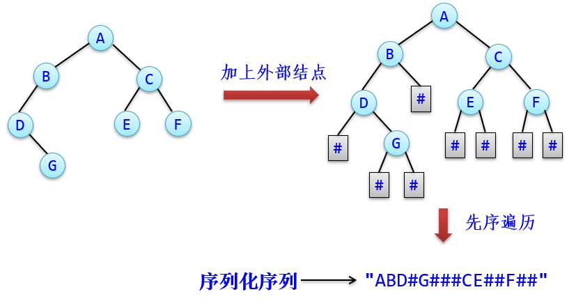

[TOC]


# 第1章 绪论

## 1.1 什么是数据结构

### 1.1.1 数据结构的定义


数据结构＝数据对象＋结构

数据结构中讨论的元素关系主要是指相邻关系或邻接关系。

1. 数据元素之间的逻辑关系：数据的逻辑结构。
2. 数据元素及其关系在计算机存储器中的存储方式：数据的存储结构（或物理结构）。
3. 施加在该数据上的操作：数据运算。

### 1.1.2 数据的逻辑结构

二元组：B=(D，R)。B是一种逻辑数据结构，D是数据元素的集合。

<x，y>，x为y的前驱元素，而y为x的后继元素。

若某个元素没有前驱元素，则称该元素为开始元素；若某个元素没有后继元素，则称该元素为终端元素。

对称序偶：若<x，y>∈r（r∈R），则<y，x>∈r（x，y∈D），可用圆括号代替尖括号，即(x，y)∈r。

逻辑结构的类型：集合，线性结构，树形结构，图形结构

### 1.1.3 数据的存储结构

存储结构：顺序存储结构，链式存储结构，索引存储结构，哈希（散列）存储结构

### 1.1.4 数据的运算

运算包括功能描述（或运算功能）和功能实现（或运算实现）。

### 1.1.5 数据结构和数据类型

数据类型是一组性质相同的值的集合和定义在此集合上的一组操作的总称。

抽象数据类型（ADT）指的是从求解问题的数学模型中抽象出来的数据逻辑结构和运算（抽象运算），而不考虑计算机的具体实现。

```
ADT 抽象数据类型名 
{  数据对象：数据对象的声明
   数据关系：数据关系的声明
   基本运算：基本运算的声明
} ADT 抽象数据类型名
```

## 1.2 算法及其描述

### 1.2.1 什么是算法

算法是对特定问题求解步骤的一种描述，它是指令的有限序列。

五个特性：有穷性，确定性，可行性，输入性，输出性。

## 1.3 算法分析

## 1.4 数据结构的目标

# 第2章 线性表

比较简单就不详细写了，反正也不可能考什么难题。

## 2.1  线性表的定义

线性表是具有相同特性的数据元素的一个有限序列。

所有数据元素类型相同。
线性表是有限个数据元素构成的。
线性表中数据元素与位置相关，即每个数据元素有唯一的序号。

## 2.2  线性表的顺序存储结构

理解结构就好了。

## 2.3  线性表的链式存储结构

理解结构就好了。

单链表，双链表，循环链表（循环单链表，循环双链表）

## 2.4 顺序表和链表的比较

当线性表的长度变化不大，易于事先确定的情况下，为了节省存储空间，宜采用顺序表作为存储结构。当线性表的长度变化较大，难以估计其存储大小时，为了节省存储空间，宜采用链表作为存储结构。

若线性表的运算主要是查找，很少做插入和删除操作，宜采用顺序表作为存储结构。若频繁地做插入和删除操作，宜采用链表作为存储结构。

## 2.5 线性表的应用—两个多项式相加

链表排序，加成另一个链表

## 2.6 STL中的线性表

别管，反正不考

# 第3章 栈和队列

## 3.1  栈

栈的定义：栈（stack）是一种只能在同一端进行插入或删除操作的线性表。

后进先出

顺序栈（注意-1的存在），共享栈


链栈（使用循环单链表最好）


简单表达式求值（难）

中缀表达式（1+1），后缀表达式（1#1#+）

```
while (若exp未读完)
{  从exp读取字符ch;
   ch为数字：将后续的所有数字均依次存放到postexp中;
   ch为左括号'('：将'('进栈到opor;
   ch为右括号')'：将opor栈中'('以前的运算符依次出栈并存放到
        postexp中,再将'('退栈;
   若ch的优先级高于栈顶运算符优先级，则将ch进栈；否则出栈并存放到
        postexp中直到该条件成立,再将ch进oper栈;
}
字符串exp扫描完毕,则退栈opor的所有运算符并存放到postexp中
```

(56-20)/(4+2*3)

```
56
56	-
56#20	-
56#20#-
56#20#-	/
56#20#-	/(
56#20#-#4	/(
56#20#-#4	/(+
56#20#-#4#2	/(+
56#20#-#4#2	/(+*
56#20#-#4#2#3#*#+	/
56#20#-#4#2#3#*#+#/
```

后缀表达式postexp求值

```
56
56,20
36
36,4
36,4,2
36,4,2,3
36,4,6
36,10
3.6
```

## 3.2  队列

先进先出

非循环（注意-1的存在，front不指向任何元素）


循环队列


一开始总归是空

入栈则注意可能变满（头等于尾则满），出栈则可能边空（头等于尾则满）

至于stl里面各种容器看的开心就好，反正不考。

迷宫问题（广度优先搜索罢了）

# 第4章  串

## 4.1 串的定义

串，串长度，空串，子串，主串，串相等

## 4.2 串的存储结构

顺序串，链串

## 4.3 STL中的string

不管

## 4.4 串的模式匹配

BF算法（一个一个对比，O(nm)）

KMP算法

abcac->-1,0,0,0,1


改进版

t[j]=t[next[j]]则nextval[j]=next[next[j]]

否则nextval[j]=next[j]


要能自己写出程序！！！

```
vector<int> getnextval(string small)
{
    vector<int> next_list(small.length());
    next_list[0] = -1;
    next_list[1] = 0;
    int j = 0,i=1;
    do
    {
        if(j==-1||small[j]==small[i]){
            i++;
            j++;
            if(small[j]==small[i]){
                next_list[i] = next_list[j];
            }else{
                next_list[i] = j;
            }
            
        }
        else{
            j = next_list[j];
        }
    } while (i<small.length());
    return next_list;
}

vector<int> getnext(string small)
{
    vector<int> next_list(small.length());
    next_list[0] = -1;
    next_list[1] = 0;
    int j = 0,i=1;
    do
    {
        if(j==-1||small[j]==small[i]){
            i++;
            j++;
            next_list[i] = j;
        }
        else{
            j = next_list[j];
        }
    } while (i<small.length());
    return next_list;
}

bool if_match(string small,string long_str){
    vector<int> next=getnextval(small);
    int i = 0;
    int j = 0;
    int small_length = small.length();
    do{
        
        if(j==-1||small[j]==long_str[i]){
            j++;
            i++;
        }else{
            j = next[j];
        }
        
    } while (i < long_str.length()&& j<small_length);
    
    if(j==small.length()){
        return true;
    }
    return false;
}

int main(){
    string a = "abcaabbabcabaacbacba";
    string b="aaaab";
    if_match(b, a);
}
```

# 第5章  数组和稀疏矩阵

## 5.1  数组

数组是二元组（idx，value）的集合，对每个idx，都有一个value值与之对应。idx称为下标，可以由一个整数、两个整数或多个整数构成，下标含有d（d≥1）个整数称为维数是d。

一维数组，一维数组

按行优先存储，按列优先存储

## 5.2  特殊矩阵的压缩存储

对称矩阵（变成下三角），上三角矩阵，下三角矩阵（注意是有带上对角线的），对角矩阵（从左到右一个一个排序）

# 第6章  递 归

## 6.1 什么是递归

直接递归（A中调用A），间接递归（A调用算法B，而B又调用A）

很多东西都可以递归（数据结构，算法….）

系统内部如何执行递归算法：一个递归函数的调用过程类似于多个函数的嵌套的调用，只不过调用函数和被调用函数是同一个函数。

时空分析（使用递归公式计算）

## 6.2 递归算法的设计

随便设计就好了，开心就好。（谁用谁傻，建议动态规划）

## 6.3 递归算法转换为非递归算法

尾递归，单向递归

用栈模拟转换法（放入问题，放入子问题，取出子问题求解，取出问题）

# 第7章  树和二叉树

## 7.1 树

树是由n（n≥0）个结点组成的有限集合（记为T）。如果n>0，这n个结点中存在（有仅存在）一个结点作为树的根结点（root），其余结点可分为m（m≥0）个互不相交的有限集T1、T2、…、Tm，其中每个子集本身又是一棵符合本定义的树，称为根结点的子树。

表示：树形表示法，文氏图表示法，凹入表示法，括号表示法


度，双亲结点，子孙结点，祖先结点，兄弟结点，结点层次，树的高度，森林

至于各种性质什么的自己画画图吧。

遍历：先根遍历，后根遍历，层次遍历

树的存储结构：双亲存储结构，孩子链存储结构，长子兄弟链存储结构

## 7.2 二叉树

二叉树也称为二分树，它是有限的结点集合，这个集合或者是空，或者由一个根结点和两棵互不相交的称为左子树和右子树的二叉树组成。

二叉树的5种形态：空二叉树，只有一个根结点的二叉树，右子树为空的二叉树，左子树为空的二叉树，左、右子树非空的二叉树

1. 在一棵二叉树中，如果所有分支结点都有左孩子结点和右孩子结点，并且叶子结点都集中在二叉树的最下一层，这样的二叉树称为满二叉树。
2. 若二叉树中最多只有最下面两层的结点的度数可以小于2，并且最下面一层的叶子结点都依次排列在该层最左边的位置上，则这样的二叉树称为完全二叉树。

二叉树性质

1. 非空二叉树上叶结点数等于双分支结点数加1。即n0=n2+1。
2. 非空二叉树上第i层上至多有2^i^-1个结点，这里应有i≥1。
3. 高度为h的二叉树至多有2^h^-1个结点（h≥1）。
4. 编号：从左到右，从上到下。
5. 具有n个（n＞0）结点的完全二叉树的高度为log2(n+1)或log2n+1。由完全二叉树的定义和树的性质4可推出。

二叉树存储结构：顺序存储结构，链式存储结构

## 7.3 二叉树先序、中序和后序遍历

二叉树遍历的概念：先序遍历（中左右），中序遍历（左中右），后序遍历（左右中）

## 7.4 二叉树的层次遍历

访问根结点（第1层）。从左到右访问第2层的所有结点。从左到右访问第3层的所有结点、…、第h层的所有结点。

使用队列的先进先出特点解决问题。

## 7.5 二叉树的构造

由先序遍历序列和中序遍历序列能够唯一确定一棵二叉树。
由后序遍历序列和中序遍历序列能够唯一确定一棵二叉树。
由先序遍历序列和后序遍历序列不能唯一确定一棵二叉树。


序列化和反序列化



```
void CreateBTree3(BTree& bt,string s)
//由序列化序列s创建二叉链：反序列化
{  int i=0;
   bt.r=CreateBTree31(s,i);
}

BTNode* CreateBTree31(string s,int& i)
//被CreateBTree3调用，其中参数i相当于全局变量
{  if (i>=s.length()) return NULL;		//i超界返回NULL 
   char d=s[i]; i++;				//取s[i]的值d 
   if (d=='#') return NULL;			//若为"#"，返回NULL
   BTNode* b=new BTNode(d);			//创建根结点(结点值为d)
   b->lchild=CreateBTree31(s,i);		//递归构造左子树
   b->rchild=CreateBTree31(s,i);		//递归构造右子树
   return b;
}
```

由于反序列化构造二叉树过程中不像先序/中序和后序/中序那样需要根结点值的比较，所以适合构造结点值相同的二叉树。

## 7.6 线索二叉树

对于n个结点的二叉树，在二叉链存储结构中有n+1个空链域。
利用这些空链域存放在某种遍历次序下该结点的前驱结点和后继结点的指针，这些指针称为线索，加上线索的二叉树称为线索二叉树。
线索二叉树分为先序、中序和后序线索二叉树。对二叉树以某种方式遍历使其变为线索二叉树的过程称为线索化。（人话就是反正那些二叉树空的指针闲着也是闲着，不如利用其顺便构造一个序列）


## 7.7  哈夫曼树

从树根结点到某个结点之间的路径长度与该结点权的乘积称为结点的带权路径长度。

> 一棵二叉树树中所有叶子结点的带权路径长度之和称为该树的带权路径长度。
>
> 
>
> WPL=1×3+3×3+5×2+7×1=29

哈夫曼树的构造算法

```
（1）根据给定的n0个权值W=(w1，w2，…，wn0)，对应结点构成n0棵二叉树的森林T=(T1，T2，…，Tn0)，其中每棵二叉树Ti（1≤i≤n0）中都只有一个带权值为wi的根结点，其左、右子树均为空。
（2）在森林T中选取两棵根结点权值最小的子树作为左、右子树构造一棵新的二叉树，且置新的二叉树的根结点的权值为其左、右子树上根的权值之和。称为合并，每合并一次T中减少一棵二叉树。
（3）重复（2）直到T只含一棵树为止。这棵树便是哈夫曼树。
```

  哈夫曼编码：表示叶子节点

在一组字符的哈夫曼编码中，任一字符的哈夫曼编码不可能是另一字符哈夫曼编码的前缀。

## 7.8 树/森林与二叉树的转换及还原

一棵树与二叉树的转换及还原


```
加线：在各兄弟结点之间加一连线，将其隐含的“兄－弟”关系以“双亲－右孩子”关系显示表示出来。
抹线：对任意结点，除了其最左子树之外，抹掉该结点与其他子树之间的“双亲－孩子”关系。
调整：以树的根结点作为二叉树的根结点，将树根与其最左子树之间的“双亲－孩子”关系改为“双亲－左孩子”关系，且将各结点按层次排列，形成二叉树。
```


```
加线：在各结点的双亲与该结点右链上的每个结点之间加一连线，以“双亲－孩子”关系显示表示出来。
抹线：抹掉二叉树中所有双亲结点与其右孩子之间的“双亲－右孩子”关系。
调整：以二叉树的根结点作为树的根结点，将各结点按层次排列，形成树。
```

森林与二叉树的转换及还原


```
转换：将森林中的每一棵树转换成二叉树，设转换成的二叉树为bt1、bt2、…、btm。
连接：将各棵转换后的二叉树的根结点相连。
调整：以bt1的根结点作为整个二叉树的根结点，将bt2的根结点作为bt1的根结点的右孩子，将bt3的根结点作为bt2的根结点的右孩子，…，如此这样得到一棵二叉树，即为该森林转换得到的二叉树。
```


```
抹线：抹掉二叉树根结点右链上所有结点之间的“双亲－右孩子”关系，分成若干个以右链上的结点为根结点的二叉树，设这些二叉树为bt1、bt2、…、btm。
转换：分别将bt1、bt2、…、btm二叉树各自还原成一棵树。
调整：将转换好的树构成森林。
```

## 7.9 并查集

给定n个结点的集合，结点编号为1～n，再给定一个等价关系，由等价关系产生所有结点的一个划分，每个结点属于一个等价类，所有等价类是不相交的。（人话就是确认两个元素是不是在同一个集合里面）
需要求一个结点所属的等价类，以及合并两个等价类。

用有根树来表示集合，树中的每个结点包含集合的一个成员，每棵树表示一个集合。
多个集合形成一个森林，以每棵树的树根作为集合的代表，并且根结点的父结点指向其自身，树上的其他结点都用一个父指针表示它的附属关系。


```
两棵分离集合树A和B高度相同时：任意一个根作为另外一个根的孩子->合并树的高度增加1，hC=MAX{hA，hB}+1。
两棵分离集合树A和B高度不相同时：将较低的根作为较高的根的孩子->合并树的高度不增加，hC=MAX{hA，hB}。
确认是不是同一个集合：看最上面那个元素是不是一样的。
```

# 第8章  图

## 8.1 图的基本概念

图G（Graph）由两个集合V（Vertex）和E（Edge）组成，记为G=(V，E)。

无向图和有向图，多重图，邻接点，起点，终点，顶点的度，入度，出度

完全无向图，完全有向图，稠密图，稀疏图

子图，路径，路径长度，简单路径

## 8.2 图的存储结构

邻接矩阵


邻接表（逆邻接表）


简化邻接表（就是邻接表的另一种表达）


## 8.3 图的遍历

看算法设计吧

深度优先（快），广度优先（找最值）

回溯法（深度优先的同时记录路径）

## 8.4 生成树和最小生成树

一个有n个顶点的连通图的生成树是一个极小连通子图。

连通图，非连通图

深度优先生成树，广度优先生成树

一个带权连通图G所有的生成树中，其中边上的权值之和最小的生成树称为图的最小生成树。

普里姆算法：不断的加入链接两个集合之间的最小边

```
（1）初始化U={v}。以v到其他顶点的所有边为候选边。
（2）重复以下步骤n-1次，使得其他n-1个顶点被加入到U中：
① 从候选边中挑选权值最小的边加入TE（所有候选边一定是连接两个顶点集U和V-U的边），设该边在V-U中的顶点是k，将顶点k加入U中。
② 考察当前V-U中的所有顶点j，修改候选边：若(k，j)的权值小于原来和顶点j关联的候选边，则用(k，j)取代后者作为候选边。
```

克鲁斯卡尔算法：不断加入全局最小的边，只要不形成回路

```
（1）置U的初值等于V（即包含有G中的全部顶点），TE的初值为空集（即图T中每一个顶点都构成一个分量）。
（2）将图G中的边按权值从小到大的顺序依次选取：若选取的边未使生成树T形成回路，则加入TE；否则舍弃，直到TE中包含n-1条边为止。
```

## 8.5 最短路径

狄克斯特拉算法：不断的走最短的路径，记录确认全局的最短路径，直到标记所有的点（计算某个点到剩下所有的点的距离）

狄克斯特拉（Dijkstra）算法不适合含负权的图求最短路径

弗洛伊德算法（找全局的点之间的最小距离）


要会写path矩阵变化即可

path[i\]\[j\]表示要从i到j的话，应该先从i到j临近的path[i\]\[j\]，再从path[i\]\[j\]走一步到j。
$$
path[i][j]=\left\{\begin{matrix}
 i & 有链接\\
 -1 & 无链接\\
\end{matrix}\right.
$$

## 8.6 拓扑排序

拓扑序列

当且仅当该顶点序列满足下列条件：若<vi，vj>是图中的有向边或者从顶点vi到顶点vj有一条路径，则在序列中顶点vi必须排在顶点vj之前。

```
（1）从有向图中选择一个没有前驱（即入度为0）的顶点并且输出它。
（2）从图中删去该顶点，并且删去从该顶点发出的全部有向边。
（3）重复上述两步，直到剩余的图中不再存在没有前驱的顶点为止。
```

一种是图中全部顶点都被输出，即得到包含全部顶点的拓扑序列，称为成功的拓扑排序。
另一种就是图中顶点未被全部输出，即只能得到部分顶点的拓扑序列，称为失败的拓扑排序。

## 8.7 AOE网与关键路径

若用一个带权有向图（DAG）描述工程的预计进度，以顶点表示事件，有向边表示活动，边e的权c(e)表示完成活动e所需的时间（比如天数），或者说活动e持续时间，即AOE网。

通常AOE网中只有一个入度为0的顶点，称为源点，和一个出度为0的顶点，称为汇点。


在AOE网中，从源点到汇点的所有路径中，具有最大路径长度的路径称为关键路径。完成整个工程的最短时间就是网中关键路径的长度。
关键路径上的活动称为关键活动，或者说关键路径是由关键活动构成的。
只要找出AOE网中的全部关键活动，也就找到了全部关键路径了。

```
ee(v)=0　　				      	当v为源点时
ee(v)=MAX{ee(x)+a，ee(y)+b，ee(z)+c}		否则
```

事件v的最迟开始时间：定义在不影响整个工程进度的前提下，事件v必须发生的时间称为v的最迟开始时间le(v)应等于ee(y)与v到汇点的最长路径长度之差： 

```
le(v)=ee(v)					当v为汇点时
le(v)=MIN{le(x)-a，le(y)-b，le(z)-c}		否则
```

# 第9章  查找

## 9.1 查找的基本概念

查找表，主关键字

查找：给定一个值k，在含有n个元素的查找表中找出关键字等于k的元素。若找到这样的元素，表示查找成功，返回该元素的信息或该元素在表中的位置；否则查找不成功或者查找失败，返回相应的指示信息。

## 9.2 线性表的查找

顺序查找，折半查找，

判定树或比较树（logn）


索引存储结构和分块查找

索引存储结构  =  数据表 + 索引表

分块查找

1. 查找索引表（有序）：可以顺序查找块，也可以二分查找块。
2. 查找数据块（无序）：只能顺序查找块中元素。

## 9.3 树表的查找

几种特殊树形结构—统称为树表。
这里的树表采用链式存储结构，由于链式存储结构既适合查找，也适合数据修改，属于动态查找表。
对于动态查找表，不仅要讨论查找方法，还讨论修改方法。

**二叉排序树**

若它的左子树非空，则左子树上所有结点值（默认为结点关键字）均小于根结点值。
若它的右子树非空，则右子树上所有结点值均大于根结点值。
左、右子树本身又各是一棵二叉排序树。


二叉排序树的插入和生成

```
若p为空，创建一个key为k的结点，返回将它作为根结点。
若k<p->key，将k插入p结点的左子树中并且修改p的左指针。
若k>p->key，将k插入p结点的右子树中并且修改p的右指针。
其他情况是k=p->key，说明树中已有关键字k，修改data值并返回p。
```

二叉排序树的查找：与折半查找类似（性能好的层数尽可能小）

删除结点


**平衡二叉树**

既保持BST性质又保证树的高度较小，通过这样的平衡规则和操作来维护O(log2n)高度的二叉排序树称为平衡二叉树，平衡二叉树有多种。
较为著名的有AVL树。

AVL树的高度平衡性质：树中每个结点的左、右子树的高度至多相差1。
也就是说，如果树T中结点v有孩子结点x和y，则|h(x)-h(y)|≤1，h(x)表示以结点x为根的子树高度。


AVL树插入结点的调整方法

LL型调整


RR型调整


LR型调整


RL型调整


**AVL树删除结点的调整方法**

（1）如果结点x左子树为空，用其右孩子结点替换它，即直接删除结点x。
（2）如果结点x右子树为空，用其左孩子结点替换它，即直接删除结点x。
（3）如果结点x同时有左右子树（这种情况下，结点x是通过值替换间接删除的，称为间接删除结点），分为两种情况：
若结点x的左子树较高，在其左子树中找到最大结点q，直接删除结点q，用结点q的值替换结点x的值。
若结点x的右子树较高，在其右子树中找到最小结点q，直接删除结点q，用结点q的值替换结点x的值。
（4）当直接删除结点x时，沿着其双亲到根结点方向逐层向上求结点的平衡因子，若一直找到根结点时路径上的所有结点均平衡，说明删除后的树仍然是一棵平衡二叉树，不需要调整，删除结束。若找到路径上的第一个失衡结点p，就要进行调整。
若直接删除的结点在结点p的左子树中。
若直接删除的结点在结点p的右子树中，调整过程类似。

**红黑树**

红黑树是一棵二叉排序树，每个结点有一个表示颜色的标志，增加外部结点（通常用nil表示），同时满足以下性质：

每个结点的颜色为红色或者黑色。
根结点的颜色为黑色。
所有外部结点的颜色为黑色。
如果一个结点是红色，则它的所有孩子结点为黑色。
对于每个结点，从该结点出发的所有路径上包含相同个数的黑色结点。

？？？？？

## 9.4 哈希表查找

设要存储的元素个数为n，设置一个长度为m（m≥n）的连续内存单元。
以每个元素的关键字ki（0≤i≤n-1）为自变量，通过一个哈希函数h把ki映射为内存单元的地址（或相对地址）h(ki)。
并把该元素存储在这个内存单元中。

对于两个不同的关键字ki和kj（i≠j）出现h(ki)=h(kj)，这种现象称为哈希冲突。（同义词冲突）

直接定址法：h(k)=k+c

除留余数法：h(k)=k mod p 

装填因子：α=n/m

开放定址法：发生冲突时查找周围一个空位置存放元素（记录）。设置一个查找周围一个空位置的函数。
线性探测法（d0=h(k)，di=(di-1+1) mod m  ），平方探测法（d0=h(k)， di=(d0±i^2) mod m  ）

拉链法

# 第10章  排序

## 10.1 排序的基本概念

排序：整理表中的元素，使之按关键字递增或递减有序排列。

在排序过程中，若整个表都是放在内存中处理，排序时不涉及数据的内、外存交换，则称之为内排序。
反之，若排序过程中要进行数据的内、外存交换，则称之为外排序。

比较的排序算法的性能：比较，移动

若待排序元素的关键字顺序正好和排序顺序相同，称此表中元素为正序。反之，若待排序元素的关键字顺序正好和排序顺序相反，称此表中元素为反序。

基于比较排序算法的平均时间复杂度不可能优于O(nlog2n)（log(n!)=nlog(n)）

如果待排序的表中，存在有多个关键字相同的元素，经过排序后这些具有相同关键字的元素之间的相对次序保持不变，则称这种排序方法是稳定的。反之，若具有相同关键字的元素之间的相对次序发生变化，则称这种排序方法是不稳定的。

## 10.2 插入排序

直接插入排序（O(n^2)）
折半插入排序（O(n^2)）
希尔排序（希尔排序是一种不稳定的排序算法）

1. 将n个元素分成d个组(d=n/2)
2. 将排序序列分为d个组，在各组内进行直接插入排序
3. 递减d=d/2，重复② ，直到d=0为止

## 10.3 交换排序

冒泡排序
快速排序：反复划分区域

核心问题：比较完怎么交换合适？


## 10.4 选择排序

简单选择排序（一种不稳定的排序方法）

堆排序

大根堆：对应的完全二叉树中，任意一个结点的关键字都大于或等于它的孩子结点的关键字。

```
#include<stdio.h>
void swap(int *a, int *b)
{
    int p;
    p = *a;
    *a = *b;
    *b = p;
}
void adjustheap(int *arr, int i, int len)
{
    int j = i*2+1;
    while(j < len)
    {
        if(j+1<len && arr[j] < arr[j+1]) //建立大堆,若左孩子小于右孩子,将j取值为右孩子的下标,右孩子再与父结点比较
        {
            j++;
        }
        //将左右孩子中，数值最大的与父结点进行比较,若孩子结点比父结点小,说明父结点的数值比左右孩子都大,不需要交换
        if(arr[i] > arr[j])
        {
            break;//说明该父结点和其孩子结点调整结束，退出循环，从下一个父结点调整
        }
        swap(&arr[i], &arr[j]);
        //交换之后还要考虑该目前j结点与自己的孩子结点的数值比较，还要进行调整,将i当前结点换成j结点所在位置
        i = j;
        j = 2*i+1;
    }
}
void makeheap(int *arr, int n)
{
    int i;
    for(i=n/2-1; i>=0; i--)//要从最后一个父节点开始调整堆
    {
        adjustheap(arr, i, n);
    }
}
void heapsort(int *arr, int len)
{
    int i = 0;
    makeheap(arr, len);
    //每次排出最大的一个元素之后，将该元素排除在堆外,调整堆后交换堆顶元素和堆的最后一个元素
    for(i=len-1; i>=0; i--)//所以要从元素最后一个开始
    {
        swap(&arr[i], &arr[0]);
        /*交换好堆后,重新调整堆*/
        adjustheap(arr, 0, i);      
    }
}
```

## 10.5 归并排序

二路归并算法

## 10.6 基数排序

基数排序就是利用多关键字排序思路，只不过将元素中的单个关键字分为多个位，每个位看成一个关键字。
