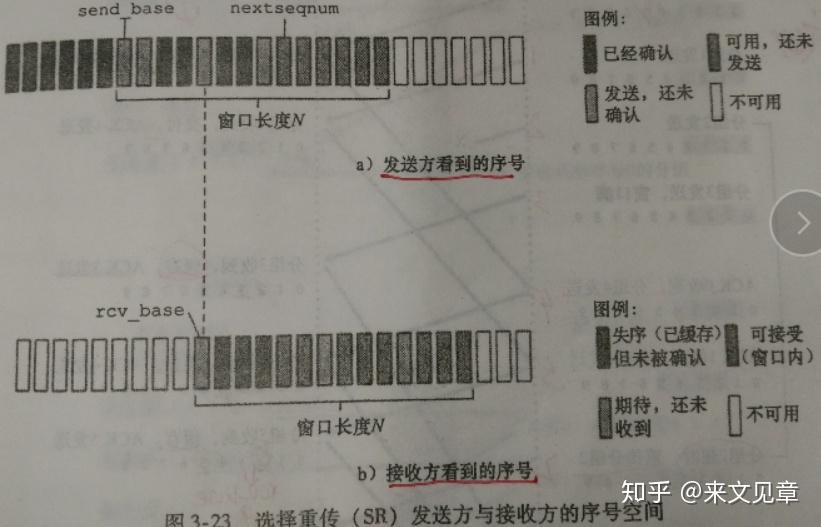
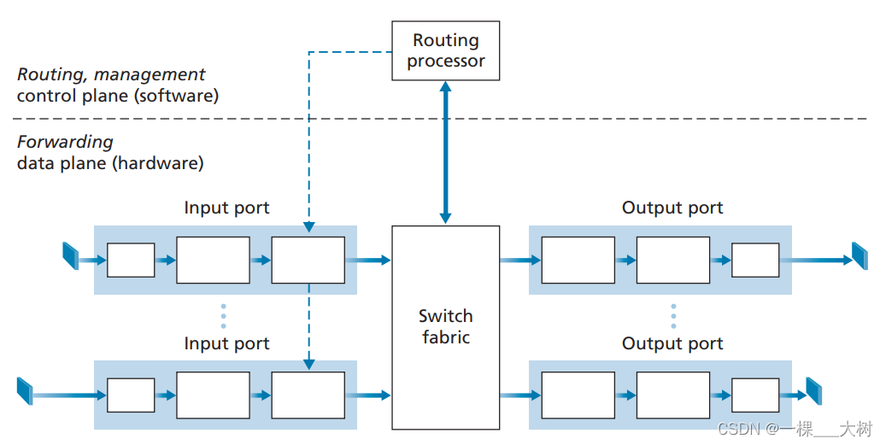
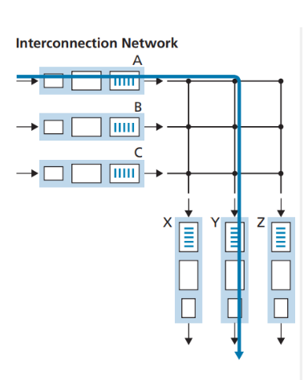

# 计算机网络

[toc]


## 第1章 概述

本章最重要的内容：

1. 互联网边缘部分和核心部分的作用，什么是分组交换？
2. 计算机网络的性能指标有哪些
3. 计算机网络分层次的体系结构是怎样的？什么是协议和服务？

**本章的重要概念**

互联网采用**存储转发的分组交换技术**和**三层 ISP 结构**

互联网按工作方式划分为**边缘部分**和**核心部分**：

1. **主机**在边缘部分，**作用**是**进行信息处理**。
2. **路由器**在核心部分，**作用**是**按存储转发方式进行分组交换**。

计算机网络最常用的 **7 个性能指标**：**速率，带宽，吞吐量，时延，时延带宽积，往返时间，信道利用率**。

**协议**是为进行网络中的数据交换建立的**规则**。计算机网络的各层和其协议的集合称为**网络的体系结构**。

**五层**的体系结构包括：**应用层、运输层、网络层、数据链路层、物理层**。运输层最重要的协议是 **TCP** 和 **UDP** 协议，网络层最重要的协议是 **IP** 协议。

**计算机网络**（简称**网络**）把许多计算机连接在一起。**互连网**把许多网络连接在一起，是**网络的网络**。

internet 是互连网，通用名词，泛指网络。**Internet** 是**互联网**，专用名词，特指全球最大的互连网。

互联网采用 **TCP/IP 协议族**作为通信规则，前身是美国的 ARPANET。

计算机通信是计算机中的**进程**（即运行着的程序）之间的通信。网络的通信方式是**客户-服务器方式**和**对等连接方式**。

客户和服务器都是通信中所涉及的应用进程。客户是服务请求方，服务器是服务提供方。

计算机网络按作用范围分为**广域网（WAN）**，城域网，**局域网（LAN）**，个人区域网（PAN）

### 1.1 计算机网络在信息时代中的作用

常见的网络有三大类：**电信网络、有线电视网络、计算机网络**。其中计算机网络是核心。

互联网即因特网，是 Internet 的译名（注意不是 internet）

>互联网（Internet) 与互**连**网的区别（Internet）
>
>1.internet是多个计算机网络通过路由器相连接而成，可以使用任意的通信协议，规模较小。
>
>2.Internet，特指全世界最大的计算机网络，由各大ISP和国际机构组建
>
>可以理解为，互连网是互联网的子集


互联网是由数量极大的各种计算机网络互连起来的。

互联网的两个基本特点：连通性、共享

互联网+ 的含义：互联网 + 各个传统行业

### 1.2 计算机网络概述

**1.2.1** **网络的网络**

**计算机网络**由多个结点和连接结点的链路组成。结点可以是计算机、集线器、交换机或路由器等。

>逻辑定义：一个将**众多分散的、自治**的计算机系统，通过通信设备和线路连接起来，由功能完善的软件来实现**资源共享和信息传递**的**系统**
>
>物理定义：一个完整的计算机网络主要由**硬件、软件、协议**三大部分组成，缺一不可。硬件主要由主机（端系统）、通信链路（如双绞线、光纤）、交换设备（如路由器、交换机等）和通信处理机（如网卡）等组成

网络之间可以通过路由器互连起来构成网络的网络，称为互连网。

网络把许多计算机连接在一起，互连网则把许多网络通过路由器连接在一起。与网络相连的计算机称为主机。

**1.2.2** **互联网基础结构发展的三个阶段**

internet 是互连网，通用名词，泛指网络。互连网之间的通信协议可以任意选择，不一定是 TCP/IP

**Internet** 是**互联网**，专用名词，特指全球最大的互连网。互联网采用 **TCP/IP 协议族**作为通信规则，前身是美国的 ARPANET。

**第三阶段的互联网**

现在的互联网是**多层次 ISP 结构**：分为主干ISP、地区ISP、本地ISP。

ISP 即互联网服务提供商，中国电信、中国联通、中国移动都是 ISP。

上网就是指接入到互联网。主机必须有 IP 地址才能上网。

ISP 从互联网管理机构申请到很多 IP 地址，同时拥有通信线路及路由器等联网设备。

用户向 ISP 交纳费用获得所需 IP 地址的使用权，然后就可以通过该 ISP 接入互联网。

互联网由全球无数的 ISP 所共同拥有。

**万维网（WWW）**是基于互联网开发的一种信息共享服务，浏览网址一般使用的就是万维网，而邮件等就没有用到万维网。

**1.2.3** **互联网的标准化工作**

所有的互联网标准都以 RFC 文档的形式发表在互联网上。互联网上有很多 RFC 文档，但只有少部分是互联网标准

### 1.3 计算机网络的组成

互联网按工作方式划分为边缘部分和核心部分：

1. 边缘部分：由连接到互联网的主机组成，作用是**进行信息处理(通信和资源共享）**。
2. 核心部分：由大量网络和连接网络的路由器组成，作用是按存储转发方式进行分组交换，**为边缘部分提供通信服务**。

**1.3.1** **计算机网络的边缘部分**

主机又称端系统，个人电脑、摄像头、手机等都属于端系统。

边缘部分利用核心部分提供的服务进行通信，一般称为计算机之间通信。

计算机之间的通信实际上是计算机 A 上某个进程和计算机 B 上另一个进程之间的通信。

通信方式主要有两类：客户-服务器方式、对等方式（P2P）。

**1.3.2** **计算机网络的核心部分**

核心部分最重要的功能是**分组交换**，主要组件是**路由器**。

路由器是实现分组交换的关键构件，用来转发分组。

**分组交换**

要发送的整块数据称为一个**报文**。将报文分为多个数据段，每个数据段加上一个**首部（包头）**构成一个**分组（包）**。

分组交换采用**存储转发技术**。路由器收到分组后，先暂时存储，检查首部，查找转发表，然后按照首部中的目的地址，找到合适的接口转发给下一个路由器，这样一步步交付给最终的目的主机。

**首部**中主要包含着目的地址、源地址等控制信息。

分组是在互联网中传送的数据单元。

**1.3.3 计算机网络的功能**

- 数据通信
- 资源共享
- 分布式处理
- 提高可靠性
- 负载均衡
- 信息综合处理

### 1.4 三种交换方式

1. 电路交换：呼叫双方在开始通话之前，首先由交换设备在两者之间建立一条专用电路，并且在整个通话期间独占该条电路直到结束。

   步骤：建立连接（占用通信资源，一条专用的物理通路）、通话（一直占用通信资源）、释放连接（归还通信资源）

   1. 缺点：在通话的全部时间内始终占用端到端的通信资源。
   2. 应用：电话使用的就是电路交换。而互联网数据因为其**突发性**，使用电路交换的话**效率很低**。

2. 报文交换：以报文作为传送单元。在这种交换方式中，发送方不需要提前建立起电路，不管接收方是否空闲，可随时向其所在的交换机发送消息。

   步骤：整个报文先传送到相邻结点，全部存储下来后查找转发表，转发到下一个结点。

   缺点：采用存储转发的机制；传输时延大且时延不确定；交换机需要足够大的存储器。

   优点：不需提前建立电路；不必等待接收方空闲，电路利用率高

   

   

3. 分组交换：将用户的消息划分为一定长度的数据分组，然后在**分组数据上加上控制信息和地址**，然后经过分组交换机发送到目的地址。

   单个分组传送到相邻结点，存储下来后查找转发表，转发到下一个结点。

   >拓展：虚电路与数据报：
   >1、虚电路在数据传输过程需要经历建立连接、数据传输、连接拆除3个阶段，有点类似于虚拟的专路；数据报通信的每个分组都需要独立的进行选路。
   >2、虚电路面向连接，数据报面向无连接。
   >3、虚电路分组头简单、传输效率高、分组不会失序；数据报分组头复杂、传输效率低、可避开拥塞、可能会出现失序。


### 1.5 计算机网络的类别

**1.5.1** **计算机网络的定义**

计算机网络并非专门用来传送数据，还支持很多其他应用。

**1.5.2** **几种不同类别的计算机网络**

* **广域网WAN：**互联网的核心部分，连接广域网各结点的一般使高速链路。
* **城域网MAN：**很多城域网采用的是以太网技术，常并入局域网进行讨论
* **局域网LAN：**一般通过高速通信线路相连，地理范围较小。校园网、企业为一般为局域网
* **个人区域网PAN：**范围很小，一般在 10m 左右。

**接入网**

接入网 AN 是用来把用户接入到互联网的网络。

接入网既不属于核心部分，也不属于边缘部分，而是位于端系统到互联网中第一个路由器之间的一种网络。

宽带接入网就是一种接入网。


### 1.6 计算机网络的性能

**1.6.1** **计算机网络的性能指标**

常用的 7 个性能指标：

1. **速率**
2. **带宽**
3. **吞吐量**
4. **时延**
5. **时延带宽积**
6. **往返时间**
7. **利用率**

**速率**

速率是计算机网络中最重要的性能指标。

速率是数据的传送速率，单位是 **bit/s**，有时也写为 **bps**。

1G 速率实际上是 1Gbit/s 而不是 1Gbyte/s。提到网络速率时，一般指的是**额定速率**或**标称速率**。

**带宽**

带宽有**两种意义**：

1. 某个信号具有的频带宽度，是一个赫兹范围。表示某信道允许通过的信号**频带范围**就称为该信道的带宽。是频域称谓，单位**Hz**
2. 计算机网络中，带宽表示网络中某通道传送数据的能力，网络带宽表示单位时间内网络中的某信道所能通过的最高数据率，单位是 **bit/s**。是时域称谓。

**吞吐量**

吞吐量表示单位时间内通过某个网络的**实际**的数据量。经常用于对现实世界中的网络的一种测量。

吞吐量受网络的带宽或额定速率的限制。取其中的min


取设备中最小的带宽

**时延**

时延是数据从网络的一端传送到另一端所需的时间。

网络中的时延由以下几个不同的部分组成：

1. **发送时延**：主机或路由器发送数据帧所需的时间，即从发送数据帧的第一个比特到最后一个比特发送完毕的时间，也叫**传输时延(从网卡或者路由器队列递交网络链路所需要的时间)**。
   1. 计算公式：**发送时延 = 数据帧长度/发送速率**。
   2. 发送速率越快，发送时延越低。
2. **传播时延**：传播时延是电磁波在信道中传播一定的距离花费的时间。

   1. 计算公式：**传播时延=信道长度 / 电磁波在信道上的传输速率。**
   2. 电磁波在网络中的传输速率比真空中低，在铜线中为 2.3 亿米每秒，在光纤中是 2 亿米每秒。
   3. 距离越长，传输时延越长。
3. **处理时延**：主机或路由器在收到分组时要花费时间处理数据，如分析分组的首部，从分组中提取数据部分，差错检验等等。
4. **排队时延**：分组在经过网络传输时要经过许多路由器，要在路由器中排队等待转发。
   1. 网络的通信量越大，排队时延越长。

**总时延 = 发送时延 + 传播时延 + 处理时延 + 排队时延**。

**高速链路（高带宽链路）**相比其他提高的是数据的发送速率，减小发送时延。光纤传输速率高即向光纤信道发送数据的速率高。

**时延带宽积**

时延带宽积 = 传播时延 \* 带宽。

时延带宽积表示的是一个管道的体积，表示**这个链路可容纳的比特，或者说同一时刻正在链路上传送的数据**。

只有链路中充满了比特时，链路才得到充分的利用。

```
例题：考虑两台主机 A 和主机 B 由一条带宽为 R bps、长度为 M 米的链路互连，信号传播速率为 V m/s。假设主机 A 从 t=0 时刻开始向主机 B 发送分组，分组长度为 L 比特，试求：(注：1 k = 103, 1 M = 106)

传播时延：dp = 信道长度(m) / 电磁波在信道上的传播速率(m/s) = M / V
传输时延：dt = 数据帧长度(b) / 信道带宽(b/s) = L / R
若忽略结点处理延迟和排队延迟，求端到端延迟 de
端到端总延迟：de = 传播时延 + 传输延迟 = M / V + L / R

若 dp > dt，则 t = dt 时刻，分组的第一个比特在哪里？
ans:  dp > dt 意味着最早发送的信号没有到达目的主机之前，数据分组的最后一个比特已经发送出来
了，所以分组的第一个比特在距离主机的 V * dt 米的链路上

若 V = 250000 km/s，L = 512 bit，R = 100 Mbps，则使带宽时延积刚好为一个分组长度（即 512 bit）的链路长度M是多少？
时延带宽积 = 传播时延 * 带宽 = M / V * R = 512，解之得 M = 1280 m
```


**往返时间**

A 向 B 发数据后需要收到 B 发回的确认信息才会继续发送数据，A 发完数据后等待确认信息的时间就是**往返时间（RTT）**。

有效数据率 = 数据长度 / ( 发送时间 + RTT )。

在互联网中，往返时间还包括各中间结点的处理时延、排队时延和转发数据时的发送时延等。

**一定程度反映了网络拥塞程度的变化。**

使用卫星通信时，**往返时间会比较长，是很重要的指标**。

**利用率**

利用率有信道利用率和网络利用率两种：

1. **信道利用率：**信道有百分之多少的时间是被利用的，即有数据通过。
2. **网络利用率：**全网络的信道利用率的加权平均值。

>例如：A发送分组需要的时间为TD，分组确认时间为TA，往返时间为RTT
>
>

信道利用率并非越大越好，因为根据排队论，当利用率增大时，信道引起的时延也会迅速增加。

D0 为网络空闲时的时延，则网络当前时延 D 和利用率 U 之间的关系为： **D = D0 / (1 - U）。**

当利用率 U 达到 0.5 时，时延就要加倍。利用率接近 1 时，时延会趋于无穷。


**1.6.2** **计算机网络的非性能特征**

费用、质量、标准化、可靠性、可扩展性和可升级性、易于管理和维护

**1.7** **计算机网络体系结构**

计算机的体系结构是分层次的。

**1.7.1** **计算机网络体系结构的形成**

两个计算机之间通信要完的工作：

1. 发起通信的计算机必须将数据通信的通路进行激活。
2. 告诉网络如何识别接收数据的计算机
3. 发起通信的计算机必须查明对方计算机是否已开机，并且与网络连接正常。
4. 发起通信的计算机中的应用程序必须清楚，对方计算机中的文件管理程序是否已做好接收文件和存储文件的准备工作。
5. 若计算机的文件格式不兼容，至少其中一台计算机可以完成格式转换。
6. 如果出现差错或意外事故，应有可靠的措施保证对方计算机最后收到正确的文件。

相互通信的计算机系统必须高度协调工作才可以完成通信。

OSI 的七层协议的体系结构是法律上的国际标准。

应用最广泛的、事实上的国际标准是 **TCP/IP**。互联网即采用的 TCP/IP。

**1.7.2** **协议与划分层次**

**网络协议**（简称**协议**）是为进行网络中的数据交换而建立的规则、标准或约定。

网络协议规定了网络中交换的数据的格式和有关的同步问题。

协议主要由**三个要素组成：**

1. **语法：**数据与控制信息的结构或格式
2. **语义：**需要发出何种控制信息，完成何种动作以及做出何种响应
3. **同步：**时间实现顺序的详细说明

网络协议是分层的，分层的好处：

1. 各层之间互相独立。某一层并不知道另一层是如何实现的，只知道接口。
2. 灵活性好。只要接口不变，一层发生变化不影响另一层。
3. 结构上可分割开。
4. 易于实现和维护。
5. 能促进标准化工作。

各层需要完成的工作包括一下的一种或多种：

1. **差错控制。**使通信更加可靠。
2. **流量控制。**发送端的发送速率必须使接收端来得及接受，不能太快。
3. **分段和重装。**发送端将数据分块，接收端还原。
4. **复用和分用。**发送端几个高层会话复用一条低层的连接，在接收端再进行分用。
5. **连接建立和释放**。交换数据前先建立一条逻辑连接，数据传送结束后再释放。

计算机网络的各层及其协议的集合就是网络的体系结构。

**1.7.3** **具有五层协议的体系结构**

**TCP/IP** 是个四层的体系结构，包含**应用层、运输层、网际层和网络接口层**。实质上 TCP/IP 只有上三层，最下面的网络接口层没什么内容。


这里以五层协议为例来学习，五层协议中的物理层和数据链路层对于 TCP/IP 中的网络接口层。

**应用层**

任务：通过应用进程间的交互来完成特定网络应用。

应用层协议定义的是应用进程间通信和交互的规则。进程即主机中正在运行的程序。

互联网中的应用层协议有**域名系统 DNS**，支持万维网应用的 **HTTP 协议**，支持电子邮件的 **SMTP 协议**等。

应用层交互的数据单元称为**报文**。

>常见的几个协议：FTP、Telnet、SMTP、HTTP、RIP、NFS、DNS

**运输层**

任务：负责向两台主机中进程之间的通信提供通用的数据传输服务。应用层利用该服务传输应用层报文。

运输层有**复用**和**分用**的功能。因为一台主机有多个进程，复用就是多个应用层进程可同时使用下面运输层的功能。

运输层主要使用两种协议：

1. **传输控制协议 TCP**：提供面向连接的、可靠的数据传输服务。数据传输的单位是**报文段**。
2. **用户数据报协议 UDP**：提供无连接的、尽最大努力的数据传输服务，不保证数据传输的可靠性。数据传输的单位是**用户数据报**。

**网络层**

任务：为分组交换网上的不同主机提供通信服务；选择合适的路由。

发送数据时，网络层把运输层产生的报文段或用户数据报封装成分组或包进行传送。

TCP/IP 体系中，**网络层使用 IP 协议**，因此分组也叫 **IP 数据报**，或简称数据报，但注意这与用户数据报不同。

互联网使用无连接的网际协议 IP。

无论哪一层的数据单元，都可以笼统地用“分组”来表示。

**数据链路层**

任务：将网络层交下来的 IP 数据报组装成帧，在**两个相邻结点的链路**上传送帧。

每一帧包括数据和必要的控制信息（包括同步信息、地址信息、差错控制等）。

**物理层**

物理层传输的单位是比特。


上图中为主机1的 AP1 进程向主机2 的 AP2 进程间传送数据的过程。

第5层、第4层、第3层分别为数据加上了属于本层的控制信息，都位于首部。第2层的控制信息分为两部分加到了首部和尾部。

对等层次间的数据单位称为该层的**协议数据单元**。

在路由器中，分组上升到第3层，过程中每一层都根据控制信息进行必要的操作并将该控制信息剥去。在第三层根据首部中的目的地址查找路由器中的转发表，找出转发分组的接口，然后依次加上新的控制信息下降到第1层，将数据发送出去。

理解：上图可以发现网际层的控制信息用于整个网络，而链路层的控制信息仅用于两个节点之间。路由器只到第3层。

**1.7.4** **实体、协议、服务和服务访问点**

**实体**表示可发送或可接收信息的硬件或软件进程。

**协议**是控制两个对等实体间进行通信的规则的集合。

在协议的控制下，两个对等实体间的通信使得本层能够向上一层提供服务。要实现本层协议，也需要下一层提供的服务。

上层使用下层提供的服务必须通过与下层交换一些命令，即**服务原语**。

同一系统中相邻两层的实体交互的地方称为**服务访问点**，实际上就是一个逻辑接口。

协议必须把所有不利的条件都事先估计到，确保能应对所有异常情况。

**1.7.5 TCP/IP的体系结构**

技术的发展不严格遵循分层概念，事实上现在某些应用程序可以直接使用 IP 层甚至网络接口层，如下图。


TCP/IP 协议族中的多种协议如下所示：

.png)

### 第一章 FAQ:

1. 互联网边缘部分和核心部分的作用？

   >边缘部分包括主机，作用是进行信息处理；核心部分包括路由器等，作用是按存储转发方式进行分组交换

2. 网络的体系结构是什么？

   >网络的各层及其协议的集合

3. 五层的体系结构是哪五层？TCP/IP 采用了几层？OSI 采用了几层

   >物理层、数据链路层、网络层、运输层、应用层。TCP/IP 采用了四层结构，将物理层和数据链路层合并为了网络接口层。OSI 采用了七层，它将应用层进一步分为了 3 层。

4. 互联网采用的是什么协议？

   >TCP/IP 系列协议

5. 常见的三种网络是哪三种？

   >有线电视网络、电信网络、计算机网络

6. 什么是 ISP，它有什么作用

   >ISP 是互联网服务提供商（国内三大运营商），它们掌握着很多 IP 地址与互联网基础设施。用户向 ISP 缴费以获得 IP 地址使用权。

7. 互联网的两种通信模式是什么?

   >服务器-客户端模式和对等模式（P2P）

8. 什么是分组？什么是分组交换？存储转发技术是怎样的？

   >分组时互联网中传送的基本单元，将分段的报文加上一个首部就构成了一个分组。存储转发技术即路由器收到分组后先暂时存储，然后检查首部，查找转发表，将分组发给下一个合适的路由器，一步步到达目的主机。

9. 什么是接入网？

   >用户接入到互联网的网路

10. 带宽的两种含义？

    >一种时频率上的范围，另一种是某一信道单位时间内可传输的最高数据率。

11. 网络中的时延的组成部分

    >发送时延、传播时延、处理时延、排队时延

12. 高速链路的高速体现在哪部分时延上？

    >高速链路的发送时延较短。光纤就是发送数据比较快，发送时延短。

13. 互联网有哪些应用层协议

    >DNS 协议、HTTP 协议、SMTP 协议、FTP 协议、P2P 协议

14. 运输层的两个主要协议。运输层的服务对象是什么？

    >TCP 和 UDP 协议。运输层服务对象是主机中的进程

15. 网络层的主要协议是什么。网络层的服务对象是什么？

    >IP 协议。网络层服务对象是不同的主机

16. 路由器会处理几层？

    >三层：最高到网络层

17. 网络层和链路层的控制信息的影响范围差异

    >网络层的控制信息用于从源主机到目的主机的整个网络。链路层的控制信息仅用于两个相邻路由器之间。


## 第2章 物理层

本章最重要的内容：

1. 物理层的任务
2. 几种常用的信道复用技术
3. 几种常用的宽带接入技术，主要是 ADSL 和 FTTx

### 2.1 物理层的基本概念

物理层关注的是如何在连接各种计算机的传输媒体上传输数据流。**物理层的任务**是尽可能屏蔽掉不同传输媒体和通信手段间的差异，使链路层感受不到这种差异。

**物理层的主要任务**：确定与传输媒体的接口有关的一些特性：

1. **机械特性：**指明接口所用接线器的形状、尺寸等机械特性。
2. **电气特性：**指明接口电缆的各条线上的电压的范围。
3. **功能特性：**指明电线上某一电平的电压的意义。
4. **过程特性：**指明不同功能的各种可能事件的出现顺序。

数据在计算机内部一般是并行传输，但在通信线路上是串行传输，所以物理层还要完成传输方式的转换。

物理层协议很多，因为物理连接的方式很多，传输媒体的种类也很多。

### 2.2 数据通信的基础知识

**2.2.1** **数据通信系统的模型**

一个**数据通信系统**可划分为源系统、传输系统、目的系统，或称为发送端、传输网络、接收端。

源系统包括源点和发送器。典型的发送器是**调制器**。

目的系统包括接收器和终点。典型的接收器是**解调器**。

通信的目的是传送**消息**，**数据**是运送消息的实体，**信号**是数据的电气或电磁的表现。

信号可分为**模拟信号**和**数字信号**。

**2.2.2** **有关信道的几个基本概念**

信道不等于电路，信道表示向某一方向传送信息的媒体，一条通信电路通常包含一条发送信道和一条接受信道。

**通信方式**

信息交互有以下三种基本方式：

1. 单向通信，又称单工通信。如有线电广播等。需要一条信道。
2. 双向交替通信，又称半双工通信。需要两条信道。
3. 双向同时通信，又称全双工通信。需要两条信道。

**调制**

来自信源的信号成为**基带信号**，因为基带信号中包含较多低频成分，而许多信道不能传输低频分量和直流分量，所以需要对基带信号调制。

调制可分为两大类：

1. **基带调制**：将数字信号转换为另一种数字信号。又称编码。
2. **带通调制：**将基带信号的频率范围转换为另一频段，并化为模拟信号。

**常用编码方式**


**不归零制**：正电平代表1，负电平代表0。

**归零制**：正脉冲代表1，负脉冲代表0。

**曼彻斯特编码：**位周期中心的向上跳变代表0，向下跳变代表1。

**差分曼彻斯特编码：**每一位的中心都有跳变。位开始的边界有跳变代表0，没有代表1。

曼彻斯特码的频率比不归零制高，但有自同步能力，即可以从信号波形自身中提取信号时钟频率。

**基本带通调制方法**


**2.2.3** **信道的极限容量**

数字通信的优点：信号在信道上传输时必然会失真，但只要能识别出原有信号，就没有影响。

传输速率越高，或距离越远，或噪声越大，失真就越严重。

**信道能通过的频率范围**

信道中码元传输的速率有上限，超过上限会出现严重的码间串扰问题，接收端无法识别编码。

信道的频带越宽，能通过的高频分量越多，最大速率越高。

**信噪比**

信号的平均功率与噪声的平均功率之比，写作 S/N，单位是分贝（dB）

信噪比 = 10 log10(S/N)。

**香农公式**

信道的极限传输速率 C = W log(2+S/N)。

香农公式表明带宽越大，信噪比越大，极限传输速率越高。还表明只要信息传输速率低于信道的极限速率，就一定可以实现无差错传输，但方法未知。

另一种提高传输速率的方法：通过编码让每个码元携带更多比特的信息。

### 2.3 物理层下面的传输媒体

传输媒体分为**导引型**和**非导引型**两大类。

导引型中电磁波沿着固体媒体传播，非导引型中传输媒体就是自由空间，又称无线传输。

**2.3.1** **导引型传输媒体**

导引型传输媒体有架空明线，双绞线，同轴电缆，光纤等。

光纤的传输带宽远大于其他传输媒体的带宽。

**2.3.2** **非导引型传输媒体**

利用无线信道进行传输是**运动中通信**的唯一手段。

短波通信质量较差，速率较低。无限电微波通信可传输电话、图像、数据等信息。紫外线及更高波段目前还不能用于通信。

卫星通信的优点是通信距离远，缺点是传播时延高，保密性差。

### 2.4 信道复用技术

**信道复用**：多个发送端使用同一条信道来传输信息。

发送端使用复用器将不同的信息合起来传输，接收端使用分用器将信息分开。

**2.4.1** **频分复用、时分复用和统计时分复用**

三种复用：

1. **频分复用FDM**：每个用户分配一个频带，通信中始终占用该频带。用户在同样时间占用不同的频带。
2. **时分复用TDM：**将时间划分为等长的帧，每个用户在每个帧中占用其中一个固定序号的间隙。用户在不同时间占用同样的频带。
   1. 因为计算机数据的突发性，时分复用的信道利用率比较低。
3. **统计时分复用STDM：**一种改进的时分复用，又称异步时分复用。STDM不是固定分配时隙，而是按需动态地分配时隙。

**2.4.2** **波分复用**

**波分复用WDM**就是光的频分复用。

一根光纤上可以复用几十路甚至更多的光载波信号。光信号传输一定距离后会衰减，因此需要使用**光纤放大器**放大后继续传输。

**2.4.3** **码分复用**

**码分复用CDM：**不同用户使用不同码型，在同样时间使用同样的频带通信。

如对某一个用户，序列00011011表示比特1,11100100表示比特0。其他用户的码片序列必须与此用户的序列相互正交。

码分复用实际上是一种**扩频通信**。无线局域网中常用CDM。

### 2.5 数字传输系统

数字通信相比模拟通信，在传输质量和经济上都更好。

光纤是长途干线最主要的传输媒体。

**同步数字序列 SDH** 和**同步光纤网 SONET** 是当前最主要的**数字传输国际标准**。简称 **SONET/SDH 标准**

### 2.6 宽带接入技术

用户连接到互联网，要先连接到某个 ISP，以便获得上网所需的 IP 地址。

**宽带接入网**是接入网的一种，即一种用来把用户接入到互联网的网络。

宽带接入可分为**有线宽带接入**和**无线宽带接入**。

**2.6.1 ADSL技术**

**非对称数字用户线 ADSL 技术**是用数字技术对现有的模拟电话用户线进行改造，使其能够承载宽带数字业务。

标准模拟电话信号的频带在 300\~3400Hz 范围，ADSL技术将 4000Hz 以下的频带留给传统电话，4000Hz 以上用于上网。

因为用户一般都是下载，ADSL 的下行带宽（从 ISP 到用户）远大于上行带宽，所以叫做非对称。

ADSL 的好处是可以利用现有的电话线，缺点是传输距离有限，并且不能保证固定的数据率。ADSL 的速率依赖于用户线的质量、长度、线径等。

ADSL在用户线（铜线）的两端各安装一个ADSL解调器。采用**基于频分复用的 DMT 调制技术**，将 4kHz 以上的频带划分为许多子信道，其中 25 个子信道用于上行，249 个子信道用于下行。

类似 ADSL 还有许多其他 xDSL 技术，速度更快，但在国内应用较少。

**2.6.2** **光纤同轴混合网(HFC网)**

**光纤同轴混合网（HFC网）**是基于有线电视网开发的一种宽带接入网。

为提高传输的可靠性和质量，HFC网将原有线电视网的同轴电缆主干部分改换为了光纤。

光纤从头端连接到光纤结点，在**光纤结点**处光信号转换为电信号，连接到一个光纤结点的典型用户数为500。

光纤节点与头端的典型距离为 25km，到用户的距离不超过 3km。


用户通过**电缆调制解调器**来使用 HFC 网，它比 ADSL 中的解调器复杂很多，因为要解决共享信道中的冲突问题。

使用 HFC 网的数据率大小不确定，它取决于这段电缆上有多少个用户正在传送数据，如果有很多人在用，每个人的速率会很慢。

**2.6.3 FTTx技术**

**光纤到户 FTTH(Fiber To The Home)** 是把光纤一直铺设到用户家庭，在光纤进入用户家中后才把光信号转换为电信号，这样的上网速率最快。

现在信号在陆地上的长距离传输基本都是使用的光缆，在 ADSL 和 HFC 中长距离传输也是用的光缆。

多个用户通过**光配线网**共享一根光纤干线，光配线网使用波分复用，上行和下行使用不同的波长。

出光纤到户 FTTH 外，还有光纤到大楼 FTTB，光纤到楼层 FTTF 等，一般运行商所说的光纤到户并非真正的 FTTH。

### 第二章 FAQ：

1. 物理层的任务是什么？

   >屏蔽掉不同传输媒体和通信手段间的差异，使链路层感受不到这种差异。

2. 五种信道复用方式?

   >时分复用、频分复用、统计时分复用、码分复用、波分复用

3. 三种宽带接入方式？

   >非对称数字用户线（ADSL技术，基于电话用户线改造）、光纤同轴混合网（HFC网）、FTTx 技术（光纤到 x 技术）


## 第3章 数据链路层

本章最重要的内容：

1. 数据链路层的点对点信道和广播信道的特点。PPP 协议和 CSMA/CD 协议的特点。
2. 数据链路层的三个基本问题：封装成帧、透明传输、差错检测。
3. 以太网 MAC 层的硬件地址。
4. 适配器、转发器、集线器、网桥、以太网交换机的作用和使用场合。


路由器转发分组时只涉及到下面三层。

### 3.1 使用点对点信道的数据链路层

**3.1.1** **数据链路和帧**

**数据链路**既包含物理线路也包含必要的通信协议，将实现协议的软件和硬件加到链路上就构成了数据链路。

常用**网络适配器**（既包括硬件也包括软件）来实现这些协议，一般适配器包括了数据链路层和物理层两层的功能。

**帧**是点对点信道的数据链路层的**协议数据单元**。网络层的协议数据单元是**IP数据报**，又称分组。

数据链路层将网络层交下来的数据构成帧发送到链路上，以及把接收到的帧里的数据取出并上交给网络层。


点对点信道的数据链路层在通信时的**主要步骤：**

1. 结点A的数据链路层把网络层交下来的IP数据报加上首部和尾部封装成帧。
2. 结点A把封装好的帧发送给结点B。
3. 结点B对接收到的帧进行差错检验，若无差错，从帧中提取出IP数据报上交给网络层，若有差错丢弃这个帧。

**3.1.2** **三个基本问题**

数据链路层的三个基本问题：**封装成帧、透明传输、差错检验**

**封装成帧**

给 IP 数据报加上首部和尾部就构成了数据链路层的帧，IP 数据报成为帧的数据部分。

链路层协议规定了帧中数据部分的长度上限——**最大传送单元（MTU）**。

首部和尾部包括**帧定界符**（即确定帧的界限）和其他控制信息。

帧定界符包括开始符（SOH）和结束符（EOT），分别是一串8为二进制数字。

帧定界符的作用：确定帧的界限。当出现差错时可以根据帧定界符识别是否是一个完整的帧。

**透明传输**

透明传输是因为控制字符产生的。

**透明传输即表示无论传送什么样的数据，都能按照原样无差错地通过数据链路层。**

**字节填充**：**因为存在帧定界符，如果传输的数据中出现了和SOH、EOT等控制字符一样的文本，就在文本前面插入一个**转义字符（ESC），接受端收到数据后在发送给网络层之前删除这个插入的转义字符。如果转义字符也出现在数据中，就在它前面再插入一个转义字符。


**差错检测**

**比特差错：**传输时产生差错，0变成了1或1变成了0.

**误码率BER：**一段时间内，传输错误的比特占所传输比特总数的比率。提升信噪比可以减小误码率。

差错检验的方法：**循环冗余检验CRC**

**循环冗余检验的原理：**

在要传输的数据后加上n位的冗余码（成为**帧检验序列FCS**），如何得出冗余码：让数据乘以2^n（相当于在后面加了n个0），然后除以一个事先约定的 n+1 位的除数P，得出 n 位的余数 R 就作为冗余码加到数据后面。接收端将收到的每一个帧除以同样的除数 P，若余数为 0 就表明没有差错，否则就是有差错，丢弃这个帧。

循环冗余检验使用硬件完成，速度很快。

循环冗余检验只能识别比特差错，无法识别帧丢失、帧重复、帧失序，因此不是可靠传输。

对于通信质量较差的无线传输链路，数据链路层协议使用帧编号、确认和重传机制。即接收方收到正确的帧就向发送方发送确认，如果发送方没有收到确认就表明出现差错，就进行重传直到收到对方的确认。

对于通信质量较好的有线传输链路，只进行CRC检验，不使用确认和重传机制，即不需要数据链路层向上提供可靠传输，而是由上层协议来改正差错。

本章的 **PPP 协议**和 **CSMA/CD 协议**都不是可靠传输的协议。

### 3.2 点对点协议PPP

**点对点协议 PPP** 是目前点对点链路中应用最广泛的数据链路层协议。

**3.2.1 PPP协议的特点**

PPP 协议是用户和 ISP 通信时使用的数据链路层协议。

**PPP** **协议应满足的需求**

1. **简单**。这是首要的需求。互联网体系结构中最复杂的部分在 TCP 协议中，网际协议 IP 和数据链路层协议都不是可靠传输。
2. **封装成帧**。PPP 协议规定使用特殊的字符作为帧定界符。
3. **透明传输**。
4. **支持多种网络层协议。**PPP 协议要能够在同一条物理链路上同时支持多种网络层协议。
5. **支持多种类型链路**。包括串行的或并行的、同步的或异步的等。例如 PPPoE（在以太网上运行的PPP），用户通过以太网上网时使用的是PPPoE协议，它将 PPP 帧再封装到一个以太网帧中。
6. **差错检测。**如果收到有错的帧就丢弃。
7. **最大传送单元**。要为每一种类型的点对点链路设置最大传送单元MTU。注意 MTU 是数据部分的最大长度。
8. **网络层地址协商。**PPP 协议要提供一种机制使通信的两个网络层的实体能通过协商知道彼此的网络层地址。
9. **数据压缩协商**。PPP 协议要提供一种方法来协商使用数据压缩算法。

TCP/IP 协议族中，可靠传输由 TCP 协议负责。PPP 不负责纠错等。PPP 只支持点对点的链路通信，且只支持全双工链路。

**PPP** **协议的组成**

PPP 协议有**三个组成部分：**

1. 一个将 IP 数据报封装到串行链路的方法。
2. 一个用来建立、配置和测试数据链路连接的**链路控制协议LCP**。
3. 一套**网络控制协议 NCP**，其中的每一个协议支持不同的网络层协议。

**3.2.2 PPP协议的帧格式**

**各字段的含义**

PPP 的首部和尾部分别为4个字段和2个字段。

首部的第一个字段和尾部的第二个字段都是**标志字段 F，**规定为 0x7E，它标志着一个帧的开始或结束。两个连续的帧之间只需要一个 F，如果连续出现两个标志字段，表示这是一个空帧，应该丢弃。

首部的第二个和第三个字段 目前都没有实际含义。第四个字段是 2 字节的协议字段，它表明了信息部分的数据类型（可能是IP数据报也可能是其他类型的数据）。**尾部的第一个字段是帧检验序列 FCS。**


**字节填充**

PPP 使用异步传输时使用了**字节填充**，转义符为 0x7D。

**零比特填充**

PPP 协议用在 SONET/SDH 链路上时使用同步传输，此时采用**零比特填充**方法来实现透明传输。

零比特填充的方法：当信息字段中出现 5 个连续的 1，立即填入一个 0，这样信息字段中就不会出现 6 个连续的 1（PPP 的帧定界符中有 6 个连续的 1）。

**3.2.3 PPP协议的工作状态**

**PPP** **链路从建立到释放的全过程**：用户拨号接入 ISP 后，就建立了从用户到 ISP 的物理连接。这时用户向 ISP 发送一系列的链路控制协议 LCP 分组，以便建立 LCP 连接。然后网络控制协议 NCP 给新接入的用户电脑分配一个临时的 IP 地址。等用户通信完毕后，NCP 释放网络层连接，收回分配的 IP 地址，然后 LCP 释放数据链路层连接，最后释放物理层连接。

**PPP** **链路的状态变化：**链路静止——链路建立——鉴别——网络层协议——链路打开——链路终止——链路静止。

1. **链路静止**：PPP 链路的其实和终止状态都是链路静止状态。
2. **链路建立：**当个人电脑当建立了到路由器的物理层连接后，PPP 进入链路建立状态，目的是建立链路层的 LCP 连接。
   1. 通过发送 LCP 的配置请求帧（是一个 PPP 帧，协议字段为 LCP 对应的代码，信息字段包括特定的配置请求）来协商配置选项，链路的另一端可以回复配置确认帧、配置否认帧或配置拒绝帧。
3. **鉴别：**若鉴别身份失败就转到链路终止状态，若成功就进入网络层协议状态
4. **网络层协议**：这时 PPP 链路的两端的网络控制协议 NCP 根据网络层的不同协议互相交换网络层特定的网络控制分组。PPP 链路的两端可以运行不同的网络层协议。
5. **链路打开**：此时链路的两个 PPP 端点可以彼此发送分组。
   1. 数据传输结束后链路的一端发送终止请求 LCP 帧请求终止链路连接，收到终止确认后转到链路终止状态。
6. **链路终止**。终止后进入链路静止状态。
7. **链路静止**。


可以看到，PPP 协议不是纯粹的数据链路层协议，还包含了物理层和网络层的内容。

### 3.3 使用广播信道的数据链路层

广播信道可以进行一对多的通信，**局域网用的就是广播信道。**

局域网可以按照拓扑结构进行分类。


**3.3.1** **局域网的数据链路层**

**局域网的最主要特点：**网络为一个单位所拥有，且地理范围和站点数目都有限。

**局域网的优点：**

1. 具有广播功能，可以从一个站点很方便地访问全网。局域网上的主机可以共享连接在局域网上的各种硬件和软件资源。
2. 便于系统的扩张和逐渐演变
3. 提高了系统的可靠性、可用性和生存性。

**以太网是局域网的一种，绝大多数局域网都是以太网**。双绞线是局域网中的主流传输媒体。

**实现共享信道有两种方法：**

1. **静态划分信道**，如频分复用、时分复用、码分复用等，但不适合局域网。

2. **动态媒体接入控制**，又称**多点接入**。特点是信道并非在用户通信时固定分配给用户。

   1. **随机接入**：特点是用户可以随机地发送消息。如果有两个用户同时发送，在共享媒体上就会产生碰撞，是发送失败。这时就需要解决碰撞的网络协议，即 CSMA/CD 协议。
   2. **受控接入：**特点是用户不能随机发送信息而必须服从一定的控制。

**以太网应用的主要是随机接入。**

由于历史原因以太网层被拆分为两个子层：逻辑链路控制 LLC 和**媒体接入控制 MAC**。现在 LLC 基本已经消失了，主要是 MAC 协议。

**适配器的作用**

计算机与外界局域网的连接是通过适配器进行的，适配器以前又称网卡。

适配器和局域网之间的通信通过电缆或双绞线以串行传输方式进行的，而适配器与计算机之间的通信是通过 I/O 总线并行传输的，因此适配器的一个重要功能就是进行数据串行传输和并行传输的转换。

适配器实现的功能包含了数据链路层和物理层两个层次的功能。

适配器收到正确的帧后，使用中断来通知计算机，并把数据交付给协议栈中的网络层。当计算机要发送 IP 数据报时，就由协议栈把分组交给适配器，适配器将其组装成帧后发送到局域网。（封装成帧、透明传输、差错检错等功能都是由适配器完成的）

计算机的**硬件地址存储在适配器中，**而**软件地址——IP地址存储在计算机中。**


**3.3.2 CSMA/CD协议**

局域网上的计算机常被称为工作站、站点等。

**为了通信的简便，以太网采取了以下两种措施：**

1. 采用较为灵活的无连接的工作方式，即不必建立连接就可以直接发送数据。适配器对发送的数据帧不编号，也不要求对方发回确认。它提供的是尽最大努力的交付，是不可靠的交付。对有差错帧是否进行重传由高层来决定。
   1. 同一时间只能有一台计算机发送数据，如果发生冲突，就使用 CSMA/CD 协议来协调。
2. 以太网发送的数据使用的是曼彻斯特编码。

**CSMA/CD** **协议的要点**

1. **多点接入**：多点接入说明是总线型网络，许多计算机以多点接入的方式连接在一根总线上。**协议的实质就是载波监听和碰撞检测**。
2. **载波监听**：使用电子技术检测信道上有没有其他计算机也在发送。不管是发送前还是发送中，每个站都要不停地检测信道。
3. **碰撞检测**：边发送边监听。如果几个站同时发送数据，总线上的信号电压变化会增大，就表明发生了碰撞。这时就立即停止发送。

在使用 CSMA/CD 协议时，不能同时发送和接收，因此使用 CSMA/CD 协议的以太网只能进行半双工通信（双向交替通信）。

发生碰撞是因为**传播时延**，A 发送了数据但是还没传到 B 处，B 就不知道有人发送了数据。

当 A 和 B 同时发送数据产生碰撞后，他们发送数据都失败，都要推迟一段时间重新发送。

因为不知道是否会发生碰撞，所以以太网存在**发送的不确定性**。

A 发送数据后最多 2θ 时间就知道是否碰撞，这 2θ 时间称为**争用期**。如果经过争用期还没碰撞，表明发送成功。

如果发生碰撞，以太网使用**截断二指数退避算法**来确定碰撞后重传的时机。

以太网规定了争用期的时长，这就约束了以太网的地理范围不能太大，不然传播时延会超过争用期限制。

以太网规定最短帧长为 64 字节（一个争用期可以发送的字节数），如果争用期发生碰撞就会停止发送，因此信道上长度小于 64 字节的帧就是无效帧。

碰撞后除了立即停止发送数据外还要继续发送一个人为干扰信号，通知所有用户现在发生了碰撞。

以太网还规定了**帧间最小间隔** 96 比特时间，这是为了使刚收到数据帧的栈清理缓存，准备接收下一帧。


**CSMA/CD** **协议的要点归纳**

1. **准备发送**：适配器从网络层获得一个分组，加上首部和尾部组成以太网帧，放入适配器缓存中。在发送前先检测信道。

2. **检测信道：**若检测到信道忙，则不停地检测直到信道空闲。若检测到空闲，并在 96 比特时间内保持空闲（保证了帧间最小间隔），就发送这个帧。

3. 在发送过程中仍不停地检测，即适配器要**边发送边监听**。这时有两种情况

   1. **发送成功：**争用期内一直未检测到碰撞。发送成功后回到 1。
   2. **发送失败**：争用期内检测到碰撞，立即停止发送，并按规定发送人为干扰信号。适配器接着执行**指数退避算法**，等待足够时间后回到 2。若重传 16 次仍不成功，就停止重传并向上报错。

以太网发送完一帧后要把已发送的帧保留一下。如果争用期检测到碰撞，推迟一段时间后还要重传。

**3.3.3** **使用集线器的星形拓扑**

现在的以太网采用星形拓扑，在星形中心使用可靠性非常高的集线器。每个站用两对双绞线，分别用于发送和接收。

集线器的特点：

1. 表面上使用集线器的局域网在物理上是一个星形网，但是在**逻辑上仍是一个总线网**，各站共享逻辑上的总线，还是使用 CSMA/CD 协议。
2. 一个集线器有很多接口，像是一个多接口的转发器。
3. 集线器工作在物理层，每个接口仅负责转发比特，不进行碰撞检测。


**3.3.4** **以太网的信道利用率**

因为发生碰撞会浪费信道资源，所以以太网的信道利用率达不到100%。

减少端到端的传播时延、可以提高信道利用率，因此以太网的连线的长度不能太长，同时以太网的帧长不能太短。

**3.3.5** **以太网的MAC层**

**MAC** **层的硬件地址**

局域网中，**硬件地址又叫 MAC 地址。**

IEEE 为局域网规定了一种 **6 字节的全球地址**，是局域网上的每一台计算机中**固化在适配器中的地址**。因此如果更换了新的适配器，硬件地址也就变了。

适配器上的标识符 **EUI-48** 就是计算机的硬件地址。

路由器通过适配器连接到局域网时，适配器上的硬件地址标志路由器的一个接口。如果路由器同时连到多个网络上，就需要多个适配器有多个硬件地址。

局域网中适配器收到的帧有三种：

1. **单播帧（一对一）**：即收到的帧的 MAC 地址与本站的地址相同。
2. **广播帧（一对全体**）。
3. **多播帧（一对多**）。

适配器至少能够识别前两种帧。

以太网适配器有一种特殊的工作方式：**混杂方式**。混杂方式的适配器只要”听到“有帧再传输就悄悄接收下来。

混杂方式可以用来监视和分析以太网上的流量，黑客也常用混杂方式非法获取信息。

**MAC** **层的帧格式**

最常用的 MAC 帧格式是”**以太网V2标准**“，此外还有 IEEE 的 **802.3 标准**。

MAC 帧的首部共有源地址字段、目的地址字段、用来标识上层使用什么协议的类型字段这3个字段，尾部有一个帧检验序列FCS。

MAC 帧没有帧定界符也没有帧长度字段。因为它用的是曼彻斯特码，曼彻斯特码的码元中间有一个电压跳变。当发送方发完一个帧后就不发送码元了，这是接收方发现没有跳变了就知道帧结束了。

MAC 帧在向下传送到物理层时要在帧前面插入 8 字节，包括一个前同步码和一个帧开始定界符。前同步码用来通知接收端调整时钟频率以与发送端的时钟同步。

MAC 帧的最小长度是 64 字节，其中数据字段最小长度是 46 字节。如果不够就要进行填充。IP数据报的首部有一个”总长度“字段，网络层根据它来识别填充字段的长度并丢弃掉。

### 3.4 扩展的以太网

有时会对以太网的范围进行扩展。这种扩展的以太网在网络层看来仍然是一个网络。

**3.4.1** **在物理层扩展以太网**

由于 CSMA/CD 协议的限制，以太网的主机之间距离不能太远。

可以使用**光纤**来扩展主机和集线器之间的距离，因为光纤的时延小带宽宽，所以可以很轻松地将主机和集线器的距离扩展到几千米。

可以将多个以太网通过**主干集线器**连接起来形成一个更大的以太网。


多个以太网通过连接进行扩展后的优点是可以实现不同以太网间的通信，且扩大了地理范围。缺点是碰撞域会增大，发送数据产生碰撞的概率增加。

**3.4.2** **在数据链路层扩展以太网**

扩展以太网更多的是在数据链路层扩展。

以太网通过**以太网交换机（又称第二层交换机）**来在数据链路层进行扩展。

**以太网交换机的特点**

以太网交换机实际上是一个多接口的网桥，每个接口直接与一台主机或另一个交换机相连，一般工作在全双工方式。

以太网交换机具有并行性，可以同时连接多对接口，使多对主机同时通信。相互通信的主机都独占传输媒体，无碰撞地传输数据。

以太网交换机是一种即插即用设备，它内部的帧交换表（又称地址表）是通过**自学习算法**自动地逐渐建立起来的。

**以太网交换机的最大优点**

**交换机的最大优点：它的并行性。**多对主机同时通信并不会平分总带宽，因为每对主机独占其传输媒体的带宽，所以每对主机的带宽还是原带宽。

传统的10Mbit/s 的共享式以太网，如果有 10 个用户，则每个用户的平均带宽为 1Mbit/s，而用以太网交换机来连接这些主机，10 个用户的带宽都是 10Mbit/s，相当于总带宽 100Mbit/s。

**以太网交换机的自学习功能**

实现自学习的两个关键点：

1. 若有主机发送数据，就把该主机的MAC地址与对应接口存入交换表。
2. 若交换表中找不到数据接收方的对应接口，就对所有接口进行广播。


因对接口连接的主机可能会改变，主机的网络适配器也可能改变，所以交换表中的每个项目都有有效时间，时间过了就会删除。

**从总线以太网到星形以太网**

总线以太网使用 **CSMA/CD** 协议，以**半双工方式**工作。

而以太网交换机**不使用共享总线，没有碰撞问题**，因此不使用 CSMA/CD 协议，而是以全双工方式工作。

**3.4.3** **虚拟局域网**

使用以太网交换机可以方便地实现**虚拟局域网 VLAN**。

**虚拟局域网 VLAN**：它是由一些局域网网段构成的与物理位置无关的逻辑组，这些网段具有某些共同的需求。每一个 VLAN 的帧都有一个明确的标识符，指明发送这个帧的计算机属于哪一个 VLAN。

虚拟局域网是局域网给用户提供的一种服务，不是一种新型局域网。

下图中每一个 VLAN 的计算机可以处于不同的局域网中。


### 3.5 高速以太网

现在的以太网的速率已经从传统的 10Mbits/s 发展到了 1Gbit/s 的吉比特以太网。

**3.5.1 100BASE-T** **以太网**

**100BASE-T** 是在双绞线上传送 100Mbit/s 基带信号的星形拓扑以太网，仍使用 CSMA/CD 协议，又称快速以太网。

100BASE-T 可以使用以太网交换机，当使用以太网交换机时工作在全双工状态，且不使用 CSMA/CD 协议。

快速以太网使用的 MAC 帧格式仍然是 IEEE802.3 标准规定的帧格式。

**3.5.2** **吉比特以太网**

**吉比特以太网**有以下几个特点：

1. 允许在 1Gbit/s 下以全双工和半双工两种方式工作。
2. 使用 IEEE 802.3 协议规定的帧格式。
3. 在半双工方式下使用 CSMA/CD 协议，在全双工方式不使用。
4. 与 10BASE-T 和 100BASE-T 向后兼容。

吉比特以太网在半双工时，采用了**“载波延伸”**方法，延长争用期与发送的 MAC 帧最小长度到 512 字节。这在发送短帧时需要进行大量填充造成了额外开销。

还增加了**“分组突发”**的功能，当很多短帧要发送时，第一个短帧采用载波延伸的方法进行填充，后面的则一个接一个地发送而不需填充。

**3.5.3 10吉比特以太网和更快的以太网**

**10GE** 的帧格式与 10Mbit/s, 100Mbit/s 和 1Gbit/s 的帧格式完全相同，最小帧长和最大帧长也相同。

10GE 只工作在全双工方式，**不使用 CSMA/CD 协议**，这使它的传输距离极大地提高。

以太网技术发展很快，10GE 后面又制定了 40GE 和 100GE 的标准，他们都只工作在全双工方式。传输距离可达几十千米。

现在以太网的工作范围已经扩大到城域网和广域网，它的优点是：

1. 技术成熟。
2. 互操作性好。
3. 价格便宜。广域网中使用以太网时价格比同步光纤网SONET便宜很多。
4. 端到端的以太网连接使帧的格式全都是以太网的格式，不需要进行帧格式转换。

以太网的发展证明了**以太网的优点：**

1. 可扩展（从 10Mbit/s 到 10 Gbit/s）。
2. 灵活（多种媒体、全/半双工，共享/交换）。
3. 易于安装。
4. 稳健性好。

**3.5.4** **使用以太网进行宽带接入**

现在也使用以太网进行宽带接入互联网。

以太网接入可以提供双向的宽带通信，且可以根据需要灵活地升级（如从 10M 到 10G）。

但是以太网的帧格式中没有用户名字段和让用户键入密码来鉴别用户身份的过程。于是诞生了 PPPoE（在以太网上运行PPP），它把 PPP 协议中的 PPP 帧封装到以太网中来传输。现在的光纤宽带接入 FTTx 都是用 PPPoE。

## 第4章 网络层

### 4.1 网络层提供的两种服务

网络层提供的服务可以是”面向连接“的或是”无连接“的服务。

互联网采用的是**无连接**的方式，发送分组时不需要建立连接。

网络层向上只提供简单灵活的、无连接的、尽最大努力交付的数据报服务。这样使造价降低，运行灵活。

提供功能：

>- 确保交付；
>- 具有时延上界的确保交付；
>- 有序分组交付；
>- 确保最小带宽；
>- 安全性；

### 4.2 网络层结构：

**4.2.1**：**转发（forwarding）——数据平面**：将分组从一个输入链路接口转移到适当的输出链路接口的路由器的本地动作（**主要利用硬件**）

**4.2.2**：**路由选择（routing）——控制平面**：确定分组从源到目的地所采取的端到端路径的网络范围处理过程（**主要利用软件**）

**每台网络路由器中有一个关键元素是它的转发表**。路由器检查到达分组首部的一个或多个字段值，进而使用这些首部值在其转发表中索引，通过这种方法来转发分组。


**软件定义网络（Software-Defined Networking，SDN）方法**是从路由器物理上分离的另一种方法，远程控制器计算和分发转发表以供每台路由器所使用：


### 4.3 网际协议IP

这里的 IP 是 IP 协议的第 4 个版本，实际叫做 IPv4。较新的还有 IPv6。

与 IP 协议配套的还有三个协议：

1. **地址解析协议 ARP**
2. **网际控制报文协议 ICMP**
3. **网际组管理协议 IGMP**

**4.2.1** **虚拟互连网络**

不同网络的区别很大，因为没有一种单一的网络能够适应所有用户的需求。因此需要通过一些中间设备将网络连接起来。

**根据所在层次，可以将中间设备分为以下四种：**

1. 物理层使用的叫**转发器**。
2. 数据链路层使用的叫**网桥或桥接器**。
3. 网络层使用的叫**路由器**。
4. 网络层以上使用的叫网关。

在物理层使用转发器或在数据链路层使用网桥时，仅是把一个网络扩大了。从网络层看，这还是一个网络，不是网络互连。

**网络互连是在网络层通过路由器实现的。**

都使用 IP 协议的网络互连以后叫虚拟互连网络，含义是这些在物理层面不同的网络在网络层看起来好像是一个统一的网络，又叫 **IP 网**。

现在的互联网就是使用了 IP 协议和 TCP 协议。

**4.2.2** **分类的IP地址**

**IP** **地址及其表示方法**

整个互联网就是一个单一的、抽象的网络。

IP 地址就是给互联网上每一台主机或路由器的**每一个接口**分配一个全世界唯一的 32 位的标识符。

IP 地址的编址方法经历了三个阶段：

1. **分类的 IP 地址。**
2. **子网的划分。**
3. **构成超网。**

分类的 IP 地址就是讲 IP 地址划分为多个固定类，每一类地址由两个固定长度的字段组成。

1. 第一个字段是网络号，标志主机所连接到的网络，一个网络号在整个互联网范围内是唯一的。
2. 第二个字段是主机号，标志该主机（或路由器），一个主机号在该网络号所指明的网络范围内是唯一的。

IP地址 = {，}，它既指明了主机接口，也指明了所在网络。

分类的 IP 地址分为以下 5 类：

1. A 类、B 类、C 类都是单播地址，是最常用的。
2. D 类是用于多播（一对多通信）。
3. E 类地址保留为以后用。

分类是考虑到了不同网络间的差异性，有的网络主机很多，有的则很少。


现在广泛使用**无分类 IP 地址**进行路由选择，分类的地址已经成为历史。

IP 地址是 4 字节共 32 位字符，平常电脑上显示的是每个字节按转化为 10 进制后的结果，称为**点分十进制法**。


**IP** **地址有以下几个特点：**

1. 每一个 IP 地址都是由网络号和主机号两部分组成，是一种分等级的地址结构。这种结构有几个优点

   1. IP 地址管理机构在分配 IP 地址时只分配网络号，而主机号由得到网络号的单位内部自行分配。
   2. 路由器仅根据目的主机所连接的网络号来转发分组而不考虑主机号。这使路由表中的项目数大幅减少，减小了路由表的存储空间和查找时间。

2. IP 地址是标志一台主机（或路由器）和一条链路的接口。如果一台主机同时连接到两个网络，它就有两个 IP 地址。
   1. 每个路由器至少连接到两个网络，所以一个路由器至少有两个不同的 IP 地址。

3. 互联网中，一个网络指的是具有相同网络号的主机的集合。所以用转发器或网桥连接起来的若干局域网仍是一个网络。

4. IP 地址中，所有分配到网络号的网络都是平等的，不管它的范围多大或多小。

**4.2.3 IP地址与硬件地址**

**硬件地址（又称物理地址、MAC地址）**是数据链路层和物理层使用的地址。MAC帧传送时使用的源地址和目的地址都属于硬件地址，放在 MAC 帧的首部。

**IP** **地址**是网络层和以上各层使用的地址，是一种**逻辑地址**。放在 IP 数据报的首部。


下面是三个局域网通过两个路由器连接在一起，主机 H1 要与主机 H2 通信。

路由器因为同时连在两个局域网上，所以有两个硬件地址。

注意：

1. 在 IP 层抽象的互联网上只能看到 IP 数据报。虽然信息要经过路由器 R1 和 R2 的转发，但是 **IP** **报首部中的源地址和目的地址始终是 IP1 和 IP2。**
2. 虽然 IP 数据报首部有源地址，路由器只根据目的站的 IP 地址的网络号进行选择。
3. 在局域网的链路层，只能看见 MAC 帧。**MAC** **帧在不同网络上传送时，MAC 帧首部中的源地址和目的地址要发生变化。**
4. IP 层抽象的互联网屏蔽了下层的复杂细节。只要在网络层上，就可以使用统一的、抽象的 IP 地址来研究主机和主机间的通信。


**4.2.4** **地址解析协议ARP**

网络层用的是 IP 地址，但实际网络的链路上传送数据帧时还是要用硬件地址。当数据传到不同网络时，MAC 帧中的硬件地址还会发生改变，主机或路由器怎么知道该在 MAC 帧的首部中填入什么硬件地址呢？

**ARP** **协议**的用途是从网络层使用的 IP 地址解析出数据链路层使用的硬件地址。

根据地址解析协议 ARP，每台主机都有一个 **ARP 高速缓存**，里面有本局域网上的各主机和路由器的 IP 地址到硬件地址的映射表。

主机的硬件地址可能会发生改变，因此该映射表会时常更新，映射表中的每个项目都有生存时间，超过生存时间的项目会被删掉。

**当主机 A 向本局域网上的主机 B 发送 IP 数据报时有两种情况：**

1. 主机 A 的 ARP 高速缓存的映射表中有主机 B 的 IP 地址，就把对应的硬件地址写入 MAC 帧，然后通过局域网把该 MAC 帧发给此硬件地址。

2. 主机 A 的 ARP 高速缓存中没有 B 的 IP 地址。此时按以下步骤找出 B 的硬件地址：

   1. 主机 A 自动运行 ARP 进程，ARP 进程在本局域网上广播发送一个 **ARP 请求分组**。分组中指明了**自己的 IP 地址与硬件地址，和主机 B 的 IP 地址。**
   2. 本局域网上所有主机上运行的 ARP 进程都受到这个 ARP 请求分组。
   3. 主机 B 的 IP 地址与 ARP 请求分组中要查询的 IP 地址一致，收下分组，并向主机 A 发送响应分组，在其中写入自己的硬件地址。其他主机则不作响应。
   4. 主机 A 收到主机 B 的响应分组后，把主机 B 的 IP 地址到硬件地址的映射写入 ARP 高速缓存中。


ARP 解决的是**同一个局域网上**主机或路由器的 IP 地址到硬件地址的映射问题。它无法解析另一个局域网上主机的硬件地址，实际上也不用。

**使用 ARP 的四种典型情况**

1. 发送方是主机，要把 IP 报发到同一个网络上的另一台主机，如从 H1 到 H2，这时 H1 发送 ARP 请求分组（在网 1 上广播）找到 H2 的硬件地址。
2. 发送方是主机，要把 IP 报发到另一个网络上的某一台主机，如从 H1 到 H3，这时 H1 发送 ARP 请求分组（在网 1 上广播）找到网 1 上的一个路由器 R1 的硬件地址。剩下的事情由 R1 完成。
3. 发送方是路由器，要把 IP 报转发到与它连接在同一个网络上的主机，如 R1 到 H2，这时 R1 发送 ARP 请求分组（在网 2 上广播）找到主机 H3 的硬件地址。
4. 发送方是路由器，要把 IP 报转发到另一个网络上的一台主机，如 R1 到 H3，这时这时 R1 发送 ARP 请求分组（在网 2 上广播）找到本网络上另一个路由器的硬件地址。

总的来说，当发送方与接收方不在同一个网络时，要通过同时位于两个或更多个网络上的路由器来中转，而 ARP 协议则用于每个局域网内部的地址解析。


**4.2.5 IP数据报的格式**

一个 IP 数据报的**首部包括两部分**，前一部分是固定长度，共 20 字节。后面是一些可选字段，长度可变。


**IP** **数据报首部的固定部分的各字段**

1. 版本。占 4 位，通信双方使用的 IP 协议的版本必须一致。
2. **首部长度。** 占 4 位，最大值是 15，注意其单位是 **4 字节**，也就是首部最大长度为 15\*4=60 字节。首部长度必须是 4 字节的整数倍。因此可选字段后面还有一个填充字段。
3. 区分服务。占 8 位，一般不使用，只有使用**区分服务 DiffServ** 时此字段才有意义，根据字段的数值为提供不同等级的服务质量。
4. **总长度。**占 16 位，最大值是 65535，是首部和数据部分的长度和，单位是**字节**。IP 数据报的长度还受到 MAC 帧最大长度的限制，因此不能太大。如果长度过长需要进行分片。分片后总长度指的是该分片的首部长度和数据长度之和。
5. **标识。** 占 16 位。**同一个数据报的不同分片标识相同**。因此接收方能根据标识将不同分片重装为原本的数据报。
6. **标志。**占 3 位。**最低位为 1 表示后面还有分片**，**为 0 表示这是最后一个分片**。中间位为 1 表示不能分片，为 0 表示可以分片。首位没有含义。
7. **片偏移。**占 13 位。**片偏移指出：较长的分组分片后，某片在原分组的相对位置**。单位是 8 字节，故**每个分片的长度是 8 字节的整数倍**。
8. **生存时间（TTL）**。占 8 位。表明数据报在网络中的寿命。单位是跳数，指明了数据报在互联网中至多可经过多少个路由器。
9. **协议。**占 8 位。指明了数据报携带的数据使用了哪种协议。
10. **首部检验和。**占 16 位。**这个字段只检验首部，不包括数据部分**。数据报每经过一个路由器，路由器就要重新计算一下首部检验和。
11. 源地址。占 32 位。
12. 目的地址。占 32 位。

**IP** **数据报首部的可变部分**

长度可变，具有多种功能，但很少使用。IPv6 已经把这部分做成固定长度的了。

**4.2.6 IP层转发分组的流程**

路由器的路由表中不直接存储主机地址，而是**存储目的网络的地址和对应下一跳的地址。**

路由表中并没有指明完整的网络路径，仅指出要想到达某个网络，需要先到哪个路由器，即仅指出下一步该怎么走。这样一跳一跳直到最后到达目的网络。


**分组转发算法如下：**

1. 从数据报的首部提取出目的主机的 IP 地址 D，得出目的网络地址为 N。
2. 若 N 就是与此路由器直接相连的某个网络地址，就直接交付，即直接把数据报交付目的主机；否则就是间接交付，执行 3。
3. 若路由表中有目的地址为 D 的特定主机路由，则把数据报传送给路由表中所指明的下一跳路由器。否则执行 4。
4. 若路由表中有到达网络 N 的路由，则把数据报传送给路由表所指明的下一跳路由器，否则执行 5。
5. 若路由表有一个默认路由，则把数据报传送给路由表所指明的默认路由器，否则执行 6。
6. 报告转发分组出错。

### 4.4 划分子网和构造超网

**4.3.1** **划分子网**

之前是两级 IP 地址，缺点很多。后在 IP 地址中又增加了一个子网号字段，将 IP 地址分为了三级。

划分子网是把 IP 地址的主机号再划分，未改变网络号。

**子网掩码**

划分子网后，IP 数据报的首部无法体现是否进行了划分。需要使用**子网掩码**。

现在的互联网规定所有的网络都必须使用子网掩码，**路由器的路由表中也必须有子网掩码这一栏。**

路由器在和相邻路由器交换信息时，必须把自己所在子网的子网掩码告诉对方。

例如一个地址`233.1.1.0/24`，其中`/24`记法，指示32比特中的最左侧24比特定义了子网地址。

详细介绍可以看：[【网络基础】通俗易懂的搞明白什么是子网掩码（大白话版）-CSDN博客](https://blog.csdn.net/pagnzong/article/details/112737814)

**4.3.2** **使用子网时分组的转发**

使用子网划分后，路由表中必须包含目的网络地址、子网掩码和下一跳地址三项内容。

此时的分组转发算法如下：

1. 从数据报的首部提取出目的主机的 IP 地址 D。
2. 判断是否为直接交付。对路由器直接相连的网络逐个检查：用各网络的子网掩码逐个与 D 按位相与，看结果是否和相应的网络地址匹配。若匹配，就直接交付；否则就是间接交付，执行 3。
3. 若路由表中有目的地址为 D 的特定主机路由，则把数据报传送给路由表中所指明的下一跳路由器。否则执行 4。
4. 对路由表中的每一行，用其中的子网掩码和 D 逐位相与，若结果与该行的**目的网络地址**匹配，则把数据报传送给该行指明的下一跳路由器，否则执行 5。
5. 若路由表有一个默认路由，则把数据报传送给路由表所指明的默认路由器，否则执行 6。
6. 报告转发分组出错。

**4.3.3** **无分类编址CIDR(构造超网)**

**无分类编址**全名**无分类域间路由选择 CIDR。**

**CIDR** **有两个主要特点：**

1. CIDR 消除了传统的 A,B,C 类地址和划分子网的概念，它把 32 位的 IP 地址分为前后两部分。“前缀”用来指明网络，后面部分用来指明主机。因此它使用的是两级编址，但是是**无分类的两级编址。**
2. CIDR 把前缀都相同的连续的 IP 地址组成一个 CIDR 地址块，只要知道该地址块中的任意一个地址，就可以知道地址块的起始地址、最大地址和地址块中的地址数。

CIDR 使用 32 位的地址掩码，地址掩码中 1 的个数对应的就是前缀的长度。前缀越短，其地址块包含的地址数越多。

使用 CIDR 可以更有效地分配地址空间。

**最长前缀匹配**

CIDR 中，路由表的每个项目由网络前缀和下一跳地址组成，查找时可能得到不止一个匹配结果。这是从匹配结果中选择具有最长网络前缀的路由，因为它对应的地址块最小。

**使用二叉线索从查找路由表**

无分类编址的路由表通常存放在一个**二叉线索树**中。

下图的二叉线索树表示了一个有 5 个 IP 地址的路由表。树的每一层对应 IP 地址中的一位，树最多有 32 层。

给定一个 IP 地址，查找它是否在该项目表中，只需在二叉线索树中一层层对应向下寻找，若中间无法在二叉树中找到对应分支，表明这个地址不在这个二叉线索中。


**DHCP**

主机地址的配置更多的是使用**动态主机配置协议（Dynamic Host Configuration Protocol，DHCP）**。

- 给定主机每次与网络连接时能得到一个相同的IP地址；
- 给某个主机分配一个临时的IP地址（temporary IP address），每次地址可能不同；
- 允许移动设备频繁的加入和离开网络；

流程：


**NAT：**

多个设备共用一个公网ip

运行原理图如下:


### 4.5 网际控制报文协议ICMP

**网际控制报文协议 ICMP** 用于更有效地转发 IP 数据报和提高交付成功的机会。

ICMP 报文装在 IP 数据报中，作为其中的数据部分。

ICMP 报文的首部共 8 个字节，具体如下图。

其中检验和字段用来检验整个 ICMP 报文。


**4.4.1 ICMP报文的种类**

ICMP 报文包括 **ICMP 差错报告报文**和 **ICMP 询问报文**两类，每类下细分为几种不同的类型。


表中给出了 4 种常用的 ICMP 差错报告报文：

1. **终点不可达**：当路由器或主机不能交付数据报时就向源点发送此报文。
2. **时间超过**：路由器收到生存时间为 0 的报文时，除丢弃该数据报外，还要向源点发送此报文。当终点在约定时间内未收到一个数据报的全部分片时，就丢弃已收到的所有分片，并向源点发送此报文。
3. **参数问题**：当路由器或目的主机收到的数据报的首部中有的字段值不正确时，就丢弃该数据报并发送此报文。
4. **改变路由（重定向）：**路由器把此报文发送给主机，以告诉主机下次将数据报发给另外的路由器。

另外 2 种常用的 ICMP 询问报文：

1. **回送请求报文和回答报文：**回送请求报文是由主机或路由器向一个特定目的主机发出的询问。收到此报文的主机必须给源主机发送 ICMP 回送回答报文。
2. **时间戳请求报文和回答报文**：时间戳请求报文是请某台主机或路由器回答当前的日期和时间。通过它可以进行时钟同步和时间测量。

ICMP 差错报告报文的**数据字段是固定格式**的：把收到的需要进行差错报告的 IP 数据报的首部和数据字段的前 8 个字节（为了得到运输层的端口号和运输层报文的发送序号）提取出来作为 ICMP 报文的数据部分。

**4.4.2 ICMP的应用举例**

**PING**

ICMP 的一个重要应用是进行**分组网间探测 PING（Packet InterNet Groper）**，以测试两台主机之间的连通性。

PING 使用了 ICMP 回送请求和回送回答报文。它会连续发送 4 条回送请求报文。

PING 是应用层直接使用 ICMP 的例子，未经过运输层。

**使用方法**：在 Windows 的 Dos 窗口中键入 **ping hostname** 即可测试本机与主机 hostname 之间的连通性，hostname 应该是某个主机的 IP 地址或域名

ping [www.baidu.com ](http://www.baidu.com;//%E6%B5%8B%E8%AF%95%E4%B8%8E%E7%99%BE%E5%BA%A6%E4%B9%8B%E9%97%B4%E7%9A%84%E8%BF%9E%E9%80%9A%E6%80%A7) ping 192.168.100.5;//测试与 IP 地址为 192.168.100.5 的之间的连通性

**tracert**

**tracert** 可以用来跟踪一个分组从源点到终点的路径。

tracert 从源主机向目的主机发送一连串的 IP 数据报。数据报中封装的是**无法交付的 UDP 用户数据报**。

这些数据报中，第一个数据报的生存时间 TTL 设为 1，后面依次增长。当第 i 个数据报到达了路径上的第 i 个路由器，其 TTL 也减到了 0，此时该路由器就会发送 ICMP 时间超过差错报告报文给源主机。由此就可以获得到达目的主机所经过的所有路由器的 IP 地址，以及到达每一个路由器的往返时间。

**使用方法：**在 Windows 的 Dos 窗口中键入 **tracert hostname** 即可测试本机到主机 hostname 所经过的路由器。

### 4.6 互联网的路由选择协议

**4.5.1** **有关路由选择协议的几个基本概念**

**路由选择协议的核心**是采用何种算法来获得路由表中的各项目。

路由选择算法可以分为静态路由选择策略和动态路由选择策略。

其中动态的可以较好地使用网络状态的变化，但实现起来较复杂，适用于大网络。互联网采用的主要是**动态的、分层次的路由选择协议**。

**分层次的路由选择协议**

互联网被划分为许多小的自治系统（AS），一个 AS 是在单一技术管理下的一组路由器，一个 AS 对另一个 AS 表现出的是一个单一的和一致的路由选择策略。目前互联网中，一个大的 ISP 就是一个 AS。也可以进一步划分。

这样互联网就把路由选择协议分为了两类：

1. **内部网关协议 IGP：**如 **RIP** 和 **OSPF** 协议，是在一个 AS 内部使用的路由选择协议。每个 AS 自己决定在自己内部使用哪一种 IGP。
2. **外部网关协议 EGP**：如 **BGP-4** 协议，用在两个不同的 AS 之间的路由选择协议。每个 AS 中位于与其他 AS 交界处的路由器除了使用 IGP 外还要使用 EGP。

**4.5.2** **内部网关协议RIP**

RIP 是一种**分布式的基于距离向量的路由选择协议**，最大优点是简单。

RIP 协议要求每一个路由器都要维护从它自己到其他每一个目的网络的距离记录，距离的单位是跳数。**RIP 选择一条具有最少路由器的路径。**

RIP 允许一条路径最多有 15 个路由器，因此 RIP 只适用于小型互联网。

RIP 和 OSPF 同为分布式路由选择协议，特点是**每一个路由器都要不断地和其他路由器交换路由信息。**

**RIP** **的特点是：**

1. 仅和相邻路由器交换信息。
2. 交换的信息是当前本路由器知道的所有信息，即自己的路由表。
3. 按固定的时间间隔交换路由信息，比如 30s。

路由器刚开始的路由表是空的，通过不断地和与它直接相连的路由器交换并更新信息，经过多次更新后，所有的路由表就都会知道到达本自治系统中任何一个网络的最短距离和下一跳路由器的地址了。

路由表中最主要的信息就是**到某个网络的最短距离和下一跳地址**。

**4.5.3** **内部网关协议OSPF**

OSPF 是分布式的链路状态协议，适用于大型互联网。OSPF 只**在链路状态发生变化时**，才向本自治系统中的所有路由器**用洪泛法**发送**与本路由器相邻的所有路由器的链路状态信息**。

链路状态指明本路由器和哪些路由器相邻，以及该链路的度量（度量可表示费用、距离、时延、带宽等），所有的路由器最终都能建立一个全网的拓扑结构图。

**4.5.4** **外部网关协议BGP**

**BGP** 是 **BGP-4** 的简写。BGP 是**不同 AS 的路由器之间**交换路由信息的协议，是一种路径向量路由选择协议。BGP 力求寻找一条能够到达目的网络**（可达）**且比较好的路由**（不兜圈子）**，而非寻找最佳路由。

**4.5.5** **路由器的构成**

### 4.7 IPv6

IPv4 的地址已经耗尽。

IPv6目前尚未推出标准协议。

**4.6.1 IPv6的基本首部**

IPv6 将**协议数据单元 PDU** 称为**分组**，而非 IP 数据报。

**IPv6** **的主要变化：**

1. 更大的地址空间：地址位数增大到了 128 位。
2. 扩展的地址层次结构：因为地址空间很大，所以可以划分更多层。
3. 灵活的首部格式：IPv6 的首部和 IPv4 的首部不兼容。
4. 改进的选项。IPv6 的首部长度是固定的，把选项放在了有效载荷中。
5. 允许协议继续扩充。
6. **支持自动配置，也就是不需要 DHCP 协议**。
7. 支持资源的预分配。
8. 首部改为 8 字节对齐：即首部长度应为 8 字节的整数倍。

IPv6 数据报分为基本首部和有效载荷。有效载荷中允许有 0 个或多个**扩展首部**。注意扩展首部不属于首部。

IPv6 的首部包括：

1. 版本。
2. 通信量类。
3. 流标号。
4. 有效载荷长度。
5. 下一个首部。
6. 跳数限制。等同于 TTL。
7. 源地址。
8. 目的地址。

**4.6.2 IPv6的地址**

IPv6 数据报的目的地址可以是以下三种之一：

1. **单播**：点对点通信。
2. **多播**：一点对多点的通信。
3. **任播：**任播的终点是一组计算机，但是数据报只交付其中一个，一般是最近的一个。

IPv6 地址有 128 位，采用**冒号十六进制计法**：每 16 位用 16 进制表示并用冒号隔开，因此共分为了 8 段，每段是一个不超过 4 位的 16进制数。

**4.6.3** **从IPv4向IPv6过渡**

两种从 IPv4 向 IPv6 过渡的策略：**双协议栈**和**隧道技术**。

**双协议栈**

双协议栈即使一部分主机或路由器装有**双协议栈：一个 IPv4 和一个 IPv6**，当它与 IPv6 主机通信时使用 IPv6 地址，与 IPv4 主机通信时使用 IPv4 地址。

双协议栈**使用域名系统 DNS 来查询目的主机使用哪一种地址**。

**隧道技术**

当源主机和目的主机都采用 IPv6 时，中间经过的网络有可能是 IPv4 网络。

在 IPv6 数据报要进入 IPv4 网络时，把 IPv6 数据报作为数据部分封装到 IPv4 数据报中，等离开 IPv4 网络后在把数据部分取出来。


**4.6.4 ICMPv6**

**ICMPv6** 是应用于 IPv6 的 ICMP 协议版本，比 ICMPv4 复杂很多，**地址解析协议 ARP 和网际组管理协议 IGMP 的功能都合并到了 ICMPv6 中**。

ICMPv6 是面向报文的协议，利用报文来报告差错、获取信息。


### 4.8 IP多播

**4.7.1 IP多播的基本概念**

在一对多的通信中，多播可以比单播节省很多资源。

**局域网具有硬件多播功能**，所以不需要复制分组就能使所有的多播组成员收到分组。

IP 多播所传送的分组需要使用多播 IP 地址。在传统的 IP 地址中的 D 类地址就是多播地址，每个 D 类地址可以标识一个**多播组**。

多台主机可以**加入到一个多播组中共享一个多播地址**。不同网络的主机可以加入到同一个多播组中。**每一台主机可以随时加入或离开一个多播组。**

能够运行多播协议的路由器为多播路由器。

**多播地址只能用于目的地址**，不能用于源地址。

IP 多播有两种

1. 在本局域网上硬件多播。
2. 在互联网范围内进行多播。

**4.7.2** **在局域网上进行硬件多播**

多播 IP 地址与以太网硬件地址之间有映射关系，但不是一一对应的。收到多播数据报的主机需要在 IP 层进行过滤。

**4.7.3** **网际组管理协议IGMP和多播路由选择协议**

**IGMP** 协议用于让连接在本地局域网上的多播路由器知道本局域网上是否有主机参加或退出了某个多播组。IGMP 工作在单个本地局域网内部。

因为主机随时可能加入或退出某个多播组。并且发送多播数据报的主机可以位于多播组内，也可以不位于多播组内。所以 IP 多播很复杂。

**IGMP** **协议的工作内容：**

1. 当某台主机加入某个多播组时，该主机向多播组的多播地址发送一个 IGMP 报文，声明自己成为了该组的成员。本地的多播路由器收到 IGMP 报文后还要转发给其他多播路由器。
2. 组成员关系是动态的。本地多播路由器要周期性地探询本地局域网上的主机是否还是组的成员。

**多播路由选择协议**

多播路由选择协议有多种，尚未进行标准化。

多播路由选择协议在转发多播数据报时有以下三种方法：

1. 洪泛与剪除。
2. 隧道技术。
3. 基于核心的发现技术。

目前的多播路由选择协议：

1. 距离向量多播路由选择协议 DVMRP
2. 基于核心的转发树 CBT
3. 开放最短通路优先的多播扩展 MOSPF
4. 协议无关多播-稀疏方式 PIM-SM
5. 协议无关多播-密集方式 PIM-DM

### 4.9 虚拟专用网VPN和网络地址转换NAT

**4.8.1** **虚拟专用网VPN**

因为 IP 地址的紧缺。所以现在使用了一种**“本地地址”**。**本地地址仅在本机构内部有效**，不是全球唯一的地址，又称**可重用地址**。

本地地址只能用于一个机构的内部通信，不能和互联网行的主机通信。互联网中的所有路由器对目的地址是**专用地址**的数据报一律不转发。

IPv4 标准指明了以下地址为**专用地址**，他们只能作为本地地址用于机构内部的通信：

1. **10.0.0.0-10.255.255.255**
2. **172.16.0.0-172.31.255.255**
3. **192.168.0.0-192.168.255.255**

采用专用地址的网络称为专用互联网或**本地互联网**。

有时一个机构的分布范围很广，就需要用公共的互联网作为**本机构各专用网之间的通信载体**，这样的称为**虚拟专用网 VPN**。

VPN 依然只用于机构内的通信，但是要经过公用的互联网，通过互联网传送的数据都要加密。这里使用了隧道技术。

VPN 中每个不同的场所必须至少有一个合法的全球 IP 地址。

VPN 代理就是依托 VPN 技术进行的。

**4.8.2** **网络地址转换NAT**

**网络地址转换 NAT** 用于实现专用网中的主机到互联网上的主机的通信。

它需要在专用网连接到互联网的路由器上安装 NAT 软件，这种路由器称为 NAT 路由器，**NAT 路由器至少有一个全球地址。**

使用本地地址的主机和外界通信时要在 NAT 路由器上将本地地址转换为全球地址。

**NAT** **路由器中有一个地址转换表**，存储本地地址与转换后的全球地址的对应关系。

通过 NAT 路由器的通信必须由专用网内的主机发起，因此**专用网内的主机不能作为服务器**。

现在的 NAT 转换表把端口号也利用上了。这样 NAT 路由器只需要有一个全球地址，通过给具有不同本地地址的主机分配不同的端口号就可以实现内部多个主机与外界互联网的通信。

### FAQ:4.1\~4.2

1. 互联网的 IP 协议提供的是什么样的服务？传统电信网提供的是什么样的服务

   >IP 协议提供简单灵活的、无连接的、尽最大努力交付的服务。传统电信网是面向连接的通信方式。

2. 与 IP 协议配套的三个协议是什么？

   >地址解析协议 ARP，网际控制报文协议 ICMP，网际组管理协议 IGMP

3. 知识点：数据链路层使用网桥将以太网连接成桥接以太网，网络层使用路由器将不同网络连接起来。

4. 什么是 IP 地址

   >分配给每一台主机或路由器的每一个接口的一个 32 位的全球唯一的标识符。

5. IP 地址由哪两部分组成

   >IP 地址由网络号部分和主机号部分组成，路由器在转发分组时只根据网络号转发

6. IP 地址可以分为哪两类

   >IP 地址可以分为单播地址和多播地址

7. IP 地址和硬件地址有哪些区别？

   >从存储位置分：IP 地址存储在主机内存中，硬件地址存储在网络适配器中。IP 地址用于网络层以上的传输，硬件地址用于物理层和数据链路层的传输。

8. 地址解析协议的用处？

   >从 IP 地址中解析出硬件地址。

9. 地址解析协议的作用范围？

   >ARP 作用范围是一个局域网内。

10. 地址解析协议的作用原理

    >每台主机上都有 ARP 高速缓存，其中存储本网络中每台主机与路由器的 IP 地址到硬件地址的映射。如果路由器或主机 A 想要向主机 B 发送消息而它没有存储主机 B 的硬件地址，就通过广播方式询问获取主机 B 的地址。

11. IP 数据报的首部包含哪些部分？

    >源地址、目的地址、版本号、首部长度、总长度、片偏移、用于区分分片的标识、用于表示是否是最后一个分片的标志、携带的数据采用的协议、区分服务，首部检验和。

12. 路由器的路由表中存储什么内容

    >路由表中存储目的网络地址和对应的下一跳地址。

13. IP 层的分组转发是怎么实现的？

    >根据路由表中的存储的下一跳地址一跳一跳地到达目的网络。

### FAQ:4.3\~4.8

1. 什么是无分类编址 CIDR

   >它不再对地址进行分类，而是采用子网掩码来识别网络号。子网掩码也是 32 位，它的前 n 位是 1，通过前 n 位等于 1 的子网掩码与一个 IP 地址相结合就可以得到它的 n 位的网络地址。

2. CIDR 中路由器如何选择下一跳地址

   >路由器存储着每个目的网络地址及对应的子网掩码，将子网掩码与目的主机 IP 地址相与，得到的结果如果与目的网络地址相同，就把分组转发给该条目对应的下一跳地址。

3. 使用 CIDR 的路由表采用了什么算法来快速查找

   >它使用了二叉线索树来存储路由表，二叉树的每一层对应 IP 地址中的一位，最多 32 层。

4. 网际控制报文协议 ICMP 的作用是什么

   >用于更有效地转发 IP 数据报和提高交付的机会

5. ICMP 报文分为几类？

   >分为差错报告报文和查询报文两大类，差错报告报文包括终点不可达报文、时间超过报文、参数问题报文、改变路由报文等，查询报文包括回送请求或回答报文、时间戳请求或回答报文。

6. ICMP 的两个典型应用

   >分组网间探测 PING：采用了回送请求和回送回答报文。tracert：用于跟踪分组经过的路径。通过发送一连串具有不同生存时间的无法交付的 UDP 数据报，采用了差错报文报文。


## 第5章 运输层

### 5.1 运输层协议概述

**5.1.1** **进程之间的通信**

网络层为主机之间提供通信，运输层为**应用进程**提供**端到端**的逻辑通信。

通信的真正端点是**主机中的进程**，即应用进程之间的通信是端到端的通信。

**运输层的复用和分用**

即发送方的**不同进程通过不同的端口号使用同一个运输层协议**，接收方的运输层则把收到的报文根据端口号分发给不同的进程。

**5.1.2** **运输层的两个主要协议**

运输层的两个主要协议是 **传输控制协议 TCP** 和 **用户数据报协议 UDP**，他们都有复用和分用，和检错的功能。

**UDP** **的特点：无连接、尽最大努力交付、面向报文，效率高、无拥塞控制**、支持一对一、一对多、多对一、多对多，**首部开销小**。

**TCP** **的特点：面向连接的、点对点通信、提供可靠传输**、全双工通信、**面向字节流，传输慢**。

**UDP**

接收方的主机收到 UDP 后不需要发出确认。

**TCP**

TCP 传送数居前要建立连接，传送完成后要释放连接。

TCP 不提供广播或多播服务。

因为 TCP 的功能较多，所以首部很长，且占用处理器资源。


**5.1.3** **运输层的端口**

运输层使用 16 位（即两字节）端口号来标志一个端口。端口号用来**标志本计算机应用层中的不同进程**。不同计算机间的端口没有关联。

这里的端口是**软件端口**，作为交互的地址使用，不同于路由器上的硬件端口。

**端口号的分配**

运输层的端口号分为服务器端使用的端口号和客户端使用的端口号。

服务器端的端口号包括 0~49151，其中 0~1023 是**熟知端口号（**又称系统端口号），剩下的是1024~49151为登记端口号。

客户端使用的端口号包括 49152\~65535。这些端口号是给某个客户进程暂时使用的，通信结束后端口号就要恢复未分配状态。


**5.1.4 套接字**

端口号拼接到IP地址形成Socket,采用发送方和接收方来识别端点

Socket=(IP+端口号)

### 5.2 用户数据报协议UDP

**5.2.1 UDP概述**

UDP 的特点：**无连接**、**尽最大努力交付**、**面向报文**、**无拥塞控制**、支持一对一、一对多、多对一、多对多，**首部开销小**。

遇到有损文件,本层直接丢弃或者将错误信息上传给上层。

**5.2.2 UDP的首部格式**

UDP 的首部总共 8 个字节，只有四个字段：**源端口、目的端口、长度、检验和**。

如果接收方发现报文中的目的端口号不对，就丢弃报文，并使用 ICMP 发送“端口不可达”差错报文给发送方。ICMP 的应用 tracert 就是使用了 UDP 报文。

因为 UDP 的通信之间是无连接的，所以虽然**要用到端口号**，但是**不用套接字**（TCP 必须要在套接字之间建立连接）。

UDP 的检验和用来检验整个 UDP 报文的差错。

**UDP** **的差错检验方法**是各个 4 字节段的反码求和，和作为检验和序列放入检验和字段。检验时对数据报各个 4 字节段反码求和，**若每一位都是 1 则无错**。

>如果校验和计算结果为0，则存入全1（65535），这在二进制反码计算中是等效的。如果发送的校验和为0，则表示没有计算校验和。

这种差错检验方法的检错能力不强，但是处理起来快。


>- **伪首部**只有在**计算检验**和时才出现，不向下传送也不向上递交。
>- 17：封装UDP报文的IP数据报首部协议字段是17。
>- UDP长度：UDP首部8B+数据部分长度（不包括伪首部）。

### 5.3 传输控制协议TCP概述

**5.3.1 TCP最主要的特点**

TCP 的特点：**面向连接**的、**点对点通信**、**提供可靠传输**、全双工通信、**面向字节流**。

1. 面向连接：使用 TCP 前要先建立连接，通信完后要释放连接。
2. 点对点通信。
3. 可靠传输：无差错、不丢失、无重复、按序到达。
4. 全双工通信：TCP 的两端都设有发送缓存和接收缓存。发送时，应用程序把数据放到 TCP 的发送缓存后，TCP 在合适的时候把数据发送出去。接收时，TCP 把收到的数据放入接收缓存，应用进程合适时读取缓存中的数据。
5. 面向字节流：流是流入到进程或从进程流出的字节序列。TCP 把应用进程交下来的数据看成一串无结构的字节流。

TCP 的**报文长度**是根据接收窗口和网络拥塞程度决定。如果应用进程一次往发送缓存中放了很长的数据，那 TCP 可能会把它划分为多个短的数据块发送，如果应用进程一次只发来一个字节，TCP 也可以等积累足够多的字节后再把它们构成报文段发出去。


**5.3.2 TCP的连接**

**IP** **地址加上端口号**称为**套接字**，套接字就是 TCP 连接的端点。

套接字不是应用进程，也不是端口。

套接字的格式： IP地址：端口号（如 192.168.100.2：80）

每一条 TCP 连接唯一地被它地两个端点的套接字所确定。

### 5.4 可靠传输的工作原理

**5.4.1** **停止等待协议**

**停止等待协议**用来**在不可靠的传输网络上**实现可靠通信。

原理：每发送完一个分组就停止发送，等待对方的确认，收到确认后再发送下一个分组。分组需要进行编号。

**出现差错**

如果发送方发送的数据在传输过程丢失了，或者到达了接收方但是报文内容出了差错，那么接收方都不会发送任何信息。这时发送方超时没有收到确认，就会进行重传。

**超时重传**是超过一定时间没收到确认就要重传刚发送过的分组。实现方式是每发送完一个分组就设置一个超时计时器，重传时间比平均往返时间长一些，这又称**自动重传请求 ARQ**。

这里要注意：

1. 发送方在发送完一个分组后，必须**暂时保留已发送的分组的副本**，以在超时重传时使用，只有收到相应的确认后才能清除保留的副本（对照发送缓存和发送窗口的后沿来理解）
2. 分组和确认分组都需要进行编号，以明确是哪个分组收到了确认，哪个没有收到（对照 TCP 报文首部中的序号和确认号来理解）。
3. 超时计时器的重传时间要比平均往返时间长一些，具体重传时间设为多少是一个很复杂的问题。

**确认丢失和确认迟到**

如果接收方发送给发送方的确认丢失或迟到了，那么发送方超时未收到确认，也会进行重传。而接收方收到重传的报文后，会丢弃这个重复的报文，并向发送方发送确认。发送方收到了重复的确认会直接丢弃。

若对方收到重复分组，就丢弃该分组，同时还要发送确认。接收方收到重复的确认后不做任何操作。

**提高信道利用率**

停止等待协议的信道利用率很低，为了提高效率，采用了流水线传输方式，这用到了**连续 ARQ 协议**和**滑动窗口协议**

流水线传输就是发送方可以连续发送多个分组，而不必每发完一个分组都要停下来等待对方的确认。


**5.4.2** **连续ARQ协议**

连续 ARQ 协议用来提高利用率，它规定：

1. 发送方维持一个**发送窗口**，凡位于发送窗口内的分组都可以连续发送出去，而不需要等待对方确认。发送方每收到一个确认，就根据确认号将发送窗口向前滑动一定距离。
2. 接收方采用**累积确认**：不必对收到的分组逐个发送确认，而是只需对按序到达的最后一个分组发送确认，表明这个分组以前的所有分组都正确收到。

由上可见，连续 ARQ 协议是在滑动窗口上实现的。滑动窗口协议是 TCP 协议的精髓。

### 5.5 TCP报文段的首部格式

TCP 传输的数据单元是报文段，一个 TCP 报文段分为首部和数据两部分。

TCP 报文段首部的前 20 个字节是固定的，后面有 4N 个字节是按需增加的选项。


首部各字段的作用：

1. **序号**：在一个 TCP 连接中传送的字节流中的每一个字节都要按顺序编号。首部中的序号字段存储本报文段发送的**数据**（是**数据，不包含首部**）的第一个字节的序号。序号字段只有 32 位，序号值不能超过 2^32。

   1. 理解：数据部分的每个字节都会占用一个序号。

      >补充：（1）当SYN = 1时，当前为连接建立阶段，此时的序号为初始序号ISN((Initial Sequence Number)，通过算法来随机生成序号；
      >
      >（2）当SYN = 0时在数据传输正式开始时，第一个报文的序号为 ISN +1，后面的报文的序号，为前一个报文的SN值+TCP报文的净荷字节数(不包含TCP头)。比如，如果发送端发送的一个TCP帧的净荷为12byte，序号为5，则发送端接着发送的下一个数据包的时候，序号的值应该设置为5+12=17。

2. **确认号**：首部中的确认号是期望收到对方下一个报文端的第一个数据字节的序号。**若确认号为 N，表明到 N-1 为止的数据都已正确收到。**

   >只有控制标志的ACK标志为1时，数据帧中的确认序号ACK Number才有效。

3. **数据偏移**：数据部分距报文起始点的偏移，实际等于**首部长度**。首部长度在 20\~60 字节之间。

4. 保留。保留为今后使用。

5. **6**个控制位：

   1. 紧急 URG：当 URG=1，此报文段需要尽快传送，优先级高。

   2. 确认 ACK：当 ACK=1，确认号字段有效。**连接建立后的所有报文段都必须令 ACK=1**。

   3. 推送 PSH：当 PSH=1，接收方收到报文后尽快交付应用进程，而非等缓存满了再交付。

   4. 复位 RST：当 RST=1，表明 TCP 连接中出现严重差错，需要释放连接再重新建立连接。

      >用于重置一个已经混乱的连接，也可用于拒绝一个无效的数据段或者拒绝一个连接请求。

   5. 同步 SYN：**当 SYN=1，表明这个一个连接报文**。如果 ACK=0 则是连接请求报文，如果 ACK=1 表明这是连接接受报文。

   6. 终止 FIN：当 **FIN=1，表明发送方已发送完数据，并要求释放连接**。

6. **窗口**：窗口指的是发送本报文段的一方的接收窗口。首部中的窗口字段指出了从本报文段中的确认号算起，**当前允许对方发送的数据量**（以字节为单位）。

7. **检验和**：检验整个数据报。

8. **紧急指针**，当 URG=1 时才有意义，指出本报文段中的紧急数据的字节数。即使在窗口为 0 时也可以发送紧急数据。

9. **选项**：长度可变，最长 40 字节。选项有**最大报文段长度 MSS**、窗口扩大选项、时间戳选项、选择确认选项等。

**最大报文段长度 MSS**

最大报文段长度 MSS 是每一个 TCP 报文段中的**数据字段的最大长度**，而不是整个 TCP 报文段的最大长度。

MSS 并不是一个标准固定值，而是可以由连接双方各自确定的值，且两个传送方向可以有不同的 MSS 值。MSS 的值可能达到几千字节。

连接建立时，双方都把自己支持的 MSS 写入这个选项字段中，以后就按照这个值传送数据。

如果未填写这一选项，那么 MSS 的默认值是 536 字节长。

**窗口扩大选项**

TCP 中窗口字段长度是 16 位，因此最大的窗口大小是 64K 字节。但是对于卫星网络，因为传播时延和带宽都很大，为了获得高吞吐率就需要更大的窗口。

**时间戳选项**

时间戳选项字段中包括时间戳值字段和时间戳回送回答字段。

时间戳选项用来计算往返时间 RTT。发送方把发送报文时的时间放入时间戳字段，接收方在确认该报文时把时间戳字段值复制到它的时间戳回送回答字段中。这样发送方收到确认报文后就可以计算出 RTT 来。

另一方面时间戳选项还可以用来防止序号绕回，因为 TCP 序号字段只有 32 位，序号值不能超过 2^32，所以可能出现具有相同序号的报文段，时间戳可以用来区分这样的报文段。

### 5.6 TCP可靠传输的实现

**5.6.1** **以字节为单位的滑动窗口**

滑动窗口是以字节为单位的，每个字节都有序号。


TCP 使用**滑动窗口机制**。**发送窗口里的序号表示允许发送的序号**，**发送窗口后沿的后面部分表示已发送且已收到了确认**，发送窗口前沿的前面部分表示不允许发送。发送窗口的前沿会不断向前移动（也可能不动或后移），发送窗口的后沿可能不动（没有收到新的确认）也可能**前移（收到了新的确认）**，不可能后移。

接收方会**把接收窗口的值放到窗口字段中**发给发送方**，发送窗口的大小不能超过接收方传来的报文首部中的窗口字段值。**

接收方**发回的确认号是自己按序收到的数据的最高序号加1**。

发送方会根据接收方发来的确认号和窗口字段来构造自己的发送窗口，确认号决定了发送窗口的后沿，窗口字段值和拥塞窗口共同决定发送窗口的大小。

发送窗口中的数据是可以直接连续发送出去的，所以发送窗口越大，可能获得的传输效率越高。

**一个使用滑动窗口进行可靠传输的例子**

A 为发送方，B 为接收方。

例子的开始时，A 根据 B 发来的窗口值（20）和确认号（31）构建了自己的发送窗口，如上图所示。此时发送窗口内的数据都是允许发送但尚未发送的数据。

现在 A 发送了 11 个字节的数据（序号 31-41），如下图所示。此时发送窗口内的数据包含已发送但未收到确认（P1~P2）的数据和允许发送但尚未发送的数据（P2P3）两部分。

这时发送窗口的状态需要三个指针来描述：P1 指向发送窗口的后沿，P2 指向允许发送但尚未发送的第一个字节，P3 指向发送窗口的前沿外即将进入发送窗口的字节。P2\~P3 之间的部分又称可用窗口。

然后 B 收到了序号为 32，33 的数据，但是没有收到序号为 31 的数据，因为 B 只对按序收到的数据中的最高序号进行确认，所以此时 B 发送给 A 的确认报文段中确认号仍为 31。


接下来 B 收到了序号为 31 的数据，并把 31\~33 的数据交付给应用进程，然后删除了这些数据。B 的接收窗口也向前移动了 3 个序号，同时给 A 发送确认号为 34 的确认报文。

A 收到确认号为 33 的报文后，也将发送窗口向前滑动了 3 个序号，此时发送窗口大小没变，但是可用窗口变大了。


接下来 A 继续把可用窗口中的数据发送完后，P2 指针向前移动和 P3 重合，此时 A 的可用窗口已减小到 0，要暂时停止发送，等待收到确认。

如果 A 超时未收到确认报文，就重传这部分数据，直到收到 B 的确认报文为止。


**发送缓存**

发送方维持一个**发送缓存**，其中存放

1. 准备发送的数据。
2. 已经发送但尚未收到确认的数据。

**发送窗口是发送缓存的一部分。**已被确认的的数据会被从发送缓存中删除，因此发送缓存和发送窗口的后沿是重合的。

应用进程向发送缓存写入数据时不能太快，否则填满发送缓冲后就没有存放数据的空间了。

实际发送/接收缓存和窗口中的字节数是非常大的。

**接收缓存**

接收方维持一个**接收缓存**，用来存放：

1. 按序到达的、尚未被接收应用程序读取的数据。
2. 未按序到达的数据。

接收窗口是接收缓存的一部分。如果应用程序来不及读取收到的数据，接收缓存就会被填满，使接收窗口减小到 0，反之接收窗口会增大，但最大不能超过接收缓存的大小。

TCP 没有明确规定如何处理未按序到达的数据，但通常是先临时存放在接收窗口中，等字节流中缺少的字节到达后，再交付给上层的应用进程。

**累积确认**

TCP 要求接收方必须有累积确认的功能，这样可以减小传输开销。

接收方可以在合适的时候发送确认，也可以在自己有数据要发送时把确认信息捎带上。

但是注意接收方不能过分推迟发送确认，以避免发送方产生不必要的重传。如果收到一连串具有最大长度的报文段，则必须每隔一个报文段就发送一个确认。

TCP 的通信是全双工通信。通信中每一方都在发送和接收报文段，因此每一方都有自己的发送窗口和接收窗口。

**5.6.2** **超时重传时间的选择**

重传时间的选择是 TCP 最复杂的问题之一。

因为 TCP 的报文可能只在一个高速局域网中传送，也可能要经过多个低速率的网络，所以重传时间不能设为固定值。

TCP 采用了一种自适应算法，它依据**往返时间 RTT** 来设置超时重传时间。

TCP 保留了一个 **历史 RTT 的加权平均结果** $RTTs_{new}$。

$RTTs$ 的计算方式 $RTTs_{new} = (1-\alpha) *RTTs_{old} + {\alpha}*RTT_{sample}$​。$\alpha$​建议取 0.125。

$RTT_{sample}$为路由器采样结果。

**超时重传时间 $RTO$** 比 $RTTs$ 略大：$RTO = RTTs + 4*RTTd$。

$RTTd $是 $RTT$ 的偏差的加权平均值$ RTTd_{new}= (1-\beta)*RTTd_{old} + \beta*|RTTs_{sample} - RTTs_{new}|$。$\beta$ 建议取 0.25。

**具体实现**

要解决当报文重传的特殊情况。

实现方式：报文段每重传一次，就把 RTO 增加一倍，当不重传了，就继续使用上述公式计算 RTO。

**5.6.3** **选择确认SACK**

当报文未按序到达（到达的字节不连续，一段一段的），发送方需要重传收到的确认号之后的所有报文，而有些确认号之后的不连续的报文实际上已经到了，全部重传会浪费资源。**选择确认**用来解决这种情况。

首部的选项中可以有选择确认 SACK 字段。SACK 使用两个字节块分别指明一个连续字段的开始位置和长度。最多可以指出 4 个连续字节块的边界情况。

SACK 应用不多。

### 5.7 TCP的流量控制

**流量控制**是为了让发送方的发送速率不要太快，要让接收方来得及接收。

**5.7.1** **利用滑动窗口实现流量控制**

流量控制是通过滑动窗口实现的。接收方会把接收窗口的大小放到给发送方的报文的窗口字段中。

发送方的发送窗口不能超过接收方给出的窗口字段的数值。

算法描述：

```
def: LastRead 指主机上最后读出的一个字节的编号
     LastRecv 指主机上最后接受到的一个字节编号
     LastSent 指发送方已发送的最后一个字节编号
     LastAsked 指发送方接受到主机确认的最后一个字节编号
     Buffer   主机缓存
     rwnd=buffer-(LastRecv-LastRead)     主机可用空闲空间,默认设置大于0
发送方操作：
     整个发送周期保证：
     LastSent-LastAsked<=rwnd
     通过维护窗口实现
接受方操作：
     每次发送ack的时候，将rwnd发送给发送方
```

下图可以很好反应rwnd，buffer等关系


**死锁**

当**接收方的接收窗口减小到 0**，发送方停止发送数据后。过了一段时间 B 的接收窗口恢复了一些，但是它发给发送方的报文丢失了，然后 A 就会一直等待 B 发送的非零窗口的通知，而**B 也一直等待 A 发送的数据，这时就进入了死锁状态**。

死锁的解决：TCP 每一个连接都设有一个持续计时器。只要 TCP 连接的一方收到对方的零窗口通知，就启动持续计时器。若持续计时器的时间到期，就发送一个零窗口探测报文段，对方则在返回这个探测报文段的确认报文时给出窗口值。

**5.7.2 TCP的传输效率**

应用进程把数据传送到 TCP 的发送缓存后，剩下的发送任务就交给 TCP 来完成了。

**Nagle** **算法**

TCP 的实现中广泛使用了 **Nagle 算法**：

1. 发送方先把到达发送缓存的第一个数据字节发送出去，收到确认后，再把发送缓存中剩下的数据组装成报文段发送。
2. 收到前一个报文段的确认后再发送下一个报文段。
3. 当缓存中的数据达到发送窗口的一半大小或报文段最大长度后，就立即发送一个报文段。

Nagle 算法用来避免发送方发送很小的报文段。

### 5.8 TCP的拥塞控制

**5.8.1** **拥塞控制的一般原理**

**拥塞**就是当前对网络中某一资源的需求超过了该资源所能提供的可用部分，网络性能变坏。

概括而言拥塞的条件就是：对资源的需求 > 可用资源。

网络拥塞的成因往往十分复杂，并拥塞常常趋于恶化。比如因为网络拥塞有报文未能按时到达，那么发送方就会超时重传使更多的分组进入网络，加剧网络拥塞。

>- 当分组的到达速率接近链路容量时，分组经历巨大的排队时延；
>- 发送方在遇到大时延时所进行的不必要重传会引起路由器利用其链路带宽来转发不必要的分组副本；
>- 当一个分组沿一条路径被丢弃时，每个上游路由器用于转发该分组到丢弃该分组而使用的传输容量最终被浪费掉

**拥塞控制就是防止过多的数据注入到网络中，**使网络中的路由器或链路不致过载。

流量控制是**端到端的问题**，是接收端抑制发送端发送数据的速率。拥塞控制是**全局性的问题**，涉及到所有的主机、路由器及相关因素。

TCP 连接的端点只要迟迟收不到对方的确认信息，就猜想网络中某处可能出现了拥塞。


上图中横坐标代表单位时间内输入到网络中的分组数，纵坐标代表单位时间内从网络输出的分组数。

拥塞控制很复杂。网络拥塞的指标有：被丢弃的分组数，平均队列长度、超时重传的分组数、平均分组时延等。

**5.8.2 TCP的拥塞控制方法**

TCP 的拥塞控制采取了**慢开始、拥塞避免、快重传、快恢复**四种算法。

这种方法是**基于窗口的拥塞控制**。发送方维持一个**拥塞窗口（cwnd）**，并让自己的发送窗口等于拥塞窗口（实际上发送窗口取拥塞窗口和接收窗口中的较小者）。

控制拥塞窗口的原则是：只要网络中没有出现拥塞，就把拥塞窗口增大一些；但只要网络出现拥塞或可能出现了拥塞，就把拥塞窗口减小一些。

判断网络拥塞的依据是**出现超时**。当出现拥塞就使拥塞窗口减小，反之增大。

PS:上面的滑动窗口设置改为：
$$
   LastByteSent-LastByteACK<=min(cwnd,rwnd)
$$


**慢开始**

初始拥塞窗口很小(cwnd窗口值设置为1个MSS)，然后由小到大逐渐增大发送窗口。

初始拥塞窗口一般不超过 1-4 个 SMSS（发送方最大报文段）长度。每收到一个新的确认后，就增加一次拥塞窗口。

使用慢开始算法，每经过一个传输轮次，拥塞窗口 cwnd 就会加倍,以$2^n$增长。

>开始时，发送方只能发送一个数据报文段，接收方收到该数据报文段后，给发送方回复一个确认报文段，发送方收到该确认报文后，将拥塞窗口的值变为2，

当前的拥塞窗口cwnd的值已经等于慢开始门限值，之后改用拥塞避免算法。

**拥塞避免**

拥塞避免算法是让拥塞窗口缓慢地增大，不像慢开始那样加倍增长。

当 cwnd 大于一个界限值时，就使用拥塞避免算法，小于时就使用慢开始算法。

当出现超时，拥塞窗口就恢复初始值重新进行慢开始，且界限值减半。


**快重传**

快重传要求当**接收方收到报文段后立即发送确认**。

当接收方收到的报文段出现丢失，它后面不论收到什么报文段，发回的确认号都是对失序之前的那个报文段的确认。

当发送方**连续收到 3 个对同一报文段的重复确认**（表明下一个报文段未收到），就立即重传下一个报文段，这样就可以避免超时。

这是为了避免出现超时，使发送方误判为网络拥塞。


**快恢复**

对于一般的超时，界限值减半，拥塞窗口直接置为初始值；对于快重传情况下，界限值减半，拥塞窗口设置为和界限值一样，以实现快恢复。


发送方的发送窗口实际设置为**接收方窗口 rwnd 和拥塞窗口 cwnd 中较小的一个**。

**5.8.3** **主动队列管理AQM**

在**网络层**，路由器可以通过采用**主动队列管理 AQM** 来减少网络拥塞的发生。

主动队列管理就是路由器采取的一种分组丢弃策略。

路由器的队列中的分组是先进先出，在队列满了之后到达的分组就直接丢弃。

主动队列管理就是在队列长度还未满时就丢弃后面的分组。但是具体丢弃策略尚未标准化。

### 5.9 TCP的运输连接管理

TCP 连接有三个阶段：连接建立、数据传送、连接释放。

主动发起 TCP 连接的应用进程是客户，另一方是服务器。

TCP 的连接开始前客户和服务器都会创建一个**传输控制块 TCB**，其中存储如 TCP 连接表、指向发送/接收缓存的指针、指向重传队列的指针等。连接释放后删除。

**5.9.1 TCP的连接建立**

TCP 的连接采用**三次握手机制：服务器要确认客户的连接请求，客户要对服务器的确认进行确认。**


>流程如下：
>
>**第一次握手**：
>客户端将TCP报文**标志位SYN置为1**，随机产生一个序号值seq=x，保存在TCP首部的序列号(Sequence Number)字段里，指明客户端打算连接的服务器的端口，并将该数据包发送给服务器端，发送完毕后，客户端进入`SYN_SENT`状态，等待服务器端确认。
>
>**第二次握手**：
>服务器端收到数据包后由标志位SYN=1知道客户端请求建立连接，服务器端将TCP报文**标志位SYN和ACK都置为1**，ack=x+1，随机产生一个序号值seq=y，并将该数据包发送给客户端以确认连接请求，服务器端进入`SYN_RCVD`状态。
>
>**第三次握手**：
>客户端收到确认后，检查ack是否为x+1，ACK是否为1，如果正确则将标志位ACK置为1，ack=y+1，并将该数据包发送给服务器端，服务器端检查seq是否为x+1，ACK是否为1，如果正确则连接建立成功，客户端和服务器端进入`ESTABLISHED`状态，完成三次握手，随后客户端与服务器端之间可以开始传输数据了。


**连接请求报文**和**连接接受报文**段都不能携带数据，但是都消耗一个序号。

第三个 **ACK 报文**段可以携带数据也可以不携带，若不携带则不消耗序号（即下一个报文序号和此报文序号相同）。

SYN-SENT 表示同步已发送状态，SYN-RCVD 表示同步收到状态，ESTABLISHED 表示已连接状态。

TCP 有如下规定：

1. SYN = 1 的报文段都不能携带数据，但要消耗掉一个序号。所以三次握手中前两个报文都不能携带数据。
2. ACK = 1 的报文段如果不携带数据则不消耗序号。

三报文握手中的第二个报文，也就是服务器发给客户的 SYN 报文也可以拆分成两个报文段，一个确认报文段（ACK = 1, ack = x+1）和一个同步报文段（SYN = 1, seq = y），那样就是四报文握手了。

**采用三报文握手是为了解决客户发送的连接请求报文中途滞留发生重传的情况。**当发生重传情况，客户可能连续发送了两个连接请求，而服务器也会回复两个连接接受，此时发送端通过最后一个确认报文保证只建立一个连接。

>详细解读：我们假设client发出的第一个连接请求报文段并没有丢失，而是在某个网络结点长时间的滞留了，以致延误到连接释放以后的某个时间才到达server。本来这是一个早已失效的报文段。但server收到此失效的连接请求报文段后，就误认为是client再次发出的一个新的连接请求。于是就向client发出确认报文段，同意建立连接。
>
>假设不采用“三次握手”，那么只要server发出确认，新的连接就建立了。由于现在client并没有发出建立连接的请求，因此不会理睬server的确认，也不会向server发送数据。但server却以为新的运输连接已经建立，并一直等待client发来数据。这样，server的很多资源就白白浪费掉了。

如果不采用三报文握手，那么只要**服务器发出确认，新的连接就建立了**。

TCP 三次握手跟现实生活中的人与人打电话是很类似的：

> 三次握手：
> “喂，你听得到吗？”
> “我听得到呀，你听得到我吗？”
> “我能听到你，今天 balabala……“

经过三次的互相确认，大家就会认为对方对听的到自己说话，并且愿意下一步沟通，否则，对话就不一定能正常下去了。

**5.9.2 TCP的连接释放**

TCP 的连接释放采用**四次挥手机制**。**任何一方**都可以在数据传送结束后发出连接释放的通知，等待对方确认后进入半关闭状态。当另一方也没有数据发送后，则发送连接释放通知，对方确认后完全关闭 TCP 连接。


上图中客户发起了**连接释放报文(FIN=1)**，此时不再传送数据。但是服务器可能还要传送数据，因此在发送一个 **ACK 报文**后，如果有数据传送还要继续发送完。

**当服务器发送完数据，就发送连接释放报文，接着客户端对此确认，服务器收到确认后彻底关闭连接。**

TCP 规定：FIN 报文即使不携带数据，也要消耗一个序号。

**四次挥手的详细流程**

1. A 向 B 发送连接释放报文（FIN 报文）后进入 FIN-WAIT-1（终止等待1）状态。
2. B 收到连接释放报文后立即发出确认，然后 B 就进入了 CLOSE-WAIT（关闭等待）状态。TCP 服务器进程这时要通知高层应用进程，从 A 到 B 方向的连接已经释放了，TCP 连接实际上已经是半关闭状态。
3. A 收到 B 的确认后，就进入 FIN-WAIT-2（终止等待2）状态，等待 B 发出的连接释放报文段。
4. B 在发送确认报文后，如果没有数据要发送，应用进程就通知 TCP 释放连接，这时 B 会发送连接释放报文（FIN 报文）。如果 B 还要发送数据，就等发送完数据后再发送连接释放报文。这之后 B 进入 LAST-ACK（最后确认）状态
5. A 收到 B 的连接释放报文后，要再发送一个确认报文段（ACK 报文），然后进入 TIME-WAIT（时间等待）状态。A 会在这一状态保持 2MSL 的时间（这里有一个时间等待计时器），之后进入 CLOSED 状态。
6. B 收到 A 的确认报文后也会进入 CLOSED 状态。B 会比 A 更早地结束连接。

MSL 含义是最长报文段寿命，RFC 标注建议是 2 分钟，实际一般小于等于 2 分钟，因此 TIME-WAIT 的时长一般小于等于 4 分钟。


**TIME-WAIT** **状态的意义**

1. 保证 A 发送的最后一个 ACK 报文段能够到达 B。这个 ACK 报文段可能丢失，当 B 没有收到 A 的 ACK 报文，会超时重传它之前发送的连接释放报文，这样 A 就能在 2MSL 时间内收到 B 重传的 FIN 报文，然后 A 重传 ACK 报文，并重新启动 2MSL 计时器。
   1. 如果没有 TIME-WAIT 状态，而是发完 ACK 报文后就立即释放连接，就无法收到 B 重传的 FIN 报文段，这样 B 就无法正常进入 CLOSED 状态。
2. 防止已失效的报文遗留到下一个连接中，经过 2MSL 在关闭连接可以使本连接产生的所有报文都从网络中消失。

**保活计时器**

保活计时器：TCP 还会设置一个保活计时器。如果客户发生故障，服务器不再收到客户发来地数据，可以通过保活计时器来避免服务器白白等待。

保活计时器的工作方式：服务器每收到一次客户的数据，就重新设置保活计时器，通常是 2 小时。如果 2h 每收到客户数据，服务器就发送一个探测报文段，之后每隔 75s 发送一次。如果连续发送 10 个探测报文后客户仍没有响应，服务器就认为客户端出了故障，关闭当前的 TCP 连接。

**TIME\_WAIT**

客户端在发送最后一个确认报文后不能直接进入 CLOSED 状态，要等待 **2MSL** 的时间（一般小于2分钟）。这是为了**保证它发送的确认报文能够到达服务器**。如果未能及时到达，服务器会超时重传连接释放报文，客户就会重新发送确认，并重新计时。另外也是保证本次连接产生的所有报文都从网络中消失。

>为什么要进行四次挥手：
>
>由于TCP协议是一种面向连接的、可靠的、基于字节流的运输层通信协议，TCP是**全双工模式**。这就意味着，关闭连接时，当Client端发出FIN报文段时，只是表示**Client端告诉Server端数据已经发送完毕**了。当Server端收到FIN报文并返回**ACK报文段**，表示它已经知道Client端没有数据发送了，但是**Server端**还是可以发送数据到**Client端**的，所以Server很可能并不会立即关闭SOCKET，直到Server端把数据也发送完毕。当Server端也发送了**FIN报文段**时，这个时候就表示Server端也没有数据要发送了，就会告诉Client端，我也没有数据要发送了，之后彼此就会愉快的中断这次TCP连接。
>
>

**5.9.3 TCP的有限状态机**

下面的状态机中虚线表示的是服务器进程的状态变迁，实线表示的是客户进程的状态变迁。


### 第五章FAQ:

1. 运输层服务对象

   >不同主机的应用进程。

2. 端口和套接字的意义

   >端口用于区分同一主机上应用层的不同应用进程。IP 地址加上端口就是套接字，套接字是运输层传输的端点。

3. UDP 的特点

   >UDP 的特点：无连接、尽最大努力交付、可以一对一或一对多或多对一或多对多、首部简单、面向报文。

4. TCP 的特点

   >TCP 的特点：面向连接、可靠传输、仅支持点对点通信、全双工通信、面向字节流、有流量控制、拥塞控制等功能。

5. 可靠传输的工作原理

   >**可靠传输依靠停止等待协议来实现。**

6. 停止等待协议如何工作

   >停止等待协议的实现方式是超时重传。超时未收到确认信息就重传分组。

7. 停止等待协议的信道利用率很低，采用什么方法提高？

   >使用连续 ARQ 协议和滑动窗口协议

8. 什么是 ARQ 协议

   >**自动重传请求ARQ** 是发送端每发送一个报文就维持一个超时计时器，它的时长比平均往返时间长一些，到时就重传。

9. TCP 的滑动窗口是什么？有什么作用？

   >包括发送端的发送窗口和接收端的接收窗口，发送窗口内的信息可发送，**发送窗口后沿收到确认号就前移至确认号位置，前沿受后沿位置及接收方发来TCP报文首部中的窗口字段影响**。滑动窗口可以提高传输效率（减少确认的发送频率）、帮助实现流量控制的功能。

10. 什么是流量控制？

    >**当发送方发送的太快使接收方来不及接收，需要控制发送方的发送速率。**


### FAQ TCP:

1. TCP 的流量控制如何实现？

   >通过 TCP 报文首部中的窗口字段和滑动窗口来实现。发送方的发送窗口不能超过确认报文中的窗口字段值。当接收方剩余的缓存不足时，就把确认报文中的窗口字段调小，使发送方下次发送的报文长度减小。

2. 什么是拥塞？拥塞控制的原理是什么？

   >**拥塞**就是当前对网络中某一资源的需求超过了该资源所能提供的可用部分，网络性能变坏。**拥塞控制就是防止过多的数据注入到网络中**。

3. 判断出现拥塞的依据是什么？

   >判断网络拥塞的依据是出现超时。这里的超时和重传不一样。

4. 流量控制和拥塞控制的区别？

   >**流量控制**是端到端的问题，是接收端抑制发送端发送数据的速率。**拥塞控制**是全局性的问题，涉及到所有的主机、路由及相关因素。

5. TCP 的拥塞控制如何实现？

   >TCP 的拥塞控制是**基于窗口的拥塞控制**。在控制拥塞窗口的大小时，采取了**慢开始、拥塞避免、快重传、快恢复**四种算法。慢开始的慢是起点低，但是增长快，指数增长。拥塞避免是窗口超过界限值后就增长变慢，等差增长。快重传目的是快速重传避免超时。快恢复是超时后快速恢复。

6. TCP 的连接过程是怎样的？

   >**三次握手建立连接：连接请求报文（SYN=1），连接响应报文（SYN=1，ACK=1），第三个报文（ACK=1，此报文没有数据部分时不占序列号）**

7. TCP 的释放过程是怎样的？

   >**四次挥手释放连接：**A 首先发出**连接释放报文**、B 发回**确认报文**，然后 B 继续发送未发送完的数据，发完后 B 再一个**连接释放报文（ACK =1）**，A 返回一个**确认报文**，B 收到后就关闭，A 等待一段时间后也关闭（避免超时重传情况）


## 第6章 应用层

应用层的协议多是基于客户-服务器方式。这里的客户和服务器都是**应用进程**。

应用层协议规定了**应用进程**通信时遵循的协议。

### 6.1 域名系统DNS

**6.1.1** **域名系统概述**

**域名系统 DNS** 是互联网使用的**命名系统**，用来**把便于识别的名字转换为 IP 地址**。

DNS 是一个**联机分布数据库系统**，采用客户-服务器方式。

DNS 使大多数名字在本地进行解析，只有少量解析要在互联网上通信。

域名到 IP 地址的解析是由互联网上的**许多域名服务器共同完成的**。

**域名到 IP 地址的解析过程：**

1. 当某一应用进程需要解析域名，就调用解析程序，成为 DNS 的一个客户，**把待解析的域名放到 DNS 请求报文中，以 UDP 用户数据报**方式发给**本地域名服务器**。本地域名服务器查找域名后把对应的 IP 地址发给该应用进程。应用进程**获得 IP 地址后即可进行通信**。
2. 如果本地域名服务器不能回答该请求，就向其他域名服务器请求，此时它就成为了客户。

**6.1.2** **互联网的域名结构**

互联网采用层次树状结构的命名方法，任何一台连接在互联网上的**主机**或**路由器**都有唯一一个域名。


如以下两个网站采用了不同的四级域名：

1. www.buaa.edu.cn ：北航主页
2. yzb.buaa.edu.cn ：北航研招办

域名由标号序列组成，**最右边的标号是顶级域名**，往左依次降低。

域名中的标号只能由**英文字母、数字和 ‘-’** 组成，**不区分大小写字母**。完整域名不超过 255 个字符。

各级域名由其上一级的域名管理机构管理，顶级域名由 ICANN 管理。

顶级域名 TLD 包括：

1. **国家顶级域名**：**cn 为中国**，us 为美国，uk 为英国。
2. **通用顶级域名**：**com(公司企业), net(网络服务机构), org(非营利性组织), int(国际组织)**, edu(美国教育机构), gov(美国政府部门), mil(美国军事部门)。
   1. 上面是最初的 7 个顶级域名，后面还增加了很多其他的。现在已经有了中文的顶级域名。
3. 基础结构域名：arpa，用于反向域名解析。

我国的二级域名分为两类：

1. 类别域名：**com(企业)**, ac(科研机构), **edu**, **gov**, mil, net, org 等。
2. 行政区域名：适用于各省。如 bj 为北京。

**6.1.3** **域名服务器**

**域名服务器**分为**根域名服务器**、**顶级域名服务器**、**权限域名服务器**和**本地域名服务器**。

1. 所有的根域名服务器都**包含所有的顶级域名服务器的域名和IP地址。**

   1. 根域名服务器是最重要的服务器，如果本地域名服务器无法解析域名，**首先求助于根域名服务器**。
   2. 根域名服务器在全球有成百上千个，但是分布是很不均衡的。
   3. 根域名服务器使用了**任播技术**。

2. 顶级域名服务器：管理在该服务器注册的二级域名。

3. 权限域名服务器：负责一个区的应服务器

4. **本地域名服务器**：主机查询域名时首先询问本地域名服务器，**计算机属性中的 DNS 服务器就是本地域名服务器**。


域名解析过程中主机向本地域名服务器的查询是递归查询。

本地域名服务器向根域名服务器的查询是迭代查询，即当根域名服务器无法完成解析时，就把下一步应该查询的域名服务器告诉本地域名服务器。


为提高查询效率，域名服务器中采用了**高速缓存**，存放最近查询过的域名信息。

### 6.2 文件传送协议

**6.2.1 FTP概述**

**文件传送协议 FTP** 使用 **TCP** 的可靠运输服务，为客户-服务器模式。

**简单文件传送协议 TFTP** 使用 **UDP** 协议。

FTP 和 TFTP 都属于文件共享协议中的一大类：**复制整个文件**。特点是要存取一个文件，就必须先获得一个本地的文件副本。要修改文件，只能对文件副本进行修改，然后将修改后的文件副本传送回到原节点。

**6.2.2 FTP的基本工作原理**

FTP 主要功能是减少或消除在不同操作系统下处理文件的不兼容性。

**FTP** **的服务器进程**

一个 FTP 服务器进程可以同时为多个客户进程提供服务。

FTP 的服务器进程包括**一个主进程和若干个从属进程：**

1. 主进程：负责接受新的请求。当主进程收到客户进程发来的连接请求后，将其交给从属进程进行处理。然后回到等待状态继续接受其他客户的请求。
2. 从属进程：负责处理单个请求。

服务器进程中的主进程和从属进程是并发执行的。

**文件传输功能的实现**

文件传输时，FTP 的客户和服务器之间会建立**两个并行的 TCP 连接：控制连接和数据连接**，其中数据连接用于传输文件。因此 **FTP 要使用两个端口号**。

两个连接对应服务器端的两个从属进程：控制进程和数据传送进程。

FTP 客户发送的传送请求通过控制连接发送给控制进程。然后**控制进程创建数据传送进程和数据连接**。

**6.2.3** **简单文件传送协议TFTP**

简单文件传送协议 TFTP 使用 UDP 协议。

TFTP 的主要优点是可用于 UDP 环境，代码简便。

TFTP 采用了类似**停止等待协议**的**重传机制**。即发送后就等待确认，没有确认就重传。

### 6.3 远程终端协议TELNET

**远程终端协议 TELNET** 采用客户服务器模型。能**将客户端的操作传到服务器端，然后将服务器端的输出返回到客户端屏幕**。

TELNET 采用 TCP 协议。

**TELNET** **的服务器进程**

TELNET 的服务器进程类似 FTP，由主进程等待新的请求，并产生从属进程来处理每一个连接。

### 6.4 万维网www

**6.4.1** **万维网概述**

万维网 WWW 是**一个大规模的、联机式的信息储藏所**。万维网的简称是 **Web**。

**超文本**指的是**包含指向其他文档的链接的文本**，一个超文本由多个信息源链接组成。超文本仅包含文本信息，超媒体扩充为包含图形、声音、视频等。

万维网是一个分布式的超媒体系统。

Web 的客户程序向互联网中的服务器程序发出请求，服务器程序向客户程序送回客户所要的万维网文档。

页面就是在客户程序主窗口显示出的万维网窗口。

**Web** **要处理的几个问题及解决方式：**

1. 如何标志分布在整个互联网上的**文档**：采用**统一资源定位符 URL**。
2. 用什么协议来实现万维网上的链接：采用**超文本传送协议 HTTP**。
3. 怎么实现创作不同风格的万维网文档：使用**超文本标记语言 HTML**。
4. 怎样使用户很方便地找到所需信息：通过搜索引擎实现。

**6.4.2** **统一资源定位符URL**

万维网使用统一资源定位符 URL 来标志万维网上的各种文档，**每个文档有在互联网内唯一的 URL**。

URL 相当于指向互联网上任何可访问对象的一个指针。

URL 的一般形式为 **://:/**

1. 协议：指出采用何种协议来获取该万维网文档，一般为 http，其次为 ftp
2. 主机：即该主机的域名。
3. **端口：通常都省略掉**，HTTP 的默认端口号是 **80**。
4. 路径：有时可省略。

输入 URL 时协议和 www 都可以省略，浏览器会自动补上。

**使用 HTTP 的 URL**

HTTP 的默认端口号是 80，通常都省略掉了。

**当路径也省略掉，则 URL 指向互联网上的某个主页**，比如 [http://www.buaa.edu.cn。](http://www.buaa.edu.cn./)

主页可以是：

1. 一个 WWW 服务器的最高级别的页面。
2. 某一个组织的一个定制的页面，从这个页面可以链接到本组织的其他站点。
3. 个人设计的 WWW 页面。

<https://www.buaa.edu.cn/jgsz1/yxsz.htm> 左边是一个 URL 链接，cn/ 右侧的为路径，最后的 .htm 表明这是一个 htlm 文档

**6.4.3** **超文本传送协议HTTP**

HTTP 是**面向事务**的应用层协议。**事务**指的是一系列的不可分割的信息交换（即这些信息交换是一个整体）。

万维网客户与服务器程序之间交互使用的协议是 HTTP 协议。万维网的客户就是浏览器

HTTP 本身是**无连接、无状态**的，使用可靠传输的 **TCP 协议**。

1. 无连接：通信双方在交换 http 报文前不需要先建立 http 连接。
2. **无状态**：HTTP 服务器不记得曾经访问过的客户。

**HTTP连接的建立与释放**

每个万维网网点都有一个服务器进程，它不断地监听 TCP 的端口 **80**，当发现有浏览器向它发来 TCP 的连接建立请求并建立连接后，浏览器就会发出浏览某个页面的请求，服务器接着返回所请求的页面作为响应。最后 TCP 连接释放。

注意这个过程：**首先建立 TCP 连接**，且该连接的**端口为 80**。客户会**把 HTTP 请求报文作为 TCP 连接三次握手中的第三个报文的数据**。然后服务器直接返回文档作为响应。

**HTTP/1.1**

HTTP/1.1 协议使用了**持续连接**。就是万维网服务器在发送响应后一段时间内仍保持这条连接，当客户继续访问时不需要重新建立 TCP 连接。

HTTP/1.1 协议的持续连接有两种工作方式：

1. 非流水线方式：客户收到前一个响应后才能发下一个请求。
2. 流水线方式：客户收到上一个响应前就可以接着发新的请求。

**代理服务器**

**代理服务器**又称**万维网高速缓存**，它把最近的一些请求和响应暂存在本地磁盘中。当新请求与暂存的请求相同，就返回暂存的响应。

代理服务器可以在客户端或服务端工作，也可以在中间系统上工作。

比如某个校园网使用了代理服务器，当校园网中某个主机的浏览器请求服务时，先和代理服务器建立 TCP 连接并发出 HTTP 请求报文，如果代理服务器有所请求对象就返回这个对象，如果没有，代理服务器就代表用户与源点服务器建立连接并发送 HTTP 请求报文。

**HTTP** **的报文结构**

HTTP 报文的每一个字段都是 **ASCII 码串**。

HTTP 有请求报文和响应报文两类报文。

HTTP 报文由三部分组成：

1. **开始行**：用于区分是请求报文还是响应报文。

   1. **请求行**：包括方法（表明了请求报文的类型），**请求的 URL**，HTTP 的版本。
   2. 状态行：响应报文的第一行叫状态行，包括：HTTP 的版本，**状态码**，解释状态码的短语。

2. 首部行：用来说明浏览器、服务器或报文主体的一些信息。

3. 实体主体：请求报文一般不使用这个字段，响应报文可能会使用。

注意：HTTP 报文中，**请求行最后有一个 CRLF**，**其他所有首部之间也都有一个 CRLF**，**首部与实体主体之间有两个 CRLF**。


一个 HTTP 请求报文的例子：

GET /dir/index.htm HTTP/1.1 //请求行，这里使用了相对 URL Host:[www.buaa.edu.cn](http://www.buaa.edu.cn/) //第一个首部行，给出了主机的域名 Connection:close //告诉服务器发送完请求的文档后就可以释放连接。 User-Agent:Mozilla/5.0 //表明用户代理使用了火狐浏览器 Accept-Launguage:cn //表明用户希望优先收到中文版本的文档 //请求报文的最后还有一个空行

**HTTP** **请求报文的一些方法**


**HTTP** **响应报文的 5 大类状态码：**

1. 1xx。表示通知信息，如请求收到了或正在处理。
2. 2xx。表示成功。
3. 3xx。表示重定向，如要完成请求还需要采取进一步的行动。如 HTTP/1.1 301 Moved Permanently。这时后面还会跟一个首部行表明新的 URL 地址：Location:<http://www.buaa.edu.cn/dd/index.html>
4. 4xx。表示客户的差错。如 Http/1.1 404 Not Found
5. 5xx。表示服务器的差错。

**在服务器上存放用户的信息**

HTTP 是无状态的。当有时想要保存一些信息，比如保存某网站的账号与密码，就需要采用 **Cookie 技术**。**万维网站点可以使用 Cookie 来跟踪用户**。

Cookie 的工作原理：当用户 A 浏览某网站，该网站的服务器就为 A 产生一个唯一的识别码，并存储在数据库中，接着在给 A 的响应报文中添加一个字段名为 Set-cookie，值为识别码的首部行，A 收到此响应报文后把它存储在自己的 Cookie 文件中。这样服务器就能够知道用户 A 什么时候访问了哪些页面。当 A 之后再次访问时，服务器可以识别出 A，这样就不需要用户 A 再次输入姓名，密码等。

**6.4.4** **万维网的文档**

万维网使用超文本标记语言 HTML 来显示各种万维网页面。

HTML 文档是一种可以使用任何文本编辑器创建的 **ASCII 码文件**。

HTML 文档一般以 .html 或 .htm 为后缀。

HTML 规定了链接的设置方法。链接一般显示为蓝色字且加上下划线，链接的终点是其他页面。

当链接指向的是本计算机中的文件，就是**本地链接**。

**其他语言**

**可扩展标记语言 XML** 和 HTML 很相似。但从设计宗旨而言，**XML 用于传输数据**，而 **HTML 用于显示数据**。

**可扩展超文本标记语言 XHTML** 是作为一种 XML 应用被重新定义的 HTML，将逐步取代 HTML。

**层叠样式表 CSS** 是一种样式表语言，用于为 HTML 文档定义布局。如规定在浏览器上显示的字体、颜色、边距等。

**静态文档**

万维网**静态文档**：文档创作完毕后就存放在万维网服务器中，在用户浏览过程中，内容不会变。

**动态文档**

**动态文档：**文档的内容是在浏览器访问万维网服务器时由应用程序动态创建的。每次访问用户看到的内容都是不一样的。

比如天气预报、股市行情等都要用动态文档。

动态文档和静态文档的差别主要在服务器一端。

通用网关接口 CGI 是一种标准，定义了动态文档如何创建。服务器端使用 **CGI 程序**来创建动态文档。

**脚本**指的是**被另一个程序而非处理器来解释或执行的程序**。JavaScript 等就是脚本语言。

**活动文档**

**活动文档**：可以使浏览器屏幕连续更新。

当浏览器请求一个活动文档，服务器直接返回**一段活动文档程序的副本**，使该程序副本在浏览器端运行。活动文档程序可以与用户直接交互，并可以连续地改变屏幕的显示。

**6.4.5** **万维网的信息检索系统**

搜索引擎是在万维网中进行搜索的工具，可以分为全文搜索引擎（百度、谷歌等）和分类目录搜索引擎（搜狐、新浪等门户网站）两大类。

全文检索搜索引擎的工作原理：通过搜索软件（如爬虫程序）到各网站搜集信息，像蜘蛛爬行一样从一个网站连接到另一个网站，然后建立一个在线索引数据库。当用户查询时，就从已经建立的索引数据库中进行查询。

**Google** **搜索技术的特点**

Google 的核心技术是 PageRank，即**网页排名**。

将搜索结构根据重要性排名。关键字频率、是否知名网站等都会影响重要性。

### 6.5 电子邮件

**6.5.1** **电子邮件概述**

电子邮件系统包括三个主要构件：**用户代理**、**邮件服务器**、**邮件协议**（包括**邮件发送协议**和**邮件读取协议**）。

用户代理就是电脑上的邮件客户端。

从用户代理把邮件发送到邮件服务器，以及邮件服务器之间的传送都要使用 **SMTP 协议**。用户代理从邮件服务器读取邮件时则使用 **POP3 或 IMAP 协议**。

**发送邮件的过程**

用户代理使用 SMTP 协议把邮件发给“发送方邮件服务器”，然后“发送方邮件服务器”与“接收方邮件服务器”建立 TCP 连接并把邮件发送过去，邮件不会在某个中间服务器落地。收件人收信时，使用 POP3 协议从“接收方邮件服务器”读取邮件。

一个邮箱地址的格式是：用户名@邮件服务器的域名，如 dhb@buaa.edu.cn。

**6.5.2** **简单邮件传送协议SMTP**

SMTP 采用客户-服务器模式。

发件人的邮件会存在发送方邮件服务器的邮件缓存中，发送方邮件服务器（此时它是 SMTP 客户）定期扫描邮件缓存，如果有邮件就与接收方邮件服务器建立连接并发送过去。

SMTP 的熟知端口是 **25**。

SMTP 发送的是明文，不利于保密；发送邮件不需要鉴别，方便了垃圾文件的泛滥。新出的扩展的 SMTP 即 **ESMTP** 对这些进行了改进。

**6.5.3** **电子邮件的信息格式**

略。

**6.5.4** **邮件读取协议POP3和IMAP**

常用的邮件读取协议有 POP3 和 IMAP。

**POP3**

POP3 采用客户-服务器模式，它非常简单、但功能有限。POP3 的特点是只要用户从 POP3 服务器读取了邮件，服务器就把该邮件删除。

**IMAP**

IMAP4 也采用客户-服务器模式，但是复杂地多。IMAP4 是一个联机协议，用户在自己计算机上就可以操纵邮件服务器的邮箱。

用户打开邮件时，邮件才传到用户的计算机上。用户未主动删除邮件前，IMAP 服务器邮箱中的邮件就一直保存着。

IMAP 的缺点是如果用户没有将邮件复制到自己计算机上，每次查阅邮件都必须上网。

**网易邮箱大师中的服务器设置**


**6.5.5** **基于万维网的电子邮件**

基于万维网的电子邮件即用户使用浏览器收发电子邮件，这种情况用户浏览器和邮件服务器之间的传送使用 HTTP 协议，邮件服务器之间的传送仍使用 SMTP 协议。

万维网电子邮件不需要在计算机中安装用户代理软件。

**6.5.6** **通用互联网邮件扩充MIME**

SMTP 只能传送 **ASCII 码**，不能传送非英语文字，也不能传送可执行文件等。

**通用互联网邮件扩充 MIME** 对 SMTP 进行了扩充，它定义了传送非 ASCII 码的编码规则。

网络中传送的还是 ASCII 码，MIME **采用一些编码方式来用 ASCII 码表示其他字符**。

MIME 指定了几百上千种可传送的文件类型，这些类型涵盖了常用的各种文件类型。

### 6.6 动态主机配置协议DHCP

因为 IP 地址中包含了网络号，而计算机第一次使用前不知道它会连到哪个网络，所以无法在出厂前就设置好 IP 地址。

当计算机的 IP 地址发生变化，比如计算机到了一个新的网络中，就要**使用动态主机配置协议 DHCP 来配置 IP 地址**，通过 DHCP 可以实现即插即用联网，而不需要人工配置 IP 地址。

**配置 IP 地址的方法**

DHCP 采用了客户-服务器模式。

**需要配置 IP 地址的主机**启动时就**向 DHCP 服务器广播发送发现报文。DHCP 收到后会给该计算机发送一个提供报文来提供分配的 IP 地址。**

响应 DHCP 客户的 DHCP 服务器可能有多个，客户机会从中选择一个给其发送请求报文。

每个网络至少有一个 **DHCP 中继代理**（一般是一个路由器），用来做主机与 DHCP 服务器之间的中转。

DHCP 服务器分配的地址有一个**租用期限制**。可能是几小时也可能是几年。当接近租用期了 DHCP 会请求更新租用期。

DHCP 客户的熟知端口是 **68**，DHCP 服务器的熟知端口是 **67**。

当一个手机从连接到一个新的 wifi 时，就要通过 DHCP 来获取新的 IP 地址。

### 6.7 简单网络管理协议SNMP

**6.7.1** **网络管理的基本概念**

**网络管理**包括对硬件、软件和人力的使用、综合和协调。

在一个网络管理系统中会有一个管理者和许多被管设备。被管设备可能是主机、路由器、集线器等。

每个被管设备中都要运行一个网络管理代理程序。代理程序在管理程序的命令和控制下，在被管设备上采取本地的行动。

网络管理采用的协议就是 **SNMP 协议**。

**SNMP** **协议**

SNMP 协议中，管理程序运行 SNMP 客户程序，代理程序运行 SNMP 服务器程序。被管对象上的 SNMP 服务器程序不停监听 SNMP 客户程序的请求和命令，一旦发现就执行对应动作。

网络管理有一个基本原理：要管理某个对象，就必然要给这个对象添加一些软件或硬件，但是这种添加的影响应该尽量小一些。SNMP 最重要的思想是尽量简单。

简单网络管理协议 SNMP 包括三部分：

1. SNMP 本身：SNMP 定义了管理站和代理间交换的分组格式，分组中包含各代理中的变量名和状态值。SNMP 负责读取和改变这些值。
2. 管理信息结构 SMI：定义了一套通用的规则，包括如何定义命名对象、如何定义对象类型、如何对对象编码的规则。
3. 管理信息库 MIB：用来在被管实体中创建命名对象。

**6.7.2** **管理信息结构SMI**

SMI 的功能有三个：

1. 被管对象怎样命名。
2. 用来存储被管对象的数据类型有哪些。
3. 在网络上传送的管理数据如何编码。

**被管对象的命名**

SMI 规定所有的被管对象的名字都必须在一颗对象命名树上。即类似于 URl 的命名方式。

**被管对象的数据类型**

SMI 把数据类型分为两大类：简单类型和结构化类型，简单类型有 Interger32 等，结构化类型有 sequence（类似结构体） 和 sequence of（类似数组） 两种

SMI 采用了抽象语法记法来定义数据类型。**抽象语法**只描述数据的结构形式，不考虑具体的编码格式，也不考虑数据结构在内存中如何存放。

**编码方法**

SMI 使用**基本编码规则 BER** 来进行数据编码，BER 指明了数据类型和值。它把所有的数据元素都组织为一个 T-L-V 三字段序列，T 定义数据类型，L 定义 V 字段的长度，V 定义数据的值。

**6.7.3** **管理信息库MIB**

管理信息就是被管对象的集合。被管对象必须维持供管理程序读写的若干控制和状态信息，这些被管对象就构成了一个虚拟的信息存储器，称为管理信息库 MIB。

只有 MIB 中的对象才是 SNMP 可以管理的。

**6.7.4 SNMP的协议数据单元和报文**

实际上 SNMP 的操作只有两种基本的管理功能：

1. 读操作：用 Get 报文来检测被管对象的状况。
2. 写操作：用 Set 报文来改变被管对象的状况。

SNMP 使用无连接的 UDP。

SNMP 实现管理功能的方式：

1. 使用探询操作：定期向被管设备发送探询信息，以了解其状况。
2. 被管对象的代理检测到严重异常事件时主动向管理者发送报告。

### 6.8 应用进程跨越网络的通信

**6.8.1** **系统调用和应用编程接口**

**系统调用接口**是应用进程的控制权和操作系统的控制权进行转换的接口，又称为**应用编程接口 API**。

API 就是应用程序和操作系统之间的接口。

API 和一般的函数调用很相似，应用程序调用 API 来将控制器传递给操作系统。

现在的 TCP/IP 协议软件是驻留在操作系统中的。**套接字接口**就是一种供应用程序使用 TCP/IP 服务的 API，Windows 系统就采用了套接字接口。

**套接字是应用进程和运输层协议之间的接口**，是应用进程为了获得网络通信服务而与操作系统进行交互时使用的一种机制。

**理解：**套接字实际上就是一套 API 接口，应用进程（应用层）通过套接字来使用位于操作系统内核的 TCP/IP 服务（运输层）。

**套接字描述符**

应用进程需要使用网络时，就要请求系统为其创建一个套接字，这个请求实际上是请求操作系统把网络通信所需的一些系统资源（如存储器时间、CPU 时间、网络带宽等）分配给它，操作系统使用一个**套接字描述符**来表示这些资源的总和，并将这个套接字描述符返回给应用进程。此后，应用进程的所有网络操作都要使用这个套接字描述符。

套接字描述符是套接字接口中的第一个参数。

通信完毕后，系统要回收该套接字描述符相关的所有资源。

**套接字的数据结构**

在机器中有一个**套接字描述符表**，其中存储了多个套接字描述符，每个进程对应一个套接字描述符，每个描述符有一个指针指向存放套接字的地址。

在套接字的数据结构中有很多参数要填写，如**协议族（PF\_INET 表示 TCP/IP 协议族）**、**服务(SOCK\_STREAM 表示 TCP 服务)**、**本地和远地 IP 地址**、**本地和远地端口**等。

**6.8.2** **几种常用的系统调用**

下面以使用 TCP 服务为例介绍了几种常用的系统调用

**并发方式工作的服务的工作模式**

一个服务器要能够同时处理多个连接，即以并发方式工作。

采用一个主服务器进程 + 多个从属服务器进程是并发方式工作的一种实现方法。

主服务器进程 M 用来不停地接受新的连接请求，M 原本就有一个套接字，但是每收到一个新的请求就为它创建一个新的套接字，并把这个新的套接字的标识符返回给客户。然后它会创建一个新的从属服务器进程使用刚才创建的新的套接字来和客户建立连接。而主服务器进程 M 则使用原来的套接字继续接受下一个连接请求。


**连接建立阶段**

刚创建的套接字的端口号和 IP 地址都是空的，此时服务器端的应用进程要调用 **bind** 来**指明套接字的本地端口号和本地 iP 地址**。在客户端可以调用 bind 也可以不调用而**由操作系统自动分配一个动态端口号**。

服务器调用 bind 后，还要调用 listen 把套接字设置为被动模式，来随时接受用户的服务请求。**UDP 服务器采用无连接方式，所以不使用 listen**

然后服务器（主服务器进程）要调用 **accept**，来完成给发出请求的远地客户分配从属服务器进程与新的套接字。

在客户端创建了套接字后，客户进程要**调用 connect 来向服务器发出连接请求**。在 connect 调用中，客户需指明远地服务器的 IP 地址和端口号。

**数据传送阶段**

客户和服务器都调用 **send** 来传送数据，调用 **recv** 来接收数据：

1. 调用 send 需要三个变量：数据要发往的套接字的描述符，要发送的数据的地址、数据的长度。
2. 调用 recv 也需要三个变量：要使用的套接字的描述符、缓存的地址、缓存空间的长度。

**连接释放阶段**

调用 **close** 来释放连接和撤销套接字。


### 6.9 P2P应用

P2P 应用采用了 P2P 体系结构：没有固定的服务器，绝大多数交互都使用**对等方式**。

目前 P2P 工作方式下的文件共享占据了互联网流量中最大的份额，比万维网所占比例大得多。

**6.9.1** **具有集中目录服务器的P2P工作方式**

第一代的 P2P 文件共享网站采用了这种方式。

这种方式下，所有用户机上文件的地址存放在一台服务器上，某个用户要下载资源时首先向该服务器询问资源地址，再从存储资源的计算机下载资源。

**6.9.2** **具有全分布式结构的P2P文件共享程序**

**BT** 是一种很流行的 P2P 应用，采用**“最稀有的优先”**的技术，尽快把最稀有的文件块收集到。

BT中参与某个文件分发的所有对等方构成了一个“洪流”，每一个洪流都有一个“追踪器”，当有对等方加入洪流时，要向追踪器登记。

如果有当前以最高数据率向某个对等方传送文件块的相邻对等方，该对等方就要优先把所请求的文件块传送给这些相邻对等方。这样使对等方彼此都能以较高的速率交换文件块。

**6.9.3 P2P文件分发的分析**

当对等方的数量很大时，采用 P2P 下载文件比传统的客户-服务器模型快很多。

**6.9.4** **在P2P对等方中搜索对象**

P2P 中广泛使用的索引和查找技术是**分布式散列表 DHT**，它实际上是一个分布式数据库。数据库中仅包含**两部分信息：关键字是资源名，值是存放对象的节点的 IP 地址**，只要给出资源名就能查到 IP 地址。但是数据库是分布式的，资源名保存在哪一台主机中呢？这就要用到基于 DHT 技术的算法。

**Chord** **算法**是一种基于 DHT 的算法，它采用了散列函数来**将资源名映射为了一个均匀分布的数字（标识符），然后将其放到 Chord 环上**。保存资源名的主机也通过散列函数映射为一个标识符放到 Chord 环上作为环上的结点（显然结点数目远少于资源名数目），然后每个资源名就保存到 Chord 环上离他最近的结点所对应的主机中。

### 第六章FAQ:

1. 什么是域名？DNS 如何实现域名解析？

   >域名是互联网采用的命名方式，**域名可以解析为 IP 地址**。DNS 通过**分布式域名服务器**来解析域名。

2. 万维网采用了哪些技术？

   >**HTTP** **协议，统一资源定位符 URL，超文本标记语言 HTML** 等。

3. HTTP 协议有哪些特点？

   >无连接、无状态的。

4. 电子邮件系统用到了哪些协议？

   >**邮件发送协议 SMTP** 和**邮件读取协议 POP3、IMAP**。

5. 动态主机配置协议 DHCP 的作用是什么？有什么特点

   >动态配置 IP 地址，实现即插即用。

6. 网络管理的三个组成部分是什么?

   >SNMP 本身、管理信息结构 SMI、管理信息库 MIB。

7. 什么是系统调用接口？

   >应用进程和操作系统之间转让控制权的接口。

## 第7章 网络安全

### 7.1 网络安全问题概述

**7.1.1** **计算机网络面临的安全性威胁**

计算机网络上的通信面临的威胁可以分为**两大类**：被动攻击（如**截获**）和主动攻击（如**中断、篡改、伪造**）。

**7.1.2** **安全的计算机网络**

安全的计算机网络应该达到：**保密性、端点鉴别、信息的完整性、运行的安全性**。

**7.1.3** **数据加密模型**

密码学包括密码编码学（设计密码体制）和密码分析学（破解密码）。

无条件安全的密码几乎不存在，大部分密码都是**计算上安全**的，即**在一定时间内是不可破解的**。

### 7.2 两类密码体制

**7.2.1** **对称密钥密码体制**

**对称密钥密码体制**中加密密钥与解密密钥是相同的。这种加密的保密性**仅取决于对密钥的保密**，算法是公开的。

**数据加密标准 DES** 是一种对称密钥密码体制。初版的 DES 已经不安全，目前采用的是**三重 DES（3DES）**。三重 DES 广泛用于网络、金融、信用卡等系统。

**7.2.2** **公钥密码体制**

**公钥密码体制**中加密密钥是公开的（**公钥**），**解密密钥是保密的（私钥）**，加密和解密算法也是公开的。

私钥是某个用户私有的，对其他人都保密。

公钥密码体制相对于对称密钥体制的**优点：**

1. 不需要考虑密钥分配问题：对称密钥需要安全地分配密钥。
2. **提供数字签名功能。**

**RSA** **体制（RSA 公钥加密算法）**是最著名的公钥密码体制，它采用了数论中的**大数分解问题**。

任何加密方法的安全性取决于密钥的长度和攻破密文所需的计算量，而非体制。

### 7.3  数字签名

**数字签名需要提供三点功能：**

1. **报文鉴别**：接收者能够核实发送者对报文的签名，从而验证发送者的身份。
2. **报文的完整性**：接收者确信收到的数据和发送者发送的数据完全一样。
3. **不可否认**：发送者事后不能否认自己对报文的签名。

基于公钥密码体制数字签名功**实现方法：**发送者使用自己的私钥对一段报文进行加密，接收者使用该发送者的公钥来解密报文。

### 7.4 鉴别

鉴别是要验证通信对方是自己要通信的对象。

**7.4.1** **报文鉴别**

**报文鉴别**用来鉴别报文的完整性，它采用了**密码散列函数**。

**散列函数的两个特点：**

1. 输入长度可以很长，输出长度则较短并长度固定。散列函数的输出叫做散列值。
2. 不同的散列值肯定对应不同的输入，但不同的输入可能得到相同的散列值。

密码学中的散列函数**最重要的特点是：要找到两个不同的报文具有相同的散列值，在计算上是不可行的**。也就是根据散列值来求报文的逆向变换是不可能的。

**报文摘要 MD5** 是进行报文鉴别的一种简单方法，但目前广泛使用的是**安全散列算法 SHA-2/3**。

散列函数的使用方法：对报文计算出散列值，将散列值附加在报文后面，将附加了散列值的整个报文加密进行发送。接收方解密后重新对报文计算散列值，如果与收到的散列值相同就没问题。

**7.4.2** **实体鉴别**

报文鉴别对每一个收到的报文都要鉴别发送者，**实体鉴别**只需要在整个连接的过程中鉴别一次。这种不同带来了微妙的影响。

**重放攻击**

场景：A 向 B 发送带有自己身份和口令的报文，并使用对称密钥加密。B 收到报文后用对称密钥解密，鉴别 A 的身份。

但是 C 可能截获 A 发出的报文并转发给 B，这样 B 就会误认为 C 是 A，之后向 C 发送了许多本该发给 A 的报文。

**不重数法**

可以采用一个不重复使用的大随机数来解决**重放攻击**。A 向 B 发送不重数（即**不同会话使用不同的数**），这样 C 截获后再向 B 发送，B 发现收到的是重复的，就不会被骗了。

### 7.5 密钥分配

密钥分配即密钥分发，是密钥管理中最大的问题，密钥必须通过最安全的通路进行分配。

**7.5.1** **对称密钥的分配**

目前常用的密钥分配方式是设立**密钥分配中心 KDC**。

**7.5.2** **公钥的分配**

公钥也不可随意分配。比如 C 截获 A 发给 B 的报文（报文用 A 的私钥加密并附有 A 的公钥）再转发给 B，B 无法验证这个公钥是 A 的还是 C 的。

所以要**将公钥与对应的实体**进行绑定，由认证中心 CA 来完成此操作。

每个实体都有 CA 发来的证书，里面有公钥机器拥有者的标识信息，此证书被 CA 进行了数字签名。

任何用户都可以从可信的地方获得认证中心 CA 的公钥。

### 7.6 互联网使用的安全协议

网络层、运输层、应用层都有相应的网络安全协议。

**7.6.1** **网络层安全协议**

网络层使用 **IPsec 协议族**。

VPN 就是用了网络层安全协议。

IPsec 没有规定用户必须使用哪种加密和鉴别算法，但它提供了一套加密算法。

**IP** **安全数据报格式**有两个协议：包括**鉴别首部协议 AH** 和**封装安全有效载荷协议 ESP**。

1. AH 协议提供源点鉴别和数据完整性，但不能保密。
2. ESP 协议提供源点鉴别、数据完整性和保密。ESP 比 AH 复杂很多。

使用 AH 或 ESP 协议的 IP 数据报叫做 IP 安全数据报（**IPsec 数据报**）。

在 IPv6 中，AH 和 ESP 都是扩展首部的一部分。AH 协议都包含在 ESP 协议内部。

IPsec 数据报的工作方式有两种：

1. 运输方式：在整个运输层报文段的前后分别添加若干控制信息，再加上 IP 首部，构成 IPsec 数据报。
2. **隧道方式（使用最多）**：在原始的 IP 数据报的前后分别添加控制信息，再加上新的 IP 首部，构成 IPsec 数据报。

无论哪种方式，IPsec 数据报的首部都是不加密的（这样路由器才能识别首部中的信息），只有数据部分是经过加密的。

**IPsec** **数据报的格式**


**7.6.2** **运输层安全协议**

运输层的安全协议有**安全套接字层 SSL** 和**运输层安全 TLS**。

SSL 最新版本是 **SSL 3.0**，**常用的浏览器和 Web 服务器都支持 SSL**，SSL 也是 TLS 的基础。

SSL 作用于端系统应用层的 HTTP 和运输层之间，**在 TCP 之上建立起一个安全通道**，为通过 TCP 传输的应用层提供安全保障。

TLS 是在 SSL3.0 的基础上设计的。

未使用 SSL 时，应用层的数据通过 TCP 套接字与运输层交互，使用 SSL 后，中间又多了一个 SSL 子层。


网址中 **https 表示使用了 SSL 协议**，TCP 的 https 端口号是 **443**，http 端口号是 **80**。

SSL 提供的安全服务可以归纳为三种：

1. **SSL** **服务器鉴别**，允许用户证实服务器的身份。
2. **SSL** **客户鉴别**，允许服务器证实客户的身份。
3. **加密的 SSL 会话，**对客户和服务器之间发送的所有报文加密，并检测报文是否被篡改。

**SSL** **的工作过程**

以浏览网站为例，用户点击链接建立 TCP 连接后，先进行浏览器和服务器间的握手协议，简要流程如下：

1. 协商加密算法。
2. 服务器鉴别。
3. 会话密钥计算。
4. 安全数据传输。


**7.6.3** **应用层安全协议**

**PGP** 是一个完整的电子邮件安全软件包，包括加密、鉴别、电子签名、压缩等技术。PGP 没有使用新概念，只是综合了现有的加密算法。

### 7.7 系统安全:防火墙与入侵检测

**防火墙**和**入侵检测系统 IDS** 构成了系统防御的两层防线。

**7.7.1** **防火墙**

防火墙是**一种特殊编程的路由器**，安装在一个网点和网络的其余部分之间，目的是**实施访问控制策略**。

防火墙内的网络称为可信的网络。

防火墙技术包括以下两类：

1. **分组过滤路由器**：它根据过滤规则（基于分组的网络层或运输层的首部信息设定）对进出内部网络的分组执行转发或丢弃。比如将所有目的端口号是 23 的进入内部网路的的分组都丢弃。
2. **应用网关**：也叫**代理服务器**。一种网络应用需要一个应用网关，万维网缓存就是一种万维网应用的代理服务器。进出网络的应用程序报文都要通过应用网关，应用网关在应用层打开报文检查是否合法。

**7.7.2** **入侵检测系统**

**入侵检测系统 IDS** 是在入侵开始后及时检测到入侵以便尽快阻止。

入侵检测系统分为两种：

1. **基于特征的 IDS**：根据已知攻击的标志性特征检测入侵。
2. **基于异常的 IDS**：根据网络流量的统计特性来检测入侵。

### 7.8 一些未来的发展方向

未来的发展方向：

1. **椭圆曲线密码（ECC）与 AES**。这是下一代金融系统使用的加密系统。
2. 移动安全。移动通信所需要的。
3. 量子密码。

## 第8章 互联网上的音频视频服务

### 8.1 概述

当提到在互联网上传送多媒体数据，一般都指**“边传输，边播放”**的特点。

多媒体信息有**两个特点**：**信息量往往很大；对传输时延和时延抖动有较高要求。**

多媒体信息构成的分组在发送时是等时的，但是到达接收端时就变成非等时的了，接收端会在缓存中的分组达到一定数量后，再以恒定速率按顺序将这些分组进行还原播放，这就产生了**播放时延**，但可以在很大程度上**消除时延抖动。**

传送时延敏感的数据时，宁可丢失少量分组，也不要接收太晚到达的分组。比如视频会议。

互联网上的**音频/视频服务有三种：**

1. **流式存储音频/视频（流媒体）**：边下载边播放。
2. **流式实况音频/视频：**边录制边发送、边下载边播放
3. **交互式音频/视频：**互联网电话、会议等

### 8.2 流式存储音频/视频

**8.2.1** **具有元文件的万维网服务器**

流媒体可以边下载边播放，但不能存储在硬盘上成为用户的文件。

**8.2.2** **媒体服务器**

媒体服务器又称流式服务器，可以更好地支持流式音频和视频的传送。

TCP 能够保证流式音频/视频文件的播放质量，但是**滞后时间长一些**。对于实时流式音频/视频文件的传送应该使用 **UDP**。

**8.2.3** **实时流式协议RTSP**

**实时流式协议 RTSP** 是为了给流式传送过程增加更多功能而设计的协议。RTSP 本身不传送数据，它仅仅是使媒体播放器能够控制多媒体流的传送。

### 8.3 交互式音频/视频

**8.3.1 IP电话概述**

通过 IP 网络进行的交互式多媒体实时通信都可以叫做 IP 电话，包括视频通话、即时传信IM（如 QQ）等。

IP 电话的通信质量由两个因素决定：

1. 通话双方端到端的时延和时延抖动。
2. 话音分组的丢失率。

**8.3.2 IP电话所需要的几种应用协议**

**8.3.3** **实时运输协议RTP**

RTP 采用无连接的 UDP 协议。

**实时运输协议 RTP** 为实时应用提供端到端的运输，但不提供任何服务质量的保证。

可以把 RTP 看成是 UDP 之上的一个运输层子层的协议。它将应用交给它的多媒体数据块封装成 RTP 分组，然后装入运输层的 UDP 数据报。

**8.3.4** **实时运输控制协议RTCP**

**实时运输控制协议 RTCP** 是与 RTP 配合使用的协议。RTCP 也采用 UDP 服务，但并不对音频/视频分组进行封装。

RTCP 的主要功能是：服务质量的监视与反馈、媒体间的同步、多播组中成员的标志。

**8.3.5 H.323**

**信令**是通信双方为建立呼叫连接和各种控制而传送的专门信息。

IP 电话有两套信令标准：**H.323 协议**和**会话发起协议 SIP**。

H.323 不是一个单独的协议而是一组协议，涵盖了很多功能，很复杂。

H.323 标准的 4 个构件是：H.323 终端、网关、网闸、多点控制单元MCU。

**8.3.6** **会话发起协议SIP**

会话发起协议 SIP 相比 H.323 简单很多，它只涉及到 IP 电话所需的信令和有关服务质量的问题。

SIP 使用文本方式的客户服务器协议。

SIP 系统只有两种构件：用户代理（包括用户代理客户和用户代理服务器）和网络服务器（包括代理服务器和重定向服务器）。

SIP 的地址很灵活，可以是电话号码、电子邮件、IP 地址等。

### 8.4 改进"尽最大努力交付"的服务

**8.4.1** **使互联网提供服务质量**

**服务质量 QoS** 是服务效能的总效果，它决定了一个用户对服务的满意程度。

服务质量可以用一些性能指标来描述：可用性、差错率、响应时间、吞吐量、分组丢失率等。服务提供者可以向用户保证某一等级的服务质量。

要使互联网具有一定的服务质量，可以采取以下措施：

1. 分类：**区分服务**
2. 管制
3. 调制
4. 呼叫接纳
5. 加权公平排队

**8.4.2** **调度和管制机制**

略

**8.4.3** **综合服务IntServ与资源预留协议RSVP**

**综合服务 IntServ** 可以对单个的应用对话提供服务质量的保证，它定义了两类服务：有保证的服务、受控负载的服务。

IntServ 有四个组成部分：资源预留协议 RSVP、接纳控制、分类器、调度器

**8.4.4** **区分服务DiffServ**

**区分服务 DiffServ（简称 DS）** 在路由器中增加区分服务的功能，在 IP 数据报中有一个区分服务字段，**利用 DS 字段的不同数值提供不同等级的服务质量**。

DiffServ 将所有的复杂性放在 DS 域的边界结点中，而使 DS 域内的路由器工作尽可能简单。


## 第9章 无线网络和移动网络

### 9.1 无线局域网WLAN

**无线局域网**：Wireless Local Area Netwrok (**WLAN**)。

**9.1.1** **无线局域网的组成**

无线局域网可以分为两大类:

1. **有固定基础设施的无线局域网**：使用了预先建立起来的基站覆盖一定范围的固定地址，比如蜂窝移动通信网使用了电信公司建立的固定基站。
   1. **有固定基础设施的**无线局域网采用的是 **802.11系列协议**。
2. **无固定基础设施的无线局域网**：移动自组网络，比如蓝牙。

**802.11**

无线以太网的标准是 802.11 系列协议，**使用 802.11 系列协议的局域网又称 Wi-Fi。**

**理解：**WLAN 表示无线局域网，Wi-Fi 表示采用 802.11 系列协议的局域网，因此 Wi-Fi 是一种局域网，且属于无线局域网。Wi-Fi 实际上已经成了 WLAN 的代名词。

802.11 无线以太网标准是用星形拓扑，其中心叫做**接入点 AP**，在 MAC 层使用 **CSMA/CA 协议**和**停止等待协议**。

802.11 规定无线局域网的最小构件是**基本服务集 BSS**。一个 BSS 包括一个基站和若干个移动站，接入点 AP 就是 BSS 内的基站。

所有的站在本 BSS 以内都可以直接通信，与其他站通信则要通过接入点 AP。

每个 AP 都有一个分配的名字，称为**服务集标识符 SSID**，它其实就是使用该 AP 的无线局域网的名字（**也就是 wifi 名字**）。

**理解：日常说的 wifi 路由器其实就是接入点 AP，而接入点 AP 本身就是一种用于 wifi 的路由器。**

一个 BSS 所覆盖的地理范围叫做一个基本服务区 BSA，直径一般不超过 100m。

**一个 BSS 可以是孤立的**，也可以通过接入点 AP 连到分配系统（DS）。

AP 与 AP 之间的连接是有线的。


当一个移动站（如上图中的 A）从一个服务集漫游到了其他服务集的范围，就要选择一个接入点 AP 与之建立关联，建立关联后加入该 BSS。

移动站关联 AP 后，要通过该 AP 向该子网**发送 DHCP 发现报文以获取 IP 地址**。这之后，移动站就作为该 AP 子网的成员加入到了网络中

移动站（手机、平板电脑等）通常选择信号最强的 AP 来连接，但是一个 AP 提供的信道是有限的，如果已经耗尽了，就只能连接其他 AP。

**移动站与 AP 间通信采用的协议就是 802.11 协议。**

现在的手机和电脑上都有内置的无线局域网适配器，它能够实现 802.11 的物理层和 MAC 层的功能。

现在的无线局域网一般采用了**加密方案 WPA 或 WPA2**，这时要加入该无线局域网就要输入密码。

**移动自组网络**

无固定基础设施的无线局域网叫做**移动自组网络**。蓝牙就是一种自组网络。

移动自组网络没有基站，而是由一些处于平等状态的移动站相互通信组成的**临时网络**。

自组网络一般不和外界的其他网络相连接。

**无线传感器网络 WSN** 是一种近年来发展很快的移动自组网络。它由大量传感器结点通过无线通信技术构成。物联网 IoT 就是 WSN 的应用领域。

**9.1.2 802.11局域网的物理层**

802.11 无线以太网标准是用星形拓扑，其中心叫做**接入点 AP**，接入点 AP 就是基本服务集内的基站。

**wifi** **的历史版本**

2020年6月正式发布的 **wifi6** 的标准是**IEEE 802.11ax**，又称HEW（High Effieciency WLAN），wifi6 标准支持1GHz 到 6GHz 的所有 ISM 频段，包括 6GHz 和目前使用的 2.4GHz 和 5GHz，向下兼容 a/b/g/n/ac。包含多种带宽，其中最高带宽为 **160MHz**,数据速率为**单条流最高1201Mbit/s**


第 4 代 wifi 是 802.11n，第 5 代 wifi 是 802.11ac

**9.1.3 802.11局域网的MAC层协议**

区分 CSMA/CA 协议和 CSMA/CD 协议：

1. **CSMA/CA**：载波监听多点接入/碰撞避免
2. **CSMA/CD**：载波监听多点接入/碰撞检测

802.11 无线以太网在 MAC 层使用 **CSMA/CA 协议和停止等待协议**。

使用停止等待协议是因为无线信道的通信质量远不如有限信道，要使用停止等待来保证**可靠传输**。

无线局域网中不能使用 CSMA/CD 协议，因为：无线局域网中不是所有的站点都能听见对方，因此无法实现碰撞检测。使用 CSMA/CA 协议是为了减小碰撞发生的概率。

802.11 的 MAC 层协议通过**协调功能**来确定基本服务集 BSS 中的各移动站**在什么时间**发送和接收数据。

它包括两个子层

1. **分布协调功能 DCF**：DCF 不采用中心控制，它在每一个结点使用 CSMA 机制的分布式接入算法，让各个移动站通过**争用信道**来获取发送权。
2. **点协调功能 PCF：**PCF 是选项，它用接入点 AP 集中控制整个 BSS 内各移动站的活动，使用类似探询的方法将发送数据权轮流交给各个站，以避免碰撞发生。**对时间敏感的业务应该采用 PCF**。


802.11 无线局域网中的 MAC 帧首部有一个持续期字段，它指出在本帧结束后还要占用信道多少时间。

802.11 标准允许**要发送数据的站对信道进行预约**，即**在发送数据帧之前先发送 RTS 帧请求发送**，收到响应允许发送的 CTS 帧后，就可发送数据帧。

802.11 采用了几种机制：

1. **帧间间隔时间：**所有的站在完成发送后，必须再等待一段**帧间间隔时间**才能发送下一帧。不同优先级的帧具有不同的帧间间隔 IFS。这可以降低碰撞概率
2. **虚拟载波监听：**源站把要占用信道的时间通知给其他所有站，其他站在这段时间就停止发送（其他站实际上没有监听，因此叫做虚拟载波监听），这可以降低碰撞概率。
3. **随机退避算法：**当某个站发现信道变为空闲时，要等待一个 DIFS 的间隔，再执行退避算法，维护一个退避计时器，计时器归零后就立即发送。这样也可以降低碰撞概率。
4. **预约机制：**要发送数据的站对信道进行预约，即**在发送数据帧之前先发送 RTS 帧请求发送**，收到响应允许发送的 CTS 帧后，就可发送数据帧。预约帧中会指明预约时间，期间其他站不会再发送数据。用户可以选择性使用预约机制。

**9.1.4 802.11局域网的MAC帧**

802.11 的 MAC 帧有**三种类型：控制帧、数据帧、管理帧**。


MAC 帧的首部有 30 字节，尾部是 4 字节的帧检验序列。

**802.11** **数据帧的地址**

802.11 数据帧有4个地址字段。地址4用于自组网络。

前三个地址的内容取决于帧控制字段中的“去往 AP”和“来自 AP”。


### 9.2 无线个人区域网WPAN

**无线个人区域网 WPAN** 就是把个人设备用无线技术连起来的自组网络。

WPAN 都工作在 **2.4GHz 频段**。

无线个人区域网包括：**蓝牙系统**、ZigBee、超高速 WPAN 等。

### 9.3 无线城域网WMAN

**无线城域网 WMAN** 可提供最后一英里的宽带无线接入，可以用来代替现在的有线宽带接入。

无线城域网的标准是 802.16 系列协议，它可以覆盖一个城市的部分区域。


### 9.4 蜂窝移动通信网

**9.4.1** **蜂窝无线通信技术简介**

移动通信有多种，如蜂窝移动通信、卫星移动通信等。

蜂窝移动通信网原来属于通信领域，但是现在的蜂窝移动通信网采用了许多 iP 技术，可以支持手机、电脑上网。

蜂窝移动通信是小区制的移动通信，它把整个网络划分成许多小区（也就是蜂窝），每个小区设置一个基站。移动站的通信都必须通过基站完成。

2G 即第二代蜂窝移动通信，带宽为 200kHz，它的代表是 GSM 系统，GPRS 也是 2G 的一种技术。2G 基本只能提供电话和短信服务。

3G 的带宽为 5MHz，并使用了 IP 的体系结构和混合的交换体制（电路交换和分组交换），3G 以后的蜂窝移动通信就是以传输业务为主的通信系统了。

3G/4G 时代诞生了上网卡，上网卡像一个 U 盘，可以插到电脑的 USB 接口上，然后电脑就可以通过 3G/4G 蜂窝移动网络接入互联网。

使用蜂窝移动通信是与同一个蜂窝小区的其他用户**共享带宽**的，每个用户实际分配到的带宽是不确定的。

小区的组成像蜂窝一样，每个基站的发射功能要能够覆盖本小区，又不会太大以至干扰邻近小区。采用蜂窝结构可以最大化频分复用，每个基站使用不同的频率。

**3G** **通信网络的构件**

**无线网络控制器 RNC** 控制一组基站，基站通过 RNC 连接到移动交换中心 MSC，MSC 控制所有 RNC 的话音业务，MSC 可以通过网关移动交换中心连接到公用电话网。

RNC 还连接到 GPRS 核心网络，当移动站要上网，就通过 GPRS 来进行。

RNC 处于无线接入网的边缘，它进行无线通信和有线通信的转换。在有线通信这边，RNC 把电路交换的话音通信传送到 MSC，把分组交换的数据传送到 GPRS。


**9.4.2** **移动IP**

**概念**

当计算机移动到外地，移动 IP 技术允许该计算机**仍保留原来的 IP 地址**。

**移动 iP 与 DHCP 的区别：**当用户带着电脑换了个位置，离开了原来的网络，通过 DHCP 协议就可以自动获取所需的 IP 地址。而移动 IP 用于**在移动中上网**

移动 IP 使用了**一些新概念：永久地址、归属地址、归属网络**、**被访网络**、**归属代理、外地代理、转交地址**、同址转交地址等。

移动 IP 使用了**几种协议**：**移动站到外地代理的协议**、**外地代理到归属代理的登记协议**、**归属代理数据报封装协议**、**外地代理拆封协议**等。

**实现**

一个移动站必须有一个原始地址，即**归属地址**（又称**永久地址**），移动站原始连接到的网络叫做**归属网络**。

移动 IP 通过使用代理来让地址的改变对互联网的其他部分是透明的。归属代理通常就是连接在归属网络上的路由器。

当移动站 A 移动到另一个地点，所接入的网络叫做**外地网络**（又叫**被访网络**），被访网络中中使用的代理叫**外地代理**，通常是连接在被访网络上的路由器。

外地代理负责两件事：

1. 为移动站 A 创建一个临时的地址：**转交地址**。转交地址的网络号与外地网络一致。
2. 及时把移动站 A 的转交地址通知 A 的归属代理。

**注意：**转交地址供移动站、外地代理、归属代理使用，各种应用程序都不使用转交地址。转交地址也不具有唯一性，外地代理向移动站 A 发送数据时不使用地址解析协议 ARP，而是用移动站 A 的 MAC 地址。

有时移动站本身也可以作为外地代理。

**一个通信的例子**

一个通信者 B 要与移动站 A 进行通信，其步骤如下：

1. B 发送给 A 的数据报目的地址是 A 的永久地址，它被 A 的归属代理所截获。
2. 归属代理把 B 发来的数据报再封装（使用了隧道技术），新的数据报的目的地址是 A 现在的转交地址，它被发送给被访网络中的外地代理。
3. 外地代理把收到的数据报拆封，取出 B 发送的原始数据发送给 A。A 收到 B 的数据报后也就知道了 B 的 IP 地址。
4. 如果 A 要回复 B，就使用自己的永久地址作为源地址，用 B 的 IP 地址为目的地址发送数据报。这时不再需要通过 A 的归属代理。


移动 IP 使用了几种协议：

1. **移动站到外地代理的登记协议：**移动站接入到被访网络时，要**向外地代理登记，获得临时的转交地址**。离开该被访网络时要注销。
2. **外地代理到归属代理的登记协议**：外地代理向归属代理登记移动站的转交地址。
3. **归属代理数据报封装协议**：将收到的发给移动站的数据报进行封装，以转交地址为新的目的地址。
4. **外地代理拆封协议：**收到数据报后拆封并发给移动站。


## 参考：

[计算机网络第八版（谢希仁）笔记](https://www.cnblogs.com/gaifa-gafin/p/17484332.html)


## 附录：

### Rdt1.0

研究在可靠信道上进行可靠数据传输。这是理想的状态。也就是说不会发生错误，也不会丢弃分组。

因为是可靠信道，所以发送方和接收方之间不需要进行控制信息的交换。发送方只需要发出去就好了，它知道数据会被可靠地传输。这样他俩之间没有交互信息，所以发送方和接收方的FSM独立。

发送方就一个状态，当上层调用rdt_send函数传来数据这个事件发生后，要采取一个活动，也就是创建packet分组然后调用信道上的udt_send将分组发出去。发出去之后由于确信分组会百分百正确地交付，所以就回到这个状态继续等待。


### Rdt2.0

**产生位错误的信道从2.0开始研究更贴近实际的情况，也就是不可靠信道上的可靠数据传输协议。**

Rdt2.0研究这样的信道：可能产生位错误（比如0变1,1变0）的信道并且只可能产生这个错误。

要解决的问题：接收方首先需要判断数据是否出错，如果错了，需要重新传输数据。作为发送方，它是不知道分组在传输过程中是否出错的，需要接收方来告知。


- 辨别数据是否出现位错误：利用校验和检测位错误
- 从错误中恢复：
  - 引入确认机制(Acknowledgements, ACK)：接收方显式地告诉发送方是否已正确接收分组。如果正确接收，就是ACK；如果分组有错误就是NAK。
  - 发送方收到NAK后，重传分组

基于这种ACK机制、NAK机制和重传机制的rdt协议称为ARQ(Automatic Repeat reQuest)协议。

总结Rdt2.0中引入的新机制：


- 差错检测
- 接收方反馈控制消息: ACK/NAK
- 重传

发送方现在有2个状态，一个是等待上层调用，一个是等待接收方控制消息。这种协议是停 —等协议。


### Rdt2.1

**应对ACK/NAK破坏**

为什么要改进？也就是说Rdt 2.0有什么缺陷？要是控制消息出错怎么办？因为ACK和NAK在传给发送方的时候也是有可能出现位错误的，那么这个时候发送方就识别不了控制信息，就会发生死锁。

可能的解决方案：

- 为ACK/NAK增加校验和，检错并纠错。难度很高。
- 添加额外的控制消息。无法从根本上解决问题。因为这个额外的控制消息在传输过程中仍然可能会坏掉。
- 如果ACK/NAK坏掉，发送方重传。这是普遍使用的方法。但是这样可能会产生重复分组。所以需要采用一种机制解决分组重复的问题。

那怎么解决重复分组的问题？采用常用的解决方法：发送方给每个分组增加序列号。如果是重复的就丢弃。

所以Rdt2.1中解决了ACK/NAK被破坏的问题。

发送方的状态机状态变多了一倍：


### Rdt3.0

在Rdt2.0系列我们假设信道只可能发生位错误，那如果可可能丢失分组，怎么办？

“校验和 + 序列号 + ACK + 重传”不够用了。

处理的方法比较简单：发送方等待一个**合理**的时间

- 等待了一个合理的时间之后如果没收到ACK，就重传
- 需要**定时器**

详细请见教材

### GBN

出现原因：rdt3.0效率太低。

GBN算法描述：


将**基序号（base）**定义为最早的未确认分组的序号，将**下一个序号（nextseqnum）**定义为最小的未使用序号（即下一个待发分组的序号）

发送方要响应的事件：

- **上层的调用**。当上层调用 `rdt_send()` 时，发送方首先检查发送窗口是否已满，即是否有 N 个已发送但未被确认的分组。如果窗口未满，则产生一个分组并将其发送，并相应地更新变量。如果窗口已满，发送方只需将数据返回给上层，隐式地指示上层该窗口已满。然后上层可能会过一会儿再试。在实际实现中，发送方更可能缓存这些数据，或者使用同步机制（如一个信号量或标志）允许上层在仅当窗口不满时才调用 `rdt_send()`。
- **收到一个ACK**。在 GBN 协议中，对序号为 n 的分组的确认采取**累积确认（cumulative acknowledgment）**的方式，表明接收方已正确接收到序号为 n 的以前且包括 n 在内的所有分组。
- **超时事件**。协议的名字“回退 N 步”来源于出现丢失和时延过长分组时发送方的行为。就像在停等协议中那样，定时器将再次用于恢复数据或确认分组的丢失。如果出现超时，**发送方重传所有已发送但未被确认过的分组**。上图中发送方仅使用一个定时器，如果收到了一个 ACK，但仍有已发送但未被确认的分组，则定时器被重新启动。如果没有已发送但未被确认的分组，该定时器被终止。

接收方什么都可以不做，只需要返回最近接收到的**有顺序的数据包**，遇到顺序不符合的数据包直接丢弃，并返回最后一个有顺序的编号。

优点：**接收方不需要缓存任何失序分组**，**唯一需要维护的信息就是下一个按序接收的分组的序号**

缺点：**随后对该分组的重传也许会丢失或出错，进而引发更多的重传**

滑窗大小N的选择：**$2^n-1$​ （n表示用几个比特位对发送数据序列编号）**

详解参考以下链接[GBN和SR的窗口最大尺寸 - 知乎](https://zhuanlan.zhihu.com/p/450499911)

### SR

SR 协议在 GBN 协议的基础上进行了改进，它通过让发送方仅重传那些它怀疑在接收方出错（即丢失或受损）的分组而避免了不必要的重传。**选择重传协议只重传真正丢失的分组.**


**选择重传的接收窗口与发送窗口一样大**.**选择重传协议允许与接收窗口一样多的分组失序到达**,并保存这些失序到达的分组,直到连续的一组分组被交付给应用层.因为发送窗口与接收窗口是相同的,所以发送出来的所有分组都可以失序到达,而且会被保留直到交付为止.但是必须强调一点,在一个可靠的协议中,接收方永远不会把分组失序地交给应用层.在他们被交付给应用层之前,先要等待那些更早发出来的分组到达.


计时：**选择重传协议要为每个分组使用一个计时器.当某个计时器超时后,只有相应的分组被重传.**



发送方的事件与动作：

- **从上层收到数据**。当从上层接收到数据后，SR 发送方检查下一个可用于该分组的序号。如果序号位于发送方的窗口内，则将数据打包并发送；否则就像在 GBN 中一样，要么将数据缓存，要么将其返回给上层以便以后传输。
- **超时**。定时器再次被用来防止丢失分组。然而，现在每个分组必须拥有其自己的逻辑定时器，因为超时发生后只能发送一个分组。
- **收到ACK**。如果收到 ACK，倘若该分组序号在窗口内，则 SR 发送方将那个被确认的分组标记为已接收。若该分组的序号等于 send_base，则窗口基序号向前移动到具有最小序号的未确认分组处。如果窗口移动了并且有序号落在窗口内的未发送分组，则发送这些分组。

接收方的事件与动作：

- **序号在 [rcv_base, rcv_base+N-1] 内的分组被正确接收**。在此情况下，收到的分组落在接收方的窗口内，一个选择 ACK 被回送给发送方。如果该分组以前没收到过，则缓存该分组。如果该分组的序号等于接收端的基序号（rcv_base），则该分组以及以前缓存的序号连续的（起始于 rcv_base 的）分组交付给上层。然后，接收窗口按向前移动分组的编号向上交付这些分组。

- **序号在 [rcv_base-N, rcv_base-1] 内的分组被正确收到**。在此情况下，必须产生一个 ACK，即使该分组是接收方以前确认过的分组。

  **其他情况**。忽略该分组。

> 接收方需要重新确认（而不是忽略）已收到过的那些序号小于当前窗口基序号的分组。为什么要返回 ACK？加入按照上图中所示的发送方和接收方的序号空间，如果分组 send_base 的 ACK 没有从接收方传播回发送方，则发送方最终将重传分组 send_base，即使显然接收方已经收了该分组。**如果接收方不确认该分组，则发送方窗口将永远不能向前滑动**。

滑窗大小N的选择：**$2^{n-1}$​ （n表示用几个比特位对发送数据序列编号）**

详解参考以下链接[GBN和SR的窗口最大尺寸 - 知乎](https://zhuanlan.zhihu.com/p/450499911)


### 路由器：

**物理组成**：

- 输入端口

  >在路由器中终结进入物理链路的物理层；
  >
  >与位于入链路远端的数据链路层交互；
  >
  >查找转发表决定路由器的输出端口；
  >
  >控制分组从输入端口转发到路由选择处理器；

- 输出端口

  >存储从交换结构接收的分组；
  >
  >执行必要的链路层和物理层功能在输出链路上传输这些分组；

- 交换结构

  >将路由器的输入端口；连接到它的输出端口

- 路由选择处理器

  >执行控制平面功能；
  >
  >传统路由器中，执行路由选择协议，维护路由选择表与关联链路状态信息，并由该路由器计算转发表；
  >
  >SDN路由器中，负责与远程控制器通信；
  >
  >执行网络管理功能；

  结构可以参考如下图：

  
  
   **工作流程：**
  
  1. 输入端口处理和基于目的地转发（可能出现排队现象）
  2. 报文交换
  3. 输出端口处理（可能出现排队现象）
  
  **输入端口处理和基于目的地转发**：
  
  功能：将上层的数据包进行解包后决定哪一个输出端口
  
  步骤：通过在转发表中进行前缀匹配实现（ip地址匹配）
  
  例如 匹配ip地址的前多少位，若匹配成功则选择对应端口：
  
  | 前缀匹配                   | 链路接口（输出端口） |
  | -------------------------- | -------------------- |
  | 1100100 0010111 00010      | 0                    |
  | 11001000 00010111 00011000 | 1                    |
  | 11001000 00010111 00011    | 2                    |
  | 其他                       | 3                    |
  
  有多个匹配时，该路由器使用**最长前缀匹配规则**，即在该表中寻找最长的匹配项，并向与最长的前缀匹配先关联的链路接口转发分组。
  
  **报文交换**:
  
  功能：将报文传递到输出端口。
  
  有三种方式：
  
  - 经内存交换（速度最快）：
  
    - 在CPU直接控制下交换的传统计算机；
    - 数据包复制到系统存储器；
    - 速度受内存带宽限制（每个数据报2个总线交叉）；
  
    
  
  - 经总线交换
  
    - 通过共享总线从输入端口存储器到输出端口存储器的数据报；
    - 总线竞争：受总线带宽限制的交换速度；
  
    
  
  - 经连接网络交换
  
    - Crossbar-Clos网络以及最初为连接多处理器中的处理器而开发的其他互连网络；
    - 多级交换机：nxn交换机由多级较小的交换机组成；
    - 利用并行性：入口时将数据报分段为固定长度单元；通过结构交换信元，在出口重新组装数据报；
  
    
  
    **输出端口处理**
  
    将交换得到的报文经过处理后交给下一层。
  
    
  
    **排队问题：**
  
    如果**输入链路中的处理速度大于报文交换处理的速度**，对于输入队列来说，需要设定一定量的缓存来保存数据。
  
    如果**输出链路的处理速度小于报文交换的处理速度**，对于输出队列来说，需要设定一定量的缓存保存数据。
  
    **分组调度**：参考操作系统的进程调度算法。
  
    
  
    
